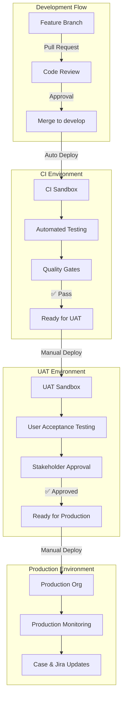

# Advanced Project Template 🚀 Full Guide

## 📚 Documentation Salesforce Project Template

A comprehensive, enterprise-grade Salesforce development project template featuring Lightning Web Components, Apex classes, metadata-driven trigger framework, automated testing, and sophisticated CI/CD pipeline configurations. This repository provides a ready foundation for scalable Salesforce projects with industry best practices and modern development workflows.

## 🚀 Project Setup

For a complete step-by-step guide to setting up this template, see:

👉 **[Project Setup Guide](docs/PROJECT-SETUP.md)**

This includes instructions for running `setup:full-env`, adding GitHub credentials, and performing the initial deployment.

## � Quick Start

**New to the project?** Follow our step-by-step setup guide:
📖 **[New Developer Setup Guide](docs/NEW-DEVELOPER-SETUP.md)** - Complete setup from Node.js installation to running the project

## �📚 Documentation

### Core Documentation
- **[Pipeline Configuration](docs/PIPELINE.md)** - CI/CD setup and GitHub Actions
- **[Environment Setup](docs/ENVIRONMENT-SETUP.md)** - GitHub environments and secrets
- **[Playwright Testing](docs/PLAYWRIGHT.md)** - E2E testing with Playwright
- **[Trigger Framework](docs/TRIGGER-FRAMEWORK.md)** - Mitch Spano's trigger framework

### Development Guides
- **[Development Workflow](docs/DEVELOPMENT.md)** - Best practices and workflows
- **[Testing Strategy](docs/TESTING.md)** - Unit testing and E2E testing
- **[Code Quality](docs/CODE-QUALITY.md)** - Static analysis and validation
- **[Prettier Configuration](docs/PRETTIER-CONFIG.md)** - Code formatting setup and usage

## 🏗️ Multi-Environment Architecture

## ⚡ Available Scripts & Commands

| Category | Script | Description | Usage |
|----------|--------|-------------|-------|
| **Deployment** | `sf project deploy start` | Deploy to default org | `sf project deploy start` |
| | `sf project deploy validate` | Validate deployment without deploying | `sf project deploy validate` |
| **Environment Management** | `./scripts/bash/setup-github-environments.sh` | Set up GitHub environments | `./scripts/bash/setup-github-environments.sh` |
| | `./scripts/bash/generate-ssl-certificates-auto.sh` | Generate JWT certificates | `./scripts/bash/generate-ssl-certificates-auto.sh` |

## 🔧 VS Code Snippets

This project includes custom VS Code snippets to accelerate development with pre-built code templates for common Salesforce patterns.

### Available Snippets

#### Apex Snippets (`apex.json`)
- **`beforeinsert`** - Method for TriggerAction.BeforeInsert
- **`afterinsert`** - Method for TriggerAction.AfterInsert  
- **`beforeupdate`** - Method for TriggerAction.BeforeUpdate
- **`afterupdate`** - Method for TriggerAction.AfterUpdate
- **`beforedelete`** - Method for TriggerAction.BeforeDelete
- **`afterdelete`** - Method for TriggerAction.AfterDelete
- **`afterundelete`** - Method for TriggerAction.AfterUndelete

#### TypeScript Snippets (`typescript.json`)
- **`playwrightScript`** - Complete Playwright test template with Salesforce login

### Setup Instructions

1. **Link snippets to VS Code:**
   ```bash
   ./scripts/bash/link-vscode-snippets.sh
   ```

2. **Restart VS Code or reload window:**
   - Press `Cmd+Shift+P` (macOS) or `Ctrl+Shift+P` (Windows/Linux)
   - Type "Developer: Reload Window" and press Enter

3. **Use snippets in your code:**
   - Open an Apex (`.cls`) or TypeScript (`.ts`) file
   - Start typing the snippet prefix (e.g., `beforeinsert`)
   - Press `Tab` or `Enter` to expand the snippet

### Managing Snippets

- **Modify snippets**: Edit files in `.vscode-snippets/` directory
- **Add new snippets**: Create new entries in the JSON files
- **Unlink snippets**: Run `./scripts/bash/unlink-vscode-snippets.sh`

The snippets are symbolically linked to your VS Code user snippets directory, so any changes you make to the project's snippet files will be immediately available in VS Code.

## 🤝 Contributing & Development Workflow

### Advanced Deployment Commands

```bash
# Deploy specific components
sf project deploy start --source-dir force-app/main/default/classes

# Deploy with tests
sf project deploy start --test-level RunLocalTests

# Deploy to specific org
sf project deploy start --target-org prod-org

# Validate deployment
sf project deploy validate --source-dir force-app

# Check deployment status
sf project deploy report --job-id <deployment-id>
```

### Trigger Framework Commands

```bash
# Deploy trigger framework
sf project deploy start --source-dir force-app/trigger-framework

# Query trigger actions
sf data query --query "SELECT Id, DeveloperName, Object_API_Name__c FROM Trigger_Action__mdt"

# Execute anonymous Apex for testing
sf apex run --file scripts/apex/test-trigger-framework.apex
```ready foundation for scalable Salesforce projects with industry best practices and modern development workflows.

## 🎯 Purpose & Features

This enterprise project template provides:

### 🏗️ **Architecture & Framework**
- **Metadata-driven trigger framework** by Mitch Spano with flow integration
- **Standardized project structure** following Salesforce DX conventions
- **Multi-package directory support** for complex enterprise solutions
- **Custom metadata type configurations** for framework behavior

### 🚀 **CI/CD & DevOps**
- **Multi-environment deployment pipeline** (CI → UAT → Production)
- **JWT-based authentication** for secure deployments
- **Delta deployment strategy** using SGD (Source Git Delta)
- **Automated case management** with Salesforce and Jira integration
- **User mapping for deployments** with fallback mechanisms
- **Comprehensive security scanning** and dependency checks

### 🧪 **Testing & Quality Assurance**
- **Multi-layered testing strategy** (Unit, Integration, E2E)
- **Jest-based Lightning Web Component testing**
- **Playwright end-to-end automation**
- **Static code analysis** with custom rulesets
- **Code coverage enforcement** and quality gates

### 🔧 **Developer Experience**
- **Automated environment setup** with SSL certificate generation
- **Git hooks with Husky** for code quality enforcement
- **Prettier and ESLint integration** with Salesforce-specific rules
- **Translation management** automation
- **Comprehensive documentation** with architecture diagrams

## 📁 Project Architecture
├── .github/                            # GitHub Actions & CI/CD
│   ├── actions/                        # Reusable composite actions
│   │   ├── setup-salesforce/           # SF CLI & environment setup
│   │   ├── extract-git-commits-tickets/# Ticket extraction from commits
│   │   ├── update-sf-cases-by-ticket/ # Salesforce case management
│   │   └── jira-ticket-update/        # Jira integration
│   └── workflows/                      # CI/CD pipeline definitions
│       ├── ci-deploy.yml              # Development environment
│       ├── uat-deploy.yml             # UAT environment  
│       ├── prod-deploy.yml            # Production environment
│       ├── security-checks.yml        # Security & dependency scans
│       └── [validation workflows]     # Pre-deployment validations
├── force-app/                          # Salesforce source code
│   ├── main/default/                   # Core application components
│   │   ├── aura/                       # Aura components (legacy)
│   │   ├── classes/                    # Apex classes & interfaces
│   │   ├── lwc/                        # Lightning Web Components
│   │   ├── objects/                    # Custom objects & fields
│   │   ├── layouts/                    # Page layouts & record types
│   │   ├── flows/                      # Salesforce Flow definitions
│   │   ├── permissionsets/             # Permission sets (no profiles)
│   │   ├── customMetadata/             # Custom metadata records
│   │   ├── settings/                   # Org-wide settings
│   │   └── translations/               # Translation workbench files
│   └── trigger-framework/              # Mitch Spano's trigger framework
│       └── default/
│           ├── classes/                # Framework classes & interfaces
│           │   ├── MetadataTriggerHandler.cls    # Core handler
│           │   ├── TriggerAction.cls             # Base interface
│           │   ├── TriggerActionFlow.cls         # Flow integration
│           │   ├── FormulaFilter.cls             # Dynamic filtering
│           │   └── [Additional framework classes]
│           ├── objects/                # Framework custom metadata
│           │   ├── TriggerAction__mdt/ # Trigger action configuration
│           │   └── TriggerActionFlow__mdt/       # Flow configuration
│           └── triggers/               # Object-specific triggers
├── scripts/                            # Automation & utility scripts
│   ├── apex/                           # Apex scripts for data operations
│   ├── bash/                           # Shell scripts for setup
│   │   ├── generate-ssl-certificates-auto.sh    # JWT cert generation
│   │   └── setup-github-environments.sh         # Environment setup
│   ├── playwright/                     # E2E test automation scripts
│   └── soql/                           # SOQL queries for analysis
├── e2e/                                # End-to-end test specifications
├── config/                             # Environment configurations
│   └── project-scratch-def.json       # Scratch org definition
├── docs/                               # Comprehensive documentation
│   ├── PIPELINE.md                     # CI/CD pipeline details
│   ├── TRIGGER-FRAMEWORK.md           # Framework implementation guide
│   ├── ENVIRONMENT-SETUP.md           # GitHub environment configuration
│   ├── TESTING.md                      # Testing strategies & utilities
│   ├── DEVELOPMENT.md                  # Development guidelines & standards
│   └── [Additional documentation]
├── static-code-analysis-rules/         # Code quality configurations
│   ├── ruleset.xml                     # PMD rules for Apex
│   └── flow/                           # Flow-specific analysis rules
└── manifest/                           # Deployment manifests
    └── package.xml                     # Complete metadata package


## 🚀 Quick Start

### Prerequisites

Ensure the following tools are installed and configured:

- **Node.js** (v18 or higher) - For Lightning Web Component development
- **Salesforce CLI** (latest) - Use `sf` commands (sfdx deprecated)
- **GitHub CLI** (gh) - For repository and environment management
- **Git** (v2.30+) - Version control with modern features
- **OpenSSL** - For JWT certificate generation
- **jq** - JSON processing (for environment scripts)

### Initial Project Setup

1. **Create new project from template:**
   ```bash
   # Using GitHub CLI (recommended)
   gh repo create my-salesforce-project --template silvansholla/advanced-project-template --public
   cd my-salesforce-project
   
   # OR clone directly
   git clone https://github.com/silvansholla/advanced-project-template.git my-salesforce-project
   cd my-salesforce-project
   ```

2. **Install project dependencies:**
   ```bash
   # Install Node.js dependencies
   npm install
   
   # Verify Salesforce CLI installation
   sf version --verbose
   
   # Install Salesforce CLI plugins (if needed)
   sf plugins install @salesforce/sfdx-scanner
   ```

3. **Generate SSL certificates for JWT authentication:**
   ```bash
   # Automated certificate generation
   chmod +x ./scripts/bash/generate-ssl-certificates-auto.sh
   ./scripts/bash/generate-ssl-certificates-auto.sh
   ```

4. **Configure GitHub environments:**
   ```bash
   # Automated environment setup
   chmod +x ./scripts/bash/setup-github-environments.sh
   ./scripts/bash/setup-github-environments.sh
   ```

5. **Install Git hooks for commit message formatting:**
   ```bash
   # Install git hooks (includes prepare-commit-msg for branch name prefixing)
   chmod +x ./scripts/bash/setup-git-hooks.sh
   ./scripts/bash/setup-git-hooks.sh
   ```

6. **Authenticate with Salesforce environments:**
   ```bash
   # Development org
   sf org login web --alias ci-org --instance-url https://test.salesforce.com
   
   # UAT org  
   sf org login web --alias uat-org --instance-url https://test.salesforce.com
   
   # Production org
   sf org login web --alias prod-org --instance-url https://login.salesforce.com
   ```

7. **Set up Connected Apps in each Salesforce org:**
   - Navigate to Setup → App Manager → New Connected App
   - Enable OAuth Settings and JWT Bearer Token Flow
   - Upload the generated certificate (server.crt)
   - Configure API scopes and callback URLs
   - Note the Consumer Key for GitHub secrets configuration

### First Deployment

```bash
# Create a scratch org for development
sf org create scratch --definition-file config/project-scratch-def.json --alias scratch-dev --duration-days 30

# Deploy trigger framework and sample code
sf project deploy start --target-org scratch-dev

# Assign permission sets
sf org assign permset --name TriggerFrameworkAdmin --target-org scratch-dev

# Open the org
sf org open --target-org scratch-dev
```

## � Git Hooks

This project includes Git hooks to improve development workflow and maintain consistent commit messages:

### Prepare Commit Message Hook
The `prepare-commit-msg` hook automatically prepends branch names to commit messages for better traceability:

- **Feature branches**: Adds `[branch-name]` prefix (e.g., `[feature/user-auth] Add login component`)
- **Main/Master branches**: Excluded by default to keep production commits clean
- **Already prefixed**: Skips if branch name already exists in the message

To manually reinstall or update hooks:
```bash
./scripts/bash/setup-git-hooks.sh
```

**Note**: The hook is automatically installed during initial project setup (step 5 above).

This template implements a sophisticated three-tier deployment strategy with automated promotion and comprehensive quality gates:



### 🔴 Production Environment (`main` branch)
- **Trigger**: Push to `main` branch with `force-app/**` changes
- **Salesforce Org**: Production environment with live customer data
- **Deployment Strategy**: Delta deployment with destructive changes
- **Quality Gates**: All tests must pass, requires approval workflow
- **Monitoring**: Automated case updates and Jira ticket status changes
- **Rollback**: Immediate rollback procedures available

### 🟡 UAT Environment (`uat` branch)
- **Trigger**: Push to `uat` branch with `force-app/**` changes  
- **Salesforce Org**: UAT sandbox with production-like data
- **Purpose**: Stakeholder validation and user acceptance testing
- **Testing**: Manual testing by business users and QA teams
- **Approval**: Business stakeholder sign-off required for production

### 🟢 CI Environment (`develop` branch)
- **Trigger**: Push to `develop` branch with `force-app/**` changes
- **Salesforce Org**: Development sandbox for continuous integration
- **Purpose**: Automated testing, validation, and developer verification
- **Quality Checks**: Unit tests, integration tests, static code analysis
- **Deployment**: Fully automated with immediate feedback

## 🔧 Advanced Features & Capabilities

### 🚀 **Deployment & Integration**
- **Delta Deployment Strategy** - Only deploys changed components using SGD (Source Git Delta)
- **JWT-Based Authentication** - Secure, certificate-based authentication for CI/CD
- **User Mapping for Deployments** - Dynamic user assignment based on GitHub actor
- **Automated Case Management** - Salesforce case updates with deployment details
- **Jira Integration** - Automatic ticket status updates and deployment tracking
- **Destructive Changes Support** - Automated handling of metadata deletions

### 🧪 **Testing & Quality Assurance**
- **Multi-Layer Testing** - Unit tests (Jest), integration tests, and E2E tests (Playwright)
- **Trigger Framework Testing** - Comprehensive test utilities for metadata-driven triggers
- **Fake ID Generation** - Advanced test data generation with `TriggerTestUtility`
- **Code Coverage Enforcement** - Minimum coverage requirements with detailed reporting
- **Static Code Analysis** - Custom PMD rulesets for Apex and Flow validation
- **Security Scanning** - Automated dependency vulnerability checks

### 🔐 **Security & Compliance**
- **Permission Set Architecture** - No profile dependencies, permission set-based access
- **Metadata Validation** - Custom validation rules for naming conventions and structure
- **SSL Certificate Management** - Automated certificate generation and rotation
- **Environment Isolation** - Strict separation between development, UAT, and production
- **Audit Trail** - Complete deployment history with case and ticket references

### 🏗️ **Trigger Framework Integration**
- **Metadata-Driven Configuration** - No hard-coded trigger logic
- **Flow Integration** - Seamless integration with Salesforce Flow
- **Dynamic Filtering** - Runtime filtering with FormulaFilter class
- **Bulk Processing** - Optimized for large data volumes
- **Error Handling** - Comprehensive error management with detailed logging
- **Bypass Mechanisms** - Permission-based trigger bypassing for data loads

### 🌐 **Developer Experience**
- **Automated Environment Setup** - One-command GitHub environment configuration
- **Git Hooks Integration** - Pre-commit hooks with Husky for code quality
- **Modern Tooling** - ESLint, Prettier, and Salesforce-specific formatting
- **Translation Management** - Automated import/export of translation workbench files
- **Documentation Generation** - Automated API documentation and code comments
- **Hot Reloading** - Fast development cycles with watch mode testing

## � Available Scripts

| Script | Description |
|--------|-------------|
| `npm test` | Run Jest unit tests |
| `npm run test:e2e` | Run Playwright E2E tests |
| `npm run lint` | Run ESLint |
| `npm run build` | Build project |
| `npm run deploy:dev` | Deploy to development |
| `npm run deploy:uat` | Deploy to UAT |
| `npm run deploy:prod` | Deploy to production |

## 🤝 Contributing & Development Workflow

### Branch Strategy

We follow a GitFlow-inspired strategy with environment-specific branches:

```
main (production)     ←── uat (staging)     ←── develop (integration)
  ↑                        ↑                     ↑
  │                        │                     │
hotfix/                 release/              feature/
branches                branches              branches
```

### Contribution Process

1. **Create a feature branch:**
   ```bash
   git checkout develop
   git pull origin develop
   git checkout -b feature/JIRA-123-amazing-feature
   ```

2. **Develop with best practices:**
   ```bash
   # Write comprehensive tests
   npm run test:unit
   
   # Follow code quality standards
   npm run lint
   npm run prettier
   
   # Test trigger framework integration
   sf apex run --file scripts/apex/test-your-changes.apex
   ```

3. **Commit with conventional commits:**
   ```bash
   git add .
   git commit -m "feat(triggers): add account validation trigger action

   - Implement AccountValidationAction class
   - Add custom metadata configuration
   - Include comprehensive unit tests
   - Update documentation
   
   Closes JIRA-123"
   ```

4. **Push and create Pull Request:**
   ```bash
   git push origin feature/JIRA-123-amazing-feature
   
   # Create PR using GitHub CLI
   gh pr create --base develop --title "feat: Add account validation trigger action" --body "Detailed description..."
   ```

5. **Code Review Process:**
   - **Automated Checks**: CI pipeline runs all tests and validations
   - **Peer Review**: At least one code review required
   - **Quality Gates**: All checks must pass before merge
   - **Documentation**: Update relevant documentation files

### Development Standards

- **Naming Convention**: All custom metadata must use `KS_` prefix
- **Permission Sets**: Use permission sets, never profiles
- **Documentation**: Every class must have comprehensive header comments
- **Testing**: Minimum 85% code coverage for all Apex classes
- **Metadata**: All trigger actions must be configured via custom metadata

### Release Management

```bash
# Prepare release branch
git checkout develop
git checkout -b release/v1.2.0

# Deploy to UAT for testing
git push origin release/v1.2.0
# This triggers UAT deployment automatically

# After UAT approval, merge to main
git checkout main
git merge release/v1.2.0
git tag v1.2.0
git push origin main --tags
# This triggers production deployment
```

## 📄 License

This project is licensed under the MIT License - see the [LICENSE](LICENSE) file for details.

## 🆘 Support & Troubleshooting

### Common Issues & Solutions

#### Authentication Issues
```bash
# JWT authentication failure
./scripts/bash/generate-ssl-certificates-auto.sh
# Then update GitHub secrets with new certificate

# Org authentication timeout
sf org login web --alias your-org --instance-url https://login.salesforce.com
```

#### Deployment Failures
```bash
# Check deployment status
sf project deploy report --job-id <deployment-id>

# Validate before deployment
sf project deploy validate --source-dir force-app

# Deploy with specific test level
sf project deploy start --test-level RunLocalTests
```

#### Trigger Framework Issues
```bash
# Verify trigger action metadata
sf data query --query "SELECT Id, DeveloperName, Apex_Class_Name__c, Order__c, Trigger_Context__c FROM Trigger_Action__mdt"

# Check bypass permissions
sf org assign permset --name TriggerFrameworkAdmin
```

### Getting Help

1. **Review Documentation**: Check the comprehensive docs in `/docs` folder
2. **Search Issues**: Review existing [GitHub Issues](../../issues) for similar problems
3. **Create New Issue**: Use issue templates for bugs or feature requests
4. **Community Support**: Join the Salesforce Developer Community discussions
5. **Professional Support**: Contact the maintainers for enterprise support options

### Issue Templates

When creating issues, please use the appropriate template:
- **🐛 Bug Report**: For reporting bugs with reproduction steps
- **✨ Feature Request**: For suggesting new functionality
- **📚 Documentation**: For documentation improvements
- **❓ Question**: For usage questions and clarifications

---

**Project Template Version:** 2.0.0  
**Last Updated:** December 2024  
**Salesforce API Version:** 62.0  
**Node.js Version:** 18+  
**Framework:** Mitch Spano Trigger Framework v3.0

## 📄 License

This project is licensed under a custom **Kerun.one Template License** - see the [LICENSE](LICENSE) file for details.

### ✅ What you CAN do:
- **Use the template** - Create new projects using this template
- **Internal modifications** - Modify for your organization's needs
- **Commercial use** - Use in commercial projects
- **Deploy applications** - Build and deploy apps from this template

### ⚠️ What requires approval from Team 1 at Kerun.one:
- **Contributing back** - Submit improvements to the original template
- **Public redistribution** - Share modified versions publicly
- **Derivative templates** - Create new template versions for distribution
- **Using Kerun.one branding** - Reference Kerun.one name in derivatives

### 🤝 Contributing Back to the Template:
1. **Contact Team 1 at Kerun.one** with your proposed changes
2. **Get written approval** before submitting contributions
3. **Ownership transfer** - Approved contributions become Kerun.one property

### 🏢 Ownership:
- **Template ownership** - Kerun.one retains full ownership of this template
- **Your projects** - Applications you build using this template belong to you
- **Quality control** - Ensures template maintains high standards
