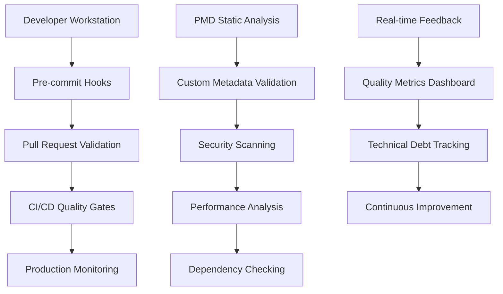
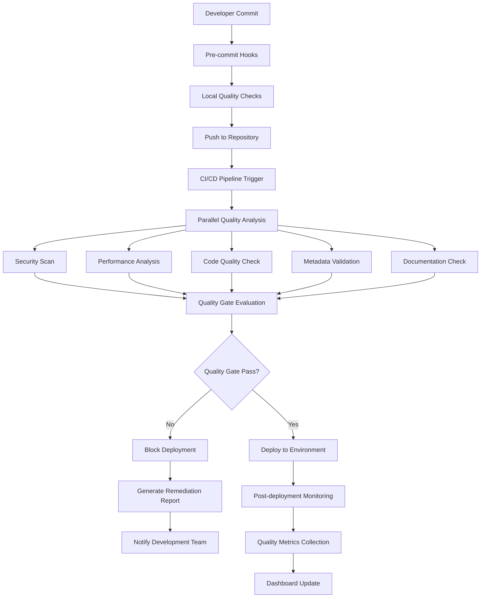

# Enterprise Code Quality & Static Analysis Framework

This document outlines our comprehensive, enterprise-grade code quality framework designed to ensure exceptional code standards, maintainability, and security across all Salesforce development activities. Our multi-layered approach implements automated static analysis, custom validation rules, and continuous quality monitoring to maintain the highest professional standards.

## 🎯 Quality Assurance Philosophy & Strategy

### Zero-Defect Quality Framework

Our code quality strategy is built upon the **Zero-Defect Principle**, implementing multiple layers of validation to catch issues early in the development lifecycle:



### Enterprise Quality Standards

| Quality Dimension | Target | Measurement | Enforcement |
|------------------|--------|-------------|-------------|
| **Code Coverage** | 95%+ lines | Apex Test Coverage | Blocking CI/CD gate |
| **Cyclomatic Complexity** | ≤8 per method | PMD Analysis | PR review requirement |
| **Technical Debt Ratio** | <5% | SonarQube metrics | Weekly team review |
| **Security Vulnerabilities** | Zero critical/high | SAST/DAST scanning | Immediate remediation |
| **Performance Issues** | Zero critical | Custom analyzers | Automated alerts |
| **Documentation Coverage** | 100% public APIs | Custom validation | PR review requirement |

## 🏗️ Architecture & Tool Ecosystem

### Multi-Tool Quality Ecosystem

Our enterprise-grade quality framework integrates multiple best-in-class tools:

```
📊 Quality Analysis Stack
├── Static Code Analysis
│   ├── PMD (Apex/Visualforce)
│   ├── ESLint (Lightning Web Components)  
│   ├── Salesforce Code Analyzer (Multi-engine)
│   ├── SonarQube (Enterprise metrics)
│   └── CodeClimate (Technical debt)
├── Security Analysis  
│   ├── Salesforce Security Scanner
│   ├── Snyk (Dependency vulnerabilities)
│   ├── OWASP ZAP (Dynamic security)
│   └── Custom SAST rules
├── Performance Analysis
│   ├── Apex Performance Profiler
│   ├── Lightning Performance Toolkit
│   ├── Custom Query Analyzers
│   └── Memory Usage Monitors
├── Metadata Validation
│   ├── Custom Metadata Scanner
│   ├── Schema Compliance Checker
│   ├── Field-Level Security Validator
│   └── Sharing Model Analyzer
└── Documentation Quality
    ├── ApexDoc Generator
    ├── Markdown Linters
    ├── API Documentation Coverage
    └── Business Process Documentation
```

### Enterprise Tool Configuration Matrix

| Tool | Purpose | Scope | Execution Context | Report Format |
|------|---------|-------|------------------|---------------|
| **PMD** | Static code analysis | Apex, VF, Triggers | Pre-commit, CI/CD | SARIF, XML, JSON |
| **ESLint** | JavaScript linting | LWC, Aura | Pre-commit, CI/CD | JSON, HTML |
| **Salesforce Scanner** | Multi-engine analysis | All metadata | CI/CD, Scheduled | SARIF, CSV |
| **SonarQube** | Quality metrics | Full codebase | CI/CD, Daily | Dashboard, API |
| **Custom Validators** | Business rules | Metadata, Processes | Real-time | JSON, Logs |

## 📁 Static Analysis Configuration Architecture

### Enterprise Configuration Structure

```
static-code-analysis-rules/
├── core/
│   ├── enterprise-ruleset.xml               # Primary PMD ruleset
│   ├── security-rules.xml                   # Security-focused rules
│   ├── performance-rules.xml                # Performance optimization rules
│   └── design-patterns-rules.xml            # Architecture patterns
├── metadata/
│   ├── custom-object-validation.json        # Custom object standards
│   ├── field-validation-rules.json          # Field-level validation
│   ├── permission-validation.json           # Security permission rules
│   └── process-validation.json              # Business process rules
├── flows/
│   ├── flow-design-rules.xml               # Flow design standards
│   ├── flow-performance-rules.xml          # Flow performance rules
│   └── flow-security-rules.xml             # Flow security validation
├── lwc/
│   ├── .eslintrc.enterprise.json           # Enterprise ESLint config
│   ├── accessibility-rules.json            # WCAG compliance rules
│   └── performance-rules.json              # LWC performance rules
├── apex/
│   ├── trigger-framework-rules.xml         # Trigger framework validation
│   ├── test-class-rules.xml               # Test class standards
│   └── integration-rules.xml               # Integration pattern rules
├── soql/
│   ├── query-performance-rules.xml         # SOQL optimization rules
│   └── security-rules.xml                  # SOQL security validation
└── reports/
    ├── quality-report-template.html        # Report template
    ├── dashboard-config.json               # Metrics dashboard config
    └── notification-rules.json             # Alert configuration
```

## 🔧 Enterprise PMD Configuration

### Master Ruleset Architecture

Our enterprise PMD configuration implements a hierarchical ruleset structure optimized for Salesforce development:

```xml
<?xml version="1.0" encoding="UTF-8"?>
<ruleset name="Enterprise Salesforce PMD Ruleset"
         xmlns="http://pmd.sourceforge.net/ruleset/2.0.0"
         xmlns:xsi="http://www.w3.org/2001/XMLSchema-instance"
         xsi:schemaLocation="http://pmd.sourceforge.net/ruleset/2.0.0 
         https://pmd.sourceforge.io/ruleset_2_0_0.xsd">

    <description>
        Enterprise-grade PMD ruleset for Salesforce development
        Implements zero-defect quality standards with comprehensive coverage
        Last updated: December 2024
    </description>

    <!-- === SECURITY RULES - ZERO TOLERANCE === -->
    <rule ref="category/apex/security.xml">
        <priority>1</priority>
    </rule>
    
    <!-- Enhanced security rules -->
    <rule ref="category/apex/security.xml/ApexCSRF">
        <priority>1</priority>
        <properties>
            <property name="strictMode" value="true"/>
        </properties>
    </rule>
    
    <rule ref="category/apex/security.xml/ApexSharingViolations">
        <priority>1</priority>
        <properties>
            <property name="enforceSharingKeywords" value="true"/>
        </properties>
    </rule>

    <!-- === PERFORMANCE RULES - CRITICAL === -->
    <rule ref="category/apex/performance.xml/AvoidSoqlInLoops">
        <priority>1</priority>
        <properties>
            <property name="reportViolationsForCalls" value="true"/>
        </properties>
    </rule>
    
    <rule ref="category/apex/performance.xml/AvoidDmlStatementsInLoops">
        <priority>1</priority>
    </rule>
    
    <rule ref="category/apex/performance.xml/AvoidSoslInLoops">
        <priority>1</priority>
    </rule>

    <!-- Custom performance rule for governor limits -->
    <rule name="GovernorLimitAwareness"
          language="apex"
          message="Method should check governor limits before expensive operations"
          class="net.sourceforge.pmd.lang.apex.rule.performance.GovernorLimitRule">
        <description>
            Ensures methods performing bulk operations check governor limits
        </description>
        <priority>2</priority>
    </rule>

    <!-- === BEST PRACTICES - MANDATORY === -->
    <rule ref="category/apex/bestpractices.xml/ApexUnitTestClassShouldHaveAsserts">
        <priority>2</priority>
        <properties>
            <property name="minimumAssertions" value="1"/>
        </properties>
    </rule>
    
    <rule ref="category/apex/bestpractices.xml/ApexUnitTestShouldNotUseSeeAllDataTrue">
        <priority>1</priority>
    </rule>
    
    <rule ref="category/apex/bestpractices.xml/AvoidGlobalModifier">
        <priority>2</priority>
        <properties>
            <property name="allowedClasses" value="TriggerHandler,BatchApexClass"/>
        </properties>
    </rule>
    
    <rule ref="category/apex/bestpractices.xml/AvoidLogicInTrigger">
        <priority>1</priority>
    </rule>

    <!-- === DESIGN PATTERNS - ARCHITECTURAL === -->
    <rule ref="category/apex/design.xml/AvoidDeeplyNestedIfStmts">
        <priority>2</priority>
        <properties>
            <property name="problemDepth" value="4"/>
        </properties>
    </rule>
    
    <rule ref="category/apex/design.xml/CyclomaticComplexity">
        <priority>2</priority>
        <properties>
            <property name="classReportLevel" value="60"/>
            <property name="methodReportLevel" value="8"/>
        </properties>
    </rule>
    
    <rule ref="category/apex/design.xml/ExcessiveClassLength">
        <priority>3</priority>
        <properties>
            <property name="minimum" value="500"/>
        </properties>
    </rule>
    
    <rule ref="category/apex/design.xml/ExcessiveMethodLength">
        <priority>3</priority>
        <properties>
            <property name="minimum" value="100"/>
        </properties>
    </rule>
    
    <rule ref="category/apex/design.xml/ExcessiveParameterList">
        <priority>3</priority>
        <properties>
            <property name="minimum" value="6"/>
        </properties>
    </rule>

    <!-- === CODE STYLE - CONSISTENCY === -->
    <rule ref="category/apex/codestyle.xml/ClassNamingConventions">
        <priority>3</priority>
        <properties>
            <property name="testClassPattern" value="[A-Z][a-zA-Z0-9]*Test"/>
            <property name="abstractClassPattern" value="Abstract[A-Z][a-zA-Z0-9]*"/>
            <property name="classPattern" value="[A-Z][a-zA-Z0-9]*"/>
        </properties>
    </rule>
    
    <rule ref="category/apex/codestyle.xml/MethodNamingConventions">
        <priority>3</priority>
        <properties>
            <property name="testPattern" value="[a-z][a-zA-Z0-9]*"/>
            <property name="staticPattern" value="[a-z][a-zA-Z0-9]*"/>
            <property name="instancePattern" value="[a-z][a-zA-Z0-9]*"/>
        </properties>
    </rule>
    
    <rule ref="category/apex/codestyle.xml/VariableNamingConventions">
        <priority>3</priority>
        <properties>
            <property name="staticFinalPattern" value="[A-Z][A-Z0-9_]*"/>
            <property name="staticPattern" value="[a-z][a-zA-Z0-9]*"/>
            <property name="instancePattern" value="[a-z][a-zA-Z0-9]*"/>
        </properties>
    </rule>

    <!-- === ERROR PRONE PATTERNS === -->
    <rule ref="category/apex/errorprone.xml/AvoidDirectAccessTriggerMap">
        <priority>2</priority>
    </rule>
    
    <rule ref="category/apex/errorprone.xml/AvoidHardcodingId">
        <priority>2</priority>
    </rule>
    
    <rule ref="category/apex/errorprone.xml/MethodWithSameNameAsEnclosingClass">
        <priority>2</priority>
    </rule>

    <!-- === DOCUMENTATION REQUIREMENTS === -->
    <rule name="RequiredClassDocumentation"
          language="apex"
          message="All public classes must have comprehensive documentation"
          class="net.sourceforge.pmd.lang.apex.rule.documentation.ClassDocumentationRule">
        <description>
            Enforces documentation standards for public classes
        </description>
        <priority>3</priority>
        <properties>
            <property name="requireDescription" value="true"/>
            <property name="requireAuthor" value="true"/>
            <property name="requireDate" value="true"/>
            <property name="requireGroup" value="true"/>
        </properties>
    </rule>

    <!-- === CUSTOM ENTERPRISE RULES === -->
    <rule name="TriggerFrameworkCompliance"
          language="apex"
          message="Triggers must use the metadata-driven trigger framework"
          class="net.sourceforge.pmd.lang.apex.rule.custom.TriggerFrameworkRule">
        <description>
            Ensures all triggers follow the enterprise trigger framework pattern
        </description>
        <priority>1</priority>
    </rule>
    
    <rule name="TestDataFactoryUsage"
          language="apex"
          message="Test classes must use centralized test data factory"
          class="net.sourceforge.pmd.lang.apex.rule.custom.TestDataFactoryRule">
        <description>
            Enforces use of standardized test data factory for consistency
        </description>
        <priority>2</priority>
    </rule>

</ruleset>
```

## 🔍 Advanced Custom Metadata Validation

### Enterprise Metadata Governance Framework

Our custom metadata validation framework ensures consistency, security, and maintainability across all Salesforce metadata:

```json
{
  "metadataGovernance": {
    "version": "2.0.0",
    "enforcementLevel": "strict",
    "reportingLevel": "comprehensive",
    "validationRules": {
      "customObjects": {
        "requiredFields": ["Name", "DeveloperName"],
        "requiredProperties": {
          "description": {
            "required": true,
            "minLength": 50,
            "pattern": "^[A-Z].*\\.$"
          },
          "sharingModel": {
            "required": true,
            "allowedValues": ["Private", "ReadOnly", "ReadWrite"]
          },
          "deploymentStatus": {
            "required": true,
            "allowedValues": ["InDevelopment", "Deployed"]
          }
        },
        "namingConvention": {
          "pattern": "^[A-Z][a-zA-Z0-9_]*__c$",
          "exceptions": ["Account", "Contact", "Opportunity"],
          "reservedWords": ["System", "Admin", "Test", "Debug"]
        },
        "fieldLimits": {
          "maxFieldCount": 500,
          "maxFormulaFields": 50,
          "maxLookupFields": 25,
          "maxRollupSummaryFields": 25
        },
        "securityRequirements": {
          "requireFieldLevelSecurity": true,
          "requireRecordTypeAccess": true,
          "validateSharingRules": true
        }
      },
      "customFields": {
        "requiredProperties": {
          "label": {
            "required": true,
            "pattern": "^[A-Z][a-zA-Z0-9\\s]*$"
          },
          "description": {
            "required": true,
            "minLength": 25
          },
          "helpText": {
            "requiredForTypes": ["Picklist", "Number", "Currency"],
            "minLength": 15
          }
        },
        "namingConvention": {
          "pattern": "^[A-Z][a-zA-Z0-9_]*__c$",
          "camelCaseRequired": true
        },
        "dataTypeValidation": {
          "forbiddenTypes": ["AutoNumber"],
          "encryptionRequired": ["Email", "Phone", "Text(255)"],
          "lengthLimits": {
            "Text": { "min": 1, "max": 255 },
            "LongTextArea": { "min": 1, "max": 32768 },
            "RichTextArea": { "min": 1, "max": 32768 }
          }
        },
        "picklistValidation": {
          "requireDescription": true,
          "maxValues": 1000,
          "sortAlphabetically": true,
          "restrictPicklist": true
        }
      },
      "workflows": {
        "maxRulesPerObject": 50,
        "requireDescription": true,
        "requireBusinessJustification": true,
        "performanceValidation": {
          "maxComplexity": 10,
          "maxCriteriaItems": 25,
          "requireBulkProcessing": true
        }
      },
      "validationRules": {
        "requireErrorMessage": true,
        "requireDescription": true,
        "requireBusinessCase": true,
        "complexityLimits": {
          "maxFormulaLength": 3900,
          "maxNestedFunctions": 10,
          "maxCriteriaItems": 25
        },
        "performanceRequirements": {
          "avoidExpensiveFunctions": ["REGEX", "BEGINS", "CONTAINS"],
          "limitLookupFields": 5,
          "requireIndexHints": true
        }
      },
      "processes": {
        "flowRequirements": {
          "requireDescription": true,
          "requireTestCoverage": true,
          "maxComplexity": 50,
          "requireErrorHandling": true
        },
        "processBuilderMigration": {
          "blockNewProcesses": true,
          "requireMigrationPlan": true,
          "documentationRequired": true
        }
      },
      "permissionSets": {
        "requireDescription": true,
        "requireBusinessJustification": true,
        "accessReview": {
          "periodicReview": "quarterly",
          "approvalRequired": true,
          "documentAccessReason": true
        },
        "fieldLevelSecurity": {
          "explicitPermissions": true,
          "validateReadWrite": true,
          "auditTrailRequired": true
        }
      },
      "reports": {
        "folderStructure": {
          "enforceNaming": true,
          "requireBusinessArea": true,
          "maxDepth": 3
        },
        "performanceValidation": {
          "maxRecords": 2000,
          "timeoutLimits": "120s",
          "indexUsageRequired": true
        }
      }
    },
    "excludePatterns": [
      "**/managed/**",
      "**/*__mdt",
      "**/Admin*",
      "**/Test*",
      "**/Backup*"
    ],
    "environmentSpecific": {
      "production": {
        "strictMode": true,
        "requireApproval": true,
        "backupRequired": true
      },
      "staging": {
        "validateOnly": false,
        "performanceTest": true
      },
      "development": {
        "allowExperimental": true,
        "warningsOnly": false
      }
    }
  },
  "integrations": {
    "cicdPipeline": {
      "blockingViolations": ["security", "performance", "critical"],
      "warningViolations": ["style", "documentation"],
      "reportGeneration": true
    },
    "governanceTools": {
      "salesforceAdvisor": true,
      "metadataApi": true,
      "customValidators": true
    }
  }
}
```

### Advanced Validation Engine

```typescript
/**
 * @description Enterprise metadata validation engine
 * @author Platform Team
 * @date 2024-12-01
 * @group Governance
 */
export class MetadataValidationEngine {
    private config: MetadataGovernanceConfig;
    private violations: ValidationViolation[] = [];
    
    constructor(config: MetadataGovernanceConfig) {
        this.config = config;
    }
    
    /**
     * @description Validates all metadata against governance rules
     */
    async validateMetadata(metadataPath: string): Promise<ValidationResult> {
        const startTime = Date.now();
        this.violations = [];
        
        try {
            // Load metadata files
            const metadata = await this.loadMetadataFiles(metadataPath);
            
            // Run validation rules
            await Promise.all([
                this.validateCustomObjects(metadata.customObjects),
                this.validateCustomFields(metadata.customFields),
                this.validateWorkflows(metadata.workflows),
                this.validateValidationRules(metadata.validationRules),
                this.validatePermissionSets(metadata.permissionSets),
                this.validateFlows(metadata.flows),
                this.validateReports(metadata.reports)
            ]);
            
            // Generate comprehensive report
            const result = this.generateValidationReport(startTime);
            
            // Integrate with CI/CD pipeline
            await this.integrateWithPipeline(result);
            
            return result;
            
        } catch (error) {
            throw new ValidationEngineError(`Metadata validation failed: ${error.message}`);
        }
    }
    
    /**
     * @description Validates custom objects against governance rules
     */
    private async validateCustomObjects(objects: CustomObject[]): Promise<void> {
        for (const obj of objects) {
            // Required field validation
            this.validateRequiredFields(obj, this.config.validationRules.customObjects.requiredFields);
            
            // Naming convention validation
            this.validateNamingConvention(obj.fullName, this.config.validationRules.customObjects.namingConvention);
            
            // Description quality validation
            this.validateDescriptionQuality(obj.description, this.config.validationRules.customObjects.requiredProperties.description);
            
            // Security validation
            await this.validateObjectSecurity(obj);
            
            // Performance validation
            this.validateObjectPerformance(obj);
        }
    }
    
    /**
     * @description Validates object security configuration
     */
    private async validateObjectSecurity(obj: CustomObject): Promise<void> {
        const securityReqs = this.config.validationRules.customObjects.securityRequirements;
        
        if (securityReqs.requireFieldLevelSecurity) {
            await this.validateFieldLevelSecurity(obj);
        }
        
        if (securityReqs.validateSharingRules) {
            await this.validateSharingRules(obj);
        }
        
        // Check for sensitive data patterns
        this.validateSensitiveDataHandling(obj);
    }
}
```

## 🚀 Enterprise Quality Execution Framework

### Local Development Workflow

```bash
# === COMPREHENSIVE QUALITY SUITE ===
# Run complete quality analysis (recommended)
npm run quality:enterprise

# Individual analysis tools
npm run quality:pmd              # PMD static analysis
npm run quality:metadata         # Custom metadata validation  
npm run quality:security         # Security vulnerability scan
npm run quality:performance      # Performance analysis
npm run quality:lwc             # Lightning Web Component analysis
npm run quality:apex            # Apex-specific analysis
npm run quality:documentation   # Documentation coverage
npm run quality:dependencies    # Dependency vulnerability scan

# === ENVIRONMENT-SPECIFIC VALIDATION ===
npm run quality:pre-commit      # Pre-commit hook validation
npm run quality:pre-deploy      # Pre-deployment validation
npm run quality:production      # Production-ready validation

# === REPORTING AND DASHBOARDS ===
npm run quality:report          # Generate comprehensive report
npm run quality:dashboard       # Launch quality dashboard
npm run quality:metrics         # Export quality metrics
npm run quality:trend           # Generate trend analysis
```

### Advanced Tool Execution

#### Enterprise PMD Analysis
```bash
# Comprehensive PMD scan with enterprise ruleset
sf scanner run \
  --engine pmd \
  --target "force-app" \
  --ruleset static-code-analysis-rules/core/enterprise-ruleset.xml \
  --format sarif \
  --outfile reports/pmd-enterprise-results.sarif \
  --severity-threshold 2 \
  --normalize-severity

# Security-focused PMD scan
sf scanner run \
  --engine pmd \
  --target "force-app" \
  --ruleset static-code-analysis-rules/core/security-rules.xml \
  --format json \
  --outfile reports/security-violations.json \
  --severity-threshold 1

# Performance-optimized scan
sf scanner run \
  --engine pmd \
  --target "force-app" \
  --ruleset static-code-analysis-rules/core/performance-rules.xml \
  --format html \
  --outfile reports/performance-analysis.html \
  --category performance

# Trigger framework compliance scan
sf scanner run \
  --engine pmd \
  --target "force-app/main/default/triggers" \
  --ruleset static-code-analysis-rules/apex/trigger-framework-rules.xml \
  --format csv \
  --outfile reports/trigger-compliance.csv
```

#### Advanced Custom Metadata Validation
```bash
# Full metadata governance validation
node scripts/quality/metadata-validator.js \
  --config static-code-analysis-rules/metadata/custom-object-validation.json \
  --target force-app/main/default \
  --output reports/metadata-governance.json \
  --mode strict \
  --environment production

# Object-specific validation
node scripts/quality/metadata-validator.js \
  --type CustomObject \
  --target force-app/main/default/objects \
  --rules static-code-analysis-rules/metadata/custom-object-validation.json \
  --format html \
  --output reports/object-validation.html

# Security-focused metadata scan
node scripts/quality/security-validator.js \
  --target force-app/main/default \
  --output reports/security-metadata.json \
  --check-permissions \
  --check-sharing \
  --check-field-security

# Performance metadata validation
node scripts/quality/performance-validator.js \
  --target force-app/main/default \
  --output reports/performance-metadata.json \
  --check-indexes \
  --check-queries \
  --check-complexity
```

#### Multi-Engine Salesforce Code Analyzer
```bash
# Comprehensive multi-engine analysis
sf scanner run \
  --target "force-app" \
  --engine "pmd,eslint-lwc,retire-js,sfge" \
  --format sarif \
  --outfile reports/comprehensive-analysis.sarif \
  --env production \
  --normalize-severity

# Lightning Web Component focused scan
sf scanner run \
  --target "force-app/**/lwc" \
  --engine "eslint-lwc" \
  --eslintconfig static-code-analysis-rules/lwc/.eslintrc.enterprise.json \
  --format json \
  --outfile reports/lwc-analysis.json

# Graph Engine analysis for complex relationships
sf scanner run \
  --target "force-app" \
  --engine "sfge" \
  --format sarif \
  --outfile reports/graph-engine-analysis.sarif \
  --projectdir . \
  --category "Security,Performance"
```

#### Enterprise Documentation Quality
```bash
# ApexDoc generation with quality metrics
npm run docs:apex -- \
  --source force-app/main/default/classes \
  --destination docs/apex \
  --template enterprise \
  --include-private false \
  --check-coverage \
  --min-coverage 90

# Markdown documentation linting
npm run docs:lint -- \
  --config .markdownlint.enterprise.json \
  --output reports/documentation-quality.json \
  docs/

# API documentation coverage
node scripts/quality/api-coverage-validator.js \
  --target force-app/main/default/classes \
  --output reports/api-documentation-coverage.json \
  --min-coverage 100
```

### Continuous Integration Pipeline

```yaml
# .github/workflows/enterprise-quality-gate.yml
name: Enterprise Quality Gate

on:
  pull_request:
    branches: [main, develop, release/*]
    paths: ['force-app/**', 'static-code-analysis-rules/**']
  push:
    branches: [main, develop]

env:
  NODE_VERSION: '18'
  SF_CLI_VERSION: 'latest'
  QUALITY_THRESHOLD: 'zero-defect'

jobs:
  enterprise-quality-analysis:
    name: Enterprise Quality Analysis
    runs-on: ubuntu-latest
    timeout-minutes: 30
    
    strategy:
      matrix:
        analysis-type: [
          'security-scan',
          'performance-analysis', 
          'metadata-governance',
          'code-quality',
          'documentation-quality'
        ]
    
    steps:
      - name: Checkout Repository
        uses: actions/checkout@v4
        with:
          fetch-depth: 0
          
      - name: Setup Node.js
        uses: actions/setup-node@v4
        with:
          node-version: ${{ env.NODE_VERSION }}
          cache: 'npm'
          
      - name: Install Salesforce CLI
        run: |
          npm install -g @salesforce/cli@${{ env.SF_CLI_VERSION }}
          sf plugins install @salesforce/sfdx-scanner
          
      - name: Install Dependencies
        run: |
          npm ci
          npm run setup:quality-tools
          
      - name: Validate Environment
        run: |
          sf version
          node --version
          npm --version
          
      - name: Security Scan
        if: matrix.analysis-type == 'security-scan'
        run: |
          # Multi-layered security analysis
          sf scanner run \
            --engine pmd \
            --target "force-app" \
            --ruleset static-code-analysis-rules/core/security-rules.xml \
            --format sarif \
            --outfile security-results.sarif \
            --severity-threshold 1
            
          # Custom security validation
          node scripts/quality/security-validator.js \
            --target force-app \
            --output security-metadata.json \
            --strict-mode
            
        continue-on-error: false
        
      - name: Performance Analysis
        if: matrix.analysis-type == 'performance-analysis'
        run: |
          # Performance-focused PMD scan
          sf scanner run \
            --engine pmd \
            --target "force-app" \
            --ruleset static-code-analysis-rules/core/performance-rules.xml \
            --format json \
            --outfile performance-results.json
            
          # Custom performance validation
          node scripts/quality/performance-validator.js \
            --target force-app \
            --output performance-metadata.json \
            --check-governor-limits
            
        continue-on-error: false
        
      - name: Metadata Governance
        if: matrix.analysis-type == 'metadata-governance'
        run: |
          # Comprehensive metadata validation
          node scripts/quality/metadata-validator.js \
            --config static-code-analysis-rules/metadata/custom-object-validation.json \
            --target force-app/main/default \
            --output metadata-governance.json \
            --mode strict \
            --environment ${{ github.ref == 'refs/heads/main' && 'production' || 'staging' }}
            
        continue-on-error: false
        
      - name: Code Quality Analysis
        if: matrix.analysis-type == 'code-quality'
        run: |
          # Enterprise PMD analysis
          sf scanner run \
            --engine pmd \
            --target "force-app" \
            --ruleset static-code-analysis-rules/core/enterprise-ruleset.xml \
            --format sarif \
            --outfile code-quality-results.sarif \
            --normalize-severity
            
          # Lightning Web Component analysis
          sf scanner run \
            --target "force-app/**/lwc" \
            --engine eslint-lwc \
            --eslintconfig static-code-analysis-rules/lwc/.eslintrc.enterprise.json \
            --format json \
            --outfile lwc-quality-results.json
            
        continue-on-error: false
        
      - name: Documentation Quality
        if: matrix.analysis-type == 'documentation-quality'
        run: |
          # ApexDoc coverage validation
          npm run docs:coverage -- \
            --source force-app/main/default/classes \
            --min-coverage 90 \
            --output documentation-coverage.json
            
          # API documentation validation
          node scripts/quality/api-coverage-validator.js \
            --target force-app/main/default/classes \
            --output api-documentation-coverage.json \
            --min-coverage 100
            
        continue-on-error: false
        
      - name: Upload Analysis Results
        uses: actions/upload-artifact@v4
        if: always()
        with:
          name: quality-analysis-${{ matrix.analysis-type }}
          path: |
            **/*-results.*
            **/*-coverage.*
            reports/
          retention-days: 30
          
      - name: Upload to Code Quality Dashboard
        if: always()
        run: |
          # Upload results to quality dashboard
          node scripts/quality/upload-to-dashboard.js \
            --analysis-type ${{ matrix.analysis-type }} \
            --branch ${{ github.ref_name }} \
            --commit ${{ github.sha }} \
            --results-path .
```

## 📊 Enterprise Quality Gates & Thresholds

### Zero-Defect Quality Standards

Our enterprise quality framework implements progressive quality gates ensuring zero critical defects reach production:

| Quality Gate | Threshold | Measurement Method | Enforcement Level | Remediation SLA |
|--------------|-----------|-------------------|-------------------|-----------------|
| **Critical Security** | 0 violations | SAST/DAST scanning | Blocking | Immediate |
| **High Security** | 0 violations | PMD security rules | Blocking | 24 hours |
| **Performance Critical** | 0 violations | Governor limit analysis | Blocking | 48 hours |
| **Code Coverage** | ≥95% | Apex test execution | Blocking | 72 hours |
| **Cyclomatic Complexity** | ≤8 per method | PMD analysis | Warning → Blocking | 1 week |
| **Technical Debt Ratio** | <3% | SonarQube metrics | Warning | 2 weeks |
| **Documentation Coverage** | 100% public APIs | ApexDoc analysis | Warning → Blocking | 1 week |
| **Dependency Vulnerabilities** | 0 high/critical | Snyk/Retire.js | Blocking | 48 hours |

### Quality Metrics Framework

```typescript
/**
 * @description Enterprise quality metrics calculation engine
 * @author Platform Team
 * @date 2024-12-01
 */
export interface QualityMetrics {
  // Code Quality Metrics
  codeQuality: {
    overallScore: number;          // 0-100 composite score
    maintainabilityIndex: number;  // Microsoft-style maintainability
    technicalDebtRatio: number;    // Percentage of technical debt
    duplicatedLines: number;       // Code duplication percentage
    cognitiveComplexity: number;   // Average cognitive complexity
  };
  
  // Security Metrics
  security: {
    securityRating: 'A' | 'B' | 'C' | 'D' | 'E';
    vulnerabilityCount: {
      critical: number;
      high: number;
      medium: number;
      low: number;
    };
    securityHotspots: number;
    complianceScore: number;       // Regulatory compliance percentage
  };
  
  // Performance Metrics
  performance: {
    performanceRating: 'A' | 'B' | 'C' | 'D' | 'E';
    governorLimitCompliance: number;  // Percentage compliance
    queryOptimizationScore: number;   // Query efficiency rating
    bulkProcessingCompliance: number; // Bulk API usage percentage
  };
  
  // Test Coverage Metrics
  testing: {
    overallCoverage: number;         // Overall test coverage percentage
    lineCoverage: number;            // Line coverage percentage
    branchCoverage: number;          // Branch coverage percentage
    conditionCoverage: number;       // Condition coverage percentage
    methodCoverage: number;          // Method coverage percentage
    classCoverage: number;           // Class coverage percentage
  };
  
  // Documentation Metrics
  documentation: {
    apiDocumentationCoverage: number;     // Public API documentation %
    codeCommentRatio: number;             // Comments per line of code
    businessProcessDocumentation: number; // Process documentation %
    technicalDocumentation: number;      // Technical docs completeness
  };
}
```

### Advanced Quality Assessment Engine

```typescript
/**
 * @description Calculates comprehensive quality scores using weighted metrics
 */
export class QualityAssessmentEngine {
  private readonly weights = {
    security: 0.25,           // 25% - Security is paramount
    performance: 0.20,        // 20% - Performance critical for UX
    codeQuality: 0.20,        // 20% - Maintainability and reliability
    testing: 0.15,           // 15% - Test coverage and quality
    documentation: 0.10,      // 10% - Knowledge management
    compliance: 0.10          // 10% - Regulatory and standards
  };
  
  /**
   * @description Calculates overall quality score
   */
  calculateOverallQuality(metrics: QualityMetrics): QualityAssessment {
    const scores = {
      security: this.calculateSecurityScore(metrics.security),
      performance: this.calculatePerformanceScore(metrics.performance), 
      codeQuality: this.calculateCodeQualityScore(metrics.codeQuality),
      testing: this.calculateTestingScore(metrics.testing),
      documentation: this.calculateDocumentationScore(metrics.documentation),
      compliance: this.calculateComplianceScore(metrics)
    };
    
    const weightedScore = Object.entries(scores).reduce((total, [key, score]) => {
      return total + (score * this.weights[key as keyof typeof this.weights]);
    }, 0);
    
    return {
      overallScore: Math.round(weightedScore),
      grade: this.getQualityGrade(weightedScore),
      scores: scores,
      recommendations: this.generateRecommendations(scores),
      actionItems: this.generateActionItems(scores),
      trend: this.calculateTrend(metrics)
    };
  }
  
  /**
   * @description Generates specific recommendations based on scores
   */
  private generateRecommendations(scores: Record<string, number>): string[] {
    const recommendations: string[] = [];
    
    if (scores.security < 90) {
      recommendations.push('Address security vulnerabilities immediately');
      recommendations.push('Implement additional SAST/DAST scanning');
      recommendations.push('Review and update security training');
    }
    
    if (scores.performance < 85) {
      recommendations.push('Optimize SOQL queries and eliminate N+1 patterns');
      recommendations.push('Implement bulk processing for DML operations');
      recommendations.push('Review and optimize trigger logic');
    }
    
    if (scores.testing < 90) {
      recommendations.push('Increase test coverage to meet enterprise standards');
      recommendations.push('Implement integration and end-to-end testing');
      recommendations.push('Add performance testing for critical paths');
    }
    
    return recommendations;
  }
}
```

## 🔧 Continuous Integration & DevOps Integration

### Enterprise CI/CD Quality Pipeline

Our quality framework integrates seamlessly with modern DevOps practices:



### Pre-commit Hook Configuration

```yaml
# .pre-commit-config.yaml
repos:
  - repo: local
    hooks:
      - id: salesforce-quality-gate
        name: Salesforce Quality Gate
        entry: bash
        language: system
        args:
          - -c
          - |
            # Run enterprise quality checks
            echo "🔍 Running enterprise quality checks..."
            
            # Quick security scan
            sf scanner run \
              --engine pmd \
              --target "force-app" \
              --ruleset static-code-analysis-rules/core/security-rules.xml \
              --format json \
              --severity-threshold 1 || exit 1
              
            # Performance validation
            node scripts/quality/performance-validator.js \
              --target force-app \
              --quick-check || exit 1
              
            # Metadata validation
            node scripts/quality/metadata-validator.js \
              --target force-app/main/default \
              --mode quick || exit 1
              
            echo "✅ Quality checks passed!"
        files: ^force-app/.*\.(cls|trigger|cmp|js|xml)$
        
      - id: apex-format
        name: Apex Code Formatting
        entry: npm run format:apex
        language: system
        files: ^force-app/.*\.(cls|trigger)$
        
      - id: lwc-lint
        name: Lightning Web Component Linting
        entry: npm run lint:lwc
        language: system
        files: ^force-app/.*lwc.*\.(js|html|css)$
```

### Quality Dashboard Integration

```typescript
/**
 * @description Real-time quality dashboard integration
 */
export class QualityDashboardService {
  private webhookUrl: string;
  private apiKey: string;
  
  constructor(config: DashboardConfig) {
    this.webhookUrl = config.webhookUrl;
    this.apiKey = config.apiKey;
  }
  
  /**
   * @description Publishes quality metrics to dashboard
   */
  async publishMetrics(metrics: QualityMetrics, context: BuildContext): Promise<void> {
    const payload = {
      timestamp: new Date().toISOString(),
      project: context.projectName,
      branch: context.branchName,
      commit: context.commitSha,
      buildNumber: context.buildNumber,
      metrics: metrics,
      qualityGate: {
        status: this.calculateQualityGateStatus(metrics),
        blockers: this.identifyBlockers(metrics),
        warnings: this.identifyWarnings(metrics)
      }
    };
    
    await this.sendToDashboard(payload);
    await this.updateTrendAnalysis(payload);
    await this.triggerAlerts(payload);
  }
  
  /**
   * @description Sends notifications for quality issues
   */
  private async triggerAlerts(payload: QualityPayload): Promise<void> {
    const alerts = this.generateAlerts(payload);
    
    for (const alert of alerts) {
      switch (alert.severity) {
        case 'critical':
          await this.sendSlackAlert(alert);
          await this.sendEmailAlert(alert);
          await this.createJiraTicket(alert);
          break;
        case 'high':
          await this.sendSlackAlert(alert);
          await this.sendEmailAlert(alert);
          break;
        case 'medium':
          await this.sendSlackAlert(alert);
          break;
      }
    }
  }
}
```

## 📈 Advanced Reporting & Analytics

### Comprehensive Quality Reporting Suite

Our enterprise reporting framework provides multi-dimensional quality insights:

#### Executive Quality Dashboard
```typescript
/**
 * @description Executive-level quality metrics and KPIs
 */
export interface ExecutiveQualityReport {
  summary: {
    overallHealthScore: number;      // 0-100 composite health score
    qualityTrend: 'improving' | 'stable' | 'declining';
    riskLevel: 'low' | 'medium' | 'high' | 'critical';
    recommendedActions: string[];
  };
  
  kpis: {
    defectDensity: number;          // Defects per 1000 lines of code
    timeToMarket: number;           // Average deployment cycle time
    technicalDebtHours: number;     // Estimated hours to resolve debt
    complianceScore: number;        // Regulatory compliance percentage
    customerSatisfactionImpact: number; // Quality impact on CSAT
  };
  
  trends: {
    qualityMetrics: TimeSeriesData[];
    deploymentFrequency: TimeSeriesData[];
    meanTimeToRecovery: TimeSeriesData[];
    changeFailureRate: TimeSeriesData[];
  };
  
  riskAssessment: {
    highRiskAreas: string[];
    upcomingDeadlines: string[];
    resourceRequirements: string[];
    mitigationStrategies: string[];
  };
}
```

#### Developer Quality Insights
```bash
# Generate comprehensive developer report
npm run quality:developer-report -- \
  --developer "john.doe@company.com" \
  --period "last-30-days" \
  --output "reports/developer-quality-insights.html"

# Team quality comparison
npm run quality:team-report -- \
  --team "platform-team" \
  --comparison-period "quarter" \
  --output "reports/team-quality-comparison.html"

# Module quality analysis
npm run quality:module-report -- \
  --module "trigger-framework" \
  --deep-analysis \
  --output "reports/module-quality-analysis.html"
```

### Automated Quality Reports

#### Daily Quality Summary
```yaml
# .github/workflows/daily-quality-report.yml
name: Daily Quality Report

on:
  schedule:
    - cron: '0 8 * * MON-FRI'  # 8 AM weekdays
  workflow_dispatch:

jobs:
  generate-daily-report:
    runs-on: ubuntu-latest
    steps:
      - name: Generate Quality Report
        run: |
          # Comprehensive daily analysis
          node scripts/quality/generate-daily-report.js \
            --branch main \
            --period 24h \
            --output reports/daily-quality-report.html \
            --send-email \
            --slack-webhook ${{ secrets.SLACK_WEBHOOK }}
```

#### Weekly Trend Analysis
```typescript
/**
 * @description Weekly quality trend analysis generator
 */
export class WeeklyTrendAnalyzer {
  async generateWeeklyReport(options: ReportOptions): Promise<WeeklyQualityReport> {
    const analysis = await Promise.all([
      this.analyzeCodeQualityTrends(),
      this.analyzeSecurityTrends(),
      this.analyzePerformanceTrends(),
      this.analyzeTestCoverageTrends(),
      this.analyzeTechnicalDebtTrends()
    ]);
    
    return {
      executiveSummary: this.generateExecutiveSummary(analysis),
      detailedMetrics: this.compileDetailedMetrics(analysis),
      recommendations: this.generateRecommendations(analysis),
      actionItems: this.generateActionItems(analysis),
      trends: this.compileTrendData(analysis),
      riskAssessment: this.assessRisks(analysis)
    };
  }
}
```

## 🛠️ Enterprise Customization & Extension

### Custom Rule Development Framework

```typescript
/**
 * @description Framework for developing custom quality rules
 */
export abstract class CustomQualityRule {
  abstract id: string;
  abstract name: string;
  abstract description: string;
  abstract severity: 'info' | 'warning' | 'error' | 'critical';
  abstract category: 'security' | 'performance' | 'maintainability' | 'reliability';
  
  /**
   * @description Executes the custom rule validation
   */
  abstract execute(context: ValidationContext): Promise<RuleViolation[]>;
  
  /**
   * @description Provides rule-specific remediation guidance
   */
  abstract getRemediationGuidance(violation: RuleViolation): RemediationGuidance;
}

/**
 * @description Example custom rule implementation
 */
export class TriggerFrameworkComplianceRule extends CustomQualityRule {
  id = 'custom-trigger-framework-compliance';
  name = 'Trigger Framework Compliance';
  description = 'Ensures all triggers follow the metadata-driven trigger framework';
  severity = 'error' as const;
  category = 'maintainability' as const;
  
  async execute(context: ValidationContext): Promise<RuleViolation[]> {
    const violations: RuleViolation[] = [];
    const triggers = context.getAllTriggers();
    
    for (const trigger of triggers) {
      if (!this.usesTriggerFramework(trigger)) {
        violations.push({
          ruleId: this.id,
          message: `Trigger ${trigger.name} does not use the trigger framework`,
          file: trigger.filePath,
          line: 1,
          severity: this.severity,
          category: this.category
        });
      }
    }
    
    return violations;
  }
  
  getRemediationGuidance(violation: RuleViolation): RemediationGuidance {
    return {
      description: 'Refactor trigger to use the metadata-driven trigger framework',
      steps: [
        'Remove logic from trigger body',
        'Create or update TriggerAction implementation',
        'Configure trigger actions in custom metadata',
        'Update trigger to use TriggerHandler.run()'
      ],
      estimatedEffort: '4-8 hours',
      references: [
        'docs/TRIGGER-FRAMEWORK.md',
        'examples/trigger-refactoring-guide.md'
      ]
    };
  }
  
  private usesTriggerFramework(trigger: ApexTrigger): boolean {
    return trigger.body.includes('TriggerHandler.run()') ||
           trigger.body.includes('MetadataTriggerHandler.run()');
  }
}
```

### Plugin Architecture for Quality Extensions

```typescript
/**
 * @description Plugin system for quality tool extensions
 */
export interface QualityPlugin {
  name: string;
  version: string;
  description: string;
  
  // Plugin lifecycle
  initialize(config: PluginConfig): Promise<void>;
  execute(context: QualityContext): Promise<QualityResult>;
  cleanup(): Promise<void>;
}

/**
 * @description Example plugin for Salesforce-specific validation
 */
export class SalesforceGovernorLimitPlugin implements QualityPlugin {
  name = 'salesforce-governor-limit-validator';
  version = '1.0.0';
  description = 'Validates code against Salesforce governor limits';
  
  async initialize(config: PluginConfig): Promise<void> {
    // Initialize plugin with configuration
  }
  
  async execute(context: QualityContext): Promise<QualityResult> {
    const violations = await this.validateGovernorLimits(context.codebase);
    
    return {
      pluginName: this.name,
      violations: violations,
      metrics: this.calculateMetrics(violations),
      recommendations: this.generateRecommendations(violations)
    };
  }
  
  private async validateGovernorLimits(codebase: Codebase): Promise<Violation[]> {
    // Implementation of governor limit validation
    return [];
  }
}
```

## 📚 Enterprise Best Practices & Standards

### Code Quality Excellence Framework

#### Apex Development Standards
```apex
/**
 * @description Enterprise Apex class template with quality standards
 * @author Platform Team
 * @date 2024-12-01
 * @group Core Framework
 * @see TriggerHandler, TestDataFactory
 */
public with sharing class EnterpriseSampleClass {
    
    // Constants - Use meaningful names and proper visibility
    private static final String DEFAULT_ERROR_MESSAGE = 'An unexpected error occurred';
    private static final Integer MAX_QUERY_RESULTS = 10000;
    
    // Instance variables - Private with proper naming
    private Id recordId;
    private String operationContext;
    
    // Static variables for caching (if needed)
    private static Map<Id, Account> accountCache = new Map<Id, Account>();
    
    /**
     * @description Constructor with proper validation
     * @param recordId The record ID to process
     * @throws IllegalArgumentException if recordId is null
     */
    public EnterpriseSampleClass(Id recordId) {
        if (recordId == null) {
            throw new IllegalArgumentException('Record ID cannot be null');
        }
        this.recordId = recordId;
        this.operationContext = 'Standard';
    }
    
    /**
     * @description Public method with comprehensive documentation
     * @param inputData The data to process
     * @return ProcessingResult containing operation results
     * @throws ProcessingException if processing fails
     */
    public ProcessingResult processData(List<SObject> inputData) {
        // Input validation
        if (inputData == null || inputData.isEmpty()) {
            throw new IllegalArgumentException('Input data cannot be null or empty');
        }
        
        // Governor limit awareness
        if (inputData.size() > MAX_QUERY_RESULTS) {
            throw new ProcessingException('Input data exceeds maximum allowed size');
        }
        
        try {
            // Bulk processing pattern
            return this.performBulkProcessing(inputData);
            
        } catch (Exception e) {
            // Proper error handling and logging
            System.debug(LoggingLevel.ERROR, 'Processing failed: ' + e.getMessage());
            throw new ProcessingException('Processing failed: ' + e.getMessage(), e);
        }
    }
    
    /**
     * @description Private helper method following single responsibility principle
     */
    private ProcessingResult performBulkProcessing(List<SObject> records) {
        // Implementation with proper error handling
        List<SObject> processedRecords = new List<SObject>();
        List<String> errors = new List<String>();
        
        for (SObject record : records) {
            try {
                SObject processedRecord = this.processIndividualRecord(record);
                processedRecords.add(processedRecord);
            } catch (Exception e) {
                errors.add('Failed to process record ' + record.Id + ': ' + e.getMessage());
            }
        }
        
        return new ProcessingResult(processedRecords, errors);
    }
    
    /**
     * @description Result wrapper class following enterprise patterns
     */
    public class ProcessingResult {
        public List<SObject> processedRecords { get; private set; }
        public List<String> errors { get; private set; }
        public Boolean hasErrors { get; private set; }
        
        public ProcessingResult(List<SObject> processedRecords, List<String> errors) {
            this.processedRecords = processedRecords ?? new List<SObject>();
            this.errors = errors ?? new List<String>();
            this.hasErrors = !this.errors.isEmpty();
        }
    }
    
    /**
     * @description Custom exception class for business logic errors
     */
    public class ProcessingException extends Exception {}
}
```

#### Lightning Web Component Standards
```javascript
/**
 * @description Enterprise LWC template with quality standards
 * @author Platform Team
 * @date 2024-12-01
 */
import { LightningElement, api, track, wire } from 'lwc';
import { getRecord, getFieldValue } from 'lightning/uiRecordApi';
import { ShowToastEvent } from 'lightning/platformShowToastEvent';
import processData from '@salesforce/apex/EnterpriseSampleClass.processData';

// Field imports for type safety
import NAME_FIELD from '@salesforce/schema/Account.Name';
import TYPE_FIELD from '@salesforce/schema/Account.Type';

const FIELDS = [NAME_FIELD, TYPE_FIELD];

/**
 * Enterprise Lightning Web Component following best practices
 * - Proper error handling
 * - Accessibility compliance
 * - Performance optimization
 * - Comprehensive documentation
 */
export default class EnterpriseSampleComponent extends LightningElement {
    // Public properties with proper documentation
    /**
     * @api
     * @description Record ID to display
     */
    @api recordId;
    
    /**
     * @api
     * @description Component configuration options
     */
    @api config = {};
    
    // Private reactive properties
    @track isLoading = false;
    @track error = null;
    @track data = null;
    
    // Wire methods for data access
    @wire(getRecord, { recordId: '$recordId', fields: FIELDS })
    wiredRecord({ error, data }) {
        if (data) {
            this.processRecordData(data);
            this.error = null;
        } else if (error) {
            this.handleError('Failed to load record', error);
        }
    }
    
    // Computed properties
    get accountName() {
        return this.data ? getFieldValue(this.data, NAME_FIELD) : '';
    }
    
    get hasData() {
        return this.data !== null && !this.isLoading;
    }
    
    get cssClasses() {
        return `enterprise-component ${this.isLoading ? 'loading' : ''}`;
    }
    
    // Event handlers
    async handleProcessData(event) {
        this.isLoading = true;
        this.error = null;
        
        try {
            const result = await processData({ 
                recordId: this.recordId,
                options: this.config 
            });
            
            this.handleSuccess('Data processed successfully', result);
            
        } catch (error) {
            this.handleError('Processing failed', error);
        } finally {
            this.isLoading = false;
        }
    }
    
    // Private helper methods
    processRecordData(recordData) {
        this.data = {
            id: recordData.id,
            name: getFieldValue(recordData, NAME_FIELD),
            type: getFieldValue(recordData, TYPE_FIELD),
            // Add more field processing as needed
        };
    }
    
    handleSuccess(title, result) {
        this.dispatchEvent(new ShowToastEvent({
            title: title,
            message: 'Operation completed successfully',
            variant: 'success'
        }));
        
        // Dispatch custom event for parent components
        this.dispatchEvent(new CustomEvent('processcomplete', {
            detail: { result }
        }));
    }
    
    handleError(title, error) {
        console.error('Component error:', error);
        
        this.error = {
            title: title,
            message: this.getErrorMessage(error)
        };
        
        this.dispatchEvent(new ShowToastEvent({
            title: title,
            message: this.error.message,
            variant: 'error',
            mode: 'sticky'
        }));
    }
    
    getErrorMessage(error) {
        if (error?.body?.message) {
            return error.body.message;
        } else if (error?.message) {
            return error.message;
        } else {
            return 'An unexpected error occurred';
        }
    }
}
```

### Quality Checklist Templates

#### Pre-Deployment Quality Checklist
- [ ] **Security Review**
  - [ ] No hardcoded credentials or sensitive data
  - [ ] Proper sharing and field-level security
  - [ ] CRUD/FLS permissions validated
  - [ ] Input validation and sanitization
  - [ ] SOQL injection prevention

- [ ] **Performance Review**
  - [ ] No SOQL/DML in loops
  - [ ] Bulk processing implemented
  - [ ] Query optimization verified
  - [ ] Governor limits considered
  - [ ] Efficient algorithms used

- [ ] **Code Quality Review**
  - [ ] 95%+ test coverage achieved
  - [ ] All PMD violations resolved
  - [ ] Naming conventions followed
  - [ ] Proper error handling implemented
  - [ ] Documentation complete

- [ ] **Architecture Review**
  - [ ] Trigger framework compliance
  - [ ] Separation of concerns maintained
  - [ ] Design patterns properly implemented
  - [ ] Dependency injection used where appropriate
  - [ ] Single responsibility principle followed

## 🔄 Continuous Improvement & Maintenance

### Quality Framework Evolution

Our quality framework continuously evolves based on:

- **Industry Best Practices**: Regular updates to incorporate new standards
- **Salesforce Platform Updates**: Adaptation to new platform features and capabilities  
- **Team Feedback**: Continuous improvement based on developer experience
- **Performance Metrics**: Data-driven optimization of quality processes
- **Security Landscape**: Proactive adaptation to emerging security threats

### Monthly Quality Review Process

1. **Metrics Analysis**: Review quality trends and identify patterns
2. **Rule Effectiveness**: Evaluate and update quality rules based on findings
3. **Tool Updates**: Update and configure quality tools with latest versions
4. **Training Updates**: Refresh team training materials and best practices
5. **Process Optimization**: Streamline quality processes based on feedback

---

## 📚 Additional Resources & References

### Enterprise Documentation
- [Trigger Framework Documentation](./TRIGGER-FRAMEWORK.md)
- [Testing Strategy Guide](./TESTING.md)
- [Development Workflow](./DEVELOPMENT.md)
- [CI/CD Pipeline Guide](./PIPELINE.md)

### External References
- [Salesforce Secure Coding Guidelines](https://developer.salesforce.com/docs/atlas.en-us.secure_coding_guide.meta/secure_coding_guide/)
- [PMD Apex Rules Reference](https://pmd.github.io/latest/pmd_rules_apex.html)
- [Lightning Web Components Security Guide](https://developer.salesforce.com/docs/component-library/documentation/en/lwc/security)
- [Salesforce Well-Architected Framework](https://developer.salesforce.com/tools/architecture)

### Quality Tools & Platforms
- [Salesforce Code Analyzer](https://developer.salesforce.com/tools/sfdx/scanner)
- [PMD Static Analysis](https://pmd.github.io/)
- [ESLint Lightning Rules](https://github.com/salesforce/eslint-plugin-lightning)
- [SonarQube Salesforce Plugin](https://github.com/SonarSource/sonar-salesforce)

---

**Document Version**: 2.0.0  
**Last Updated**: December 2024  
**Next Review**: January 2025  

**Quality Commitment**: This framework represents our unwavering commitment to delivering exceptional, secure, and maintainable Salesforce solutions that exceed enterprise standards and drive business success.
