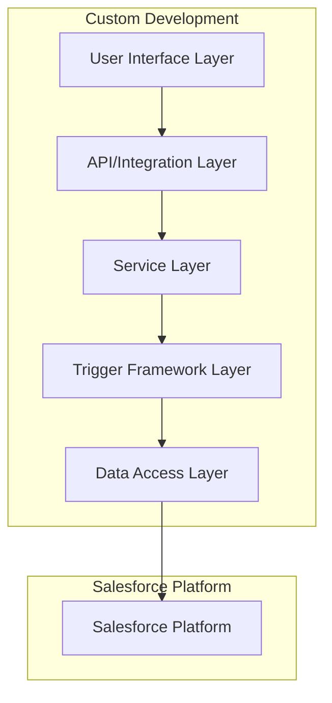
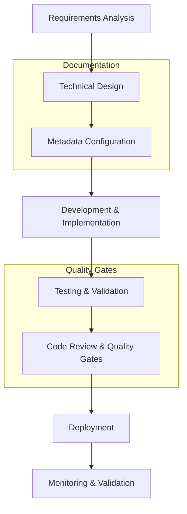

# Development Guide

> **Enterprise Salesforce Development Standards & Best Practices**

This comprehensive guide establishes the development standards, architectural patterns, and best practices for building scalable, maintainable Salesforce solutions. It covers the metadata-driven trigger framework, enterprise naming conventions, comprehensive documentation standards, and modern permission management strategies.

## Table of Contents

- [🎯 Overview](#-overview)
- [🏗️ Architecture & Design Principles](#️-architecture--design-principles)
- [⚡ Trigger Framework Implementation](#-trigger-framework-implementation)
- [📋 Naming Conventions & Standards](#-naming-conventions--standards)
- [📚 Documentation Standards](#-documentation-standards)
- [🔐 Permission Management Strategy](#-permission-management-strategy)
- [🔄 Development Workflow](#-development-workflow)
- [✅ Quality Assurance & Testing](#-quality-assurance--testing)
- [🛡️ Security & Compliance](#️-security--compliance)
- [🚀 Performance Optimization](#-performance-optimization)
- [📊 Monitoring & Observability](#-monitoring--observability)
- [🧪 Examples & Implementation Patterns](#-examples--implementation-patterns)
- [🔧 Troubleshooting & Maintenance](#-troubleshooting--maintenance)

## 🎯 Overview

This project implements enterprise-grade development standards designed to ensure scalability, maintainability, and consistency across all Salesforce customizations. Our approach emphasizes:

- **Metadata-Driven Architecture**: Configuration over customization
- **Standardized Naming**: KS_ prefix convention for organizational consistency
- **Comprehensive Documentation**: Self-documenting code and metadata
- **Permission Set Strategy**: Feature-based security model
- **Quality-First Approach**: Automated testing and validation
- **Performance Excellence**: Optimized for bulk operations and scalability

### Core Principles

1. **Configuration Over Customization**: Leverage metadata-driven patterns
2. **Separation of Concerns**: Clear architectural boundaries
3. **Testability**: Design for comprehensive test coverage
4. **Security by Design**: Built-in security considerations
5. **Performance First**: Optimized for enterprise-scale operations
6. **Documentation as Code**: Living documentation that evolves with implementation

## 🏗️ Architecture & Design Principles

### Enterprise Architecture Overview

Our Salesforce architecture follows a layered approach with clear separation of concerns:



### Design Patterns & Standards

#### 1. Metadata-Driven Configuration
```apex
/**
 * @description Configuration service that loads settings from custom metadata
 * @example
 * String setting = KS_ConfigurationService.getSetting('Territory', 'DefaultAssignment');
 */
public class KS_ConfigurationService {
    
    private static Map<String, Map<String, String>> configCache = new Map<String, Map<String, String>>();
    
    /**
     * @description Retrieves configuration value by category and key
     * @param category Configuration category (e.g., 'Territory', 'Integration')
     * @param key Specific configuration key
     * @return Configuration value or null if not found
     */
    public static String getSetting(String category, String key) {
        if (!configCache.containsKey(category)) {
            loadCategoryConfiguration(category);
        }
        
        Map<String, String> categoryConfig = configCache.get(category);
        return categoryConfig != null ? categoryConfig.get(key) : null;
    }
    
    /**
     * @description Loads configuration for a specific category from custom metadata
     * @param category Configuration category to load
     */
    private static void loadCategoryConfiguration(String category) {
        Map<String, String> categoryMap = new Map<String, String>();
        
        for (KS_Configuration__mdt config : [
            SELECT DeveloperName, KS_Value__c 
            FROM KS_Configuration__mdt 
            WHERE KS_Category__c = :category 
            AND KS_Active__c = true
        ]) {
            categoryMap.put(config.DeveloperName, config.KS_Value__c);
        }
        
        configCache.put(category, categoryMap);
    }
}
```

#### 2. Service Layer Pattern
```apex
/**
 * @description Territory service handling all territory-related business logic
 * @group Territory Management
 */
public with sharing class KS_TerritoryService {
    
    private static final String CONFIG_CATEGORY = 'Territory';
    
    /**
     * @description Assigns territories to accounts based on business rules
     * @param accounts List of accounts to process
     * @return Map of account IDs to assigned territories
     */
    public static Map<Id, String> assignTerritories(List<Account> accounts) {
        Map<Id, String> assignments = new Map<Id, String>();
        
        // Load territory mapping rules
        Map<String, String> mappingRules = loadTerritoryMappings();
        
        // Process each account
        for (Account acc : accounts) {
            String territory = determineTerritoryForAccount(acc, mappingRules);
            if (String.isNotBlank(territory)) {
                assignments.put(acc.Id, territory);
            }
        }
        
        return assignments;
    }
    
    /**
     * @description Validates territory assignments against business rules
     * @param assignments Map of account IDs to territories
     * @return List of validation errors
     */
    public static List<String> validateTerritoryAssignments(Map<Id, String> assignments) {
        List<String> errors = new List<String>();
        
        // Validate territory exists
        Set<String> validTerritories = getValidTerritories();
        
        for (Id accountId : assignments.keySet()) {
            String territory = assignments.get(accountId);
            if (!validTerritories.contains(territory)) {
                errors.add('Invalid territory: ' + territory + ' for account: ' + accountId);
            }
        }
        
        return errors;
    }
    
    // Private helper methods...
    private static Map<String, String> loadTerritoryMappings() {
        // Implementation details
        return new Map<String, String>();
    }
    
    private static String determineTerritoryForAccount(Account acc, Map<String, String> mappingRules) {
        // Business logic for territory determination
        return null;
    }
    
    private static Set<String> getValidTerritories() {
        // Load valid territories from metadata
        return new Set<String>();
    }
}
```

#### 3. Factory Pattern for Test Data
```apex
/**
 * @description Test data factory for creating consistent test data
 * @group Testing Utilities
 */
@IsTest
public class KS_TestDataFactory {
    
    /**
     * @description Creates test accounts with specified parameters
     * @param count Number of accounts to create
     * @param params Additional parameters for account creation
     * @return List of created test accounts
     */
    public static List<Account> createTestAccounts(Integer count, Map<String, Object> params) {
        List<Account> accounts = new List<Account>();
        
        for (Integer i = 0; i < count; i++) {
            Account acc = new Account(
                Name = 'Test Account ' + i,
                Type = (String) params.get('Type'),
                Industry = (String) params.get('Industry')
            );
            
            // Apply custom parameters
            if (params.containsKey('BillingPostalCode')) {
                acc.BillingPostalCode = (String) params.get('BillingPostalCode');
            }
            
            accounts.add(acc);
        }
        
        insert accounts;
        return accounts;
    }
    
    /**
     * @description Creates territory mapping test data
     * @param mappings Map of postal codes to territories
     * @return List of created territory mappings
     */
    public static List<KS_TerritoryMapping__c> createTerritoryMappings(Map<String, String> mappings) {
        List<KS_TerritoryMapping__c> territoryMappings = new List<KS_TerritoryMapping__c>();
        
        for (String postalCode : mappings.keySet()) {
            territoryMappings.add(new KS_TerritoryMapping__c(
                Name = 'Test Mapping ' + postalCode,
                KS_PostalCode__c = postalCode,
                KS_TerritoryName__c = mappings.get(postalCode)
            ));
        }
        
        insert territoryMappings;
        return territoryMappings;
    }
}
```

#### 4. Error Handling Framework
```apex
/**
 * @description Centralized error handling and logging service
 * @group System Utilities
 */
public class KS_ErrorHandlingService {
    
    /**
     * @description Logs error and returns user-friendly message
     * @param error Exception to log
     * @param context Additional context information
     * @return User-friendly error message
     */
    public static String handleError(Exception error, String context) {
        // Log technical details
        System.debug(LoggingLevel.ERROR, 'Error in ' + context + ': ' + error.getMessage());
        System.debug(LoggingLevel.ERROR, 'Stack trace: ' + error.getStackTraceString());
        
        // Create error log record
        createErrorLog(error, context);
        
        // Return user-friendly message
        return getUserFriendlyMessage(error);
    }
    
    /**
     * @description Creates error log record for monitoring
     * @param error Exception to log
     * @param context Additional context
     */
    private static void createErrorLog(Exception error, String context) {
        try {
            KS_ErrorLog__c errorLog = new KS_ErrorLog__c(
                KS_Context__c = context,
                KS_ErrorMessage__c = error.getMessage(),
                KS_StackTrace__c = error.getStackTraceString(),
                KS_ErrorType__c = error.getTypeName(),
                KS_Timestamp__c = DateTime.now()
            );
            insert errorLog;
        } catch (Exception logError) {
            // Fallback: at least log to debug
            System.debug(LoggingLevel.ERROR, 'Failed to create error log: ' + logError.getMessage());
        }
    }
    
    private static String getUserFriendlyMessage(Exception error) {
        // Map technical errors to user-friendly messages
        Map<String, String> errorMappings = new Map<String, String>{
            'DmlException' => 'Unable to save your changes. Please check required fields and try again.',
            'QueryException' => 'Unable to retrieve data. Please contact your administrator.',
            'CalloutException' => 'External service is temporarily unavailable. Please try again later.'
        };
        
        String errorType = error.getTypeName();
        return errorMappings.containsKey(errorType) ? 
               errorMappings.get(errorType) : 
               'An unexpected error occurred. Please contact your administrator.';
    }
}
```

## ⚡ Trigger Framework Implementation

### Framework Architecture

Our metadata-driven trigger framework provides enterprise-grade automation capabilities with the following features:

- **Scalable Architecture**: Handle complex business logic without code conflicts
- **Metadata Configuration**: Configure trigger behavior without code deployments  
- **Flow Integration**: Seamless integration with Salesforce Flow
- **Error Handling**: Comprehensive error management and logging
- **Bulk Processing**: Efficient handling of large data volumes
- **Order Management**: Configurable execution order for multiple actions
- **Conditional Execution**: Entry criteria for selective processing

### Core Framework Components

#### 1. MetadataTriggerHandler
The central orchestrator that manages trigger execution based on metadata configuration:

```apex
/**
 * @description Metadata-driven trigger handler that executes actions based on configuration
 * @author Mitch Spano
 * @see https://github.com/mitchspano/apex-trigger-actions-framework
 */
public inherited sharing class MetadataTriggerHandler extends TriggerBase {
    
    @TestVisible
    private List<TriggerAction.BeforeInsert> beforeInsertActions;
    @TestVisible
    private List<TriggerAction.AfterInsert> afterInsertActions;
    @TestVisible
    private List<TriggerAction.BeforeUpdate> beforeUpdateActions;
    @TestVisible  
    private List<TriggerAction.AfterUpdate> afterUpdateActions;
    @TestVisible
    private List<TriggerAction.BeforeDelete> beforeDeleteActions;
    @TestVisible
    private List<TriggerAction.AfterDelete> afterDeleteActions;
    @TestVisible
    private List<TriggerAction.AfterUndelete> afterUndeleteActions;
    
    public void run() {
        if (!shouldRun()) {
            return;
        }
        
        switch on Trigger.operationType {
            when BEFORE_INSERT {
                this.beforeInsert(Trigger.new);
            }
            when AFTER_INSERT {
                this.afterInsert(Trigger.new);
            }
            when BEFORE_UPDATE {
                this.beforeUpdate(Trigger.new, Trigger.old);
            }
            when AFTER_UPDATE {
                this.afterUpdate(Trigger.new, Trigger.old);
            }
            when BEFORE_DELETE {
                this.beforeDelete(Trigger.old);
            }
            when AFTER_DELETE {
                this.afterDelete(Trigger.old);
            }
            when AFTER_UNDELETE {
                this.afterUndelete(Trigger.new);
            }
        }
    }
    
    private Boolean shouldRun() {
        return !TriggerBase.isBypassed(String.valueOf(this).substring(0,String.valueOf(this).indexOf(':')));
    }
}
```

#### 2. TriggerAction Interfaces
Standard interfaces that all trigger actions must implement:

```apex
/**
 * @description Interface definitions for trigger actions
 */
public interface TriggerAction {
    
    // Before trigger interfaces
    interface BeforeInsert {
        void beforeInsert(List<SObject> newList);
    }
    
    interface BeforeUpdate {
        void beforeUpdate(List<SObject> newList, List<SObject> oldList);
    }
    
    interface BeforeDelete {
        void beforeDelete(List<SObject> oldList);
    }
    
    // After trigger interfaces
    interface AfterInsert {
        void afterInsert(List<SObject> newList);
    }
    
    interface AfterUpdate {
        void afterUpdate(List<SObject> newList, List<SObject> oldList);
    }
    
    interface AfterDelete {
        void afterDelete(List<SObject> oldList);
    }
    
    interface AfterUndelete {
        void afterUndelete(List<SObject> newList);
    }
    
    // Async finalizer interface
    interface DmlFinalizer {
        void execute(FinalizerContext context);
    }
}
```

#### 3. Trigger Action Implementation Pattern
```apex
/**
 * @description Example trigger action implementing multiple interfaces
 * @group Account Management
 * @author Development Team
 * @date 2025-01-20
 */
public class KS_AccountValidationAction implements TriggerAction.BeforeInsert, TriggerAction.BeforeUpdate {
    
    private static final String ERROR_ACCOUNT_NAME = 'Account Name is required and must be meaningful';
    private static final String ERROR_ACCOUNT_TYPE = 'Account Type must be specified for proper categorization';
    private static final String ERROR_PHONE_FORMAT = 'Phone number must be in valid format (e.g., +1-555-123-4567)';
    
    public void beforeInsert(List<SObject> newList) {
        validateAccounts((List<Account>) newList);
    }
    
    public void beforeUpdate(List<SObject> newList, List<SObject> oldList) {
        // Only validate changed records
        List<Account> accountsToValidate = filterChangedAccounts(
            (List<Account>) newList, 
            (List<Account>) oldList
        );
        
        if (!accountsToValidate.isEmpty()) {
            validateAccounts(accountsToValidate);
        }
    }
    
    /**
     * @description Validates account records against business rules
     * @param accounts List of accounts to validate
     */
    private void validateAccounts(List<Account> accounts) {
        try {
            for (Account acc : accounts) {
                validateAccountName(acc);
                validateAccountType(acc);
                validatePhoneFormat(acc);
                validateBusinessSpecificRules(acc);
            }
        } catch (Exception e) {
            // Log error for monitoring
            KS_ErrorHandlingService.handleError(e, 'KS_AccountValidationAction.validateAccounts');
            
            // Add user-friendly error to record
            if (!accounts.isEmpty()) {
                accounts[0].addError('Validation failed. Please check your data and try again.');
            }
        }
    }
    
    /**
     * @description Validates account name meets business requirements
     * @param acc Account to validate
     */
    private void validateAccountName(Account acc) {
        if (String.isBlank(acc.Name)) {
            acc.addError(ERROR_ACCOUNT_NAME);
            return;
        }
        
        // Additional business rules
        if (acc.Name.length() < 3) {
            acc.addError('Account Name must be at least 3 characters long');
        }
        
        if (acc.Name.containsIgnoreCase('test') && !Test.isRunningTest()) {
            acc.addError('Test accounts are not allowed in production');
        }
    }
    
    /**
     * @description Validates account type is appropriate
     * @param acc Account to validate
     */
    private void validateAccountType(Account acc) {
        if (String.isBlank(acc.Type)) {
            acc.addError(ERROR_ACCOUNT_TYPE);
            return;
        }
        
        // Load valid types from configuration
        Set<String> validTypes = getValidAccountTypes();
        if (!validTypes.contains(acc.Type)) {
            acc.addError('Invalid Account Type: ' + acc.Type);
        }
    }
    
    /**
     * @description Validates phone number format if provided
     * @param acc Account to validate
     */
    private void validatePhoneFormat(Account acc) {
        if (String.isNotBlank(acc.Phone)) {
            Pattern phonePattern = Pattern.compile('^\\+?[1-9]\\d{1,14}$');
            if (!phonePattern.matcher(acc.Phone.replaceAll('[^\\d+]', '')).matches()) {
                acc.addError(ERROR_PHONE_FORMAT);
            }
        }
    }
    
    /**
     * @description Applies additional business-specific validation rules
     * @param acc Account to validate
     */
    private void validateBusinessSpecificRules(Account acc) {
        // Industry-specific validations
        if (acc.Industry == 'Healthcare' && String.isBlank(acc.KS_ComplianceLevel__c)) {
            acc.addError('Compliance Level is required for Healthcare accounts');
        }
        
        // Territory validation
        if (String.isNotBlank(acc.KS_Territory__c)) {
            Set<String> validTerritories = KS_TerritoryService.getValidTerritories();
            if (!validTerritories.contains(acc.KS_Territory__c)) {
                acc.addError('Invalid Territory assignment: ' + acc.KS_Territory__c);
            }
        }
    }
    
    /**
     * @description Filters accounts that have validation-relevant changes
     * @param newAccounts Updated accounts
     * @param oldAccounts Previous account values
     * @return Accounts that need validation
     */
    private List<Account> filterChangedAccounts(List<Account> newAccounts, List<Account> oldAccounts) {
        List<Account> changedAccounts = new List<Account>();
        Map<Id, Account> oldAccountMap = new Map<Id, Account>(oldAccounts);
        
        for (Account newAcc : newAccounts) {
            Account oldAcc = oldAccountMap.get(newAcc.Id);
            
            if (hasValidationRelevantChanges(newAcc, oldAcc)) {
                changedAccounts.add(newAcc);
            }
        }
        
        return changedAccounts;
    }
    
    /**
     * @description Checks if validation-relevant fields have changed
     * @param newAcc Updated account
     * @param oldAcc Previous account values
     * @return True if validation is needed
     */
    private Boolean hasValidationRelevantChanges(Account newAcc, Account oldAcc) {
        return newAcc.Name != oldAcc.Name ||
               newAcc.Type != oldAcc.Type ||
               newAcc.Phone != oldAcc.Phone ||
               newAcc.Industry != oldAcc.Industry ||
               newAcc.KS_Territory__c != oldAcc.KS_Territory__c;
    }
    
    /**
     * @description Retrieves valid account types from configuration
     * @return Set of valid account types
     */
    private Set<String> getValidAccountTypes() {
        // Load from custom metadata or configuration
        return new Set<String>{
            'Customer - Direct',
            'Customer - Channel',
            'Prospect',
            'Partner',
            'Competitor'
        };
    }
}
```

### Metadata Configuration Schema

The trigger framework uses custom metadata types to configure behavior:

#### Trigger_Action__mdt Schema
```xml
<?xml version="1.0" encoding="UTF-8"?>
<CustomMetadata xmlns="http://soap.sforce.com/2006/04/metadata" xmlns:xsi="http://www.w3.org/2001/XMLSchema-instance" xmlns:xsd="http://www.w3.org/2001/XMLSchema">
    <description>Configuration for trigger actions in the metadata-driven framework</description>
    <label>Trigger Action</label>
    <pluralLabel>Trigger Actions</pluralLabel>
    
    <!-- Core Configuration Fields -->
    <fields>
        <fullName>KS_Apex_Class_Name__c</fullName>
        <description>Name of the Apex class that implements the trigger action logic. Must implement appropriate TriggerAction interface(s).</description>
        <label>Apex Class Name</label>
        <type>Text</type>
        <length>255</length>
        <required>true</required>
    </fields>
    
    <fields>
        <fullName>KS_Object_API_Name__c</fullName>
        <description>API name of the SObject this trigger action applies to (e.g., Account, Contact, Custom_Object__c).</description>
        <label>Object API Name</label>
        <type>Text</type>
        <length>255</length>
        <required>true</required>
    </fields>
    
    <fields>
        <fullName>KS_Trigger_Context__c</fullName>
        <description>Trigger contexts where this action should execute. Separate multiple contexts with semicolons (e.g., "Before Insert;Before Update").</description>
        <label>Trigger Context</label>
        <type>Text</type>
        <length>255</length>
        <required>true</required>
    </fields>
    
    <fields>
        <fullName>KS_Order__c</fullName>
        <description>Execution order for this action when multiple actions exist for the same trigger context. Lower numbers execute first.</description>
        <label>Order</label>
        <type>Number</type>
        <precision>3</precision>
        <scale>0</scale>
        <required>true</required>
    </fields>
    
    <fields>
        <fullName>KS_Active__c</fullName>
        <description>Whether this trigger action is currently active. Inactive actions are skipped during execution.</description>
        <label>Active</label>
        <type>Checkbox</type>
        <defaultValue>true</defaultValue>
    </fields>
    
    <!-- Advanced Configuration -->
    <fields>
        <fullName>KS_Entry_Criteria__c</fullName>
        <description>Formula expression that determines when this action should execute. Leave blank to always execute. Use Salesforce formula syntax.</description>
        <label>Entry Criteria</label>
        <type>LongTextArea</type>
        <length>1000</length>
    </fields>
    
    <fields>
        <fullName>KS_Description__c</fullName>
        <description>Detailed description of what this trigger action does, including business logic and impact.</description>
        <label>Description</label>
        <type>LongTextArea</type>
        <length>2000</length>
        <required>true</required>
    </fields>
    
    <fields>
        <fullName>KS_Environment__c</fullName>
        <description>Environments where this action should be active (Production, Sandbox, All). Defaults to All.</description>
        <label>Environment</label>
        <type>Picklist</type>
        <valueSet>
            <valueSetDefinition>
                <value>
                    <fullName>All</fullName>
                    <default>true</default>
                    <label>All</label>
                </value>
                <value>
                    <fullName>Production</fullName>
                    <default>false</default>
                    <label>Production</label>
                </value>
                <value>
                    <fullName>Sandbox</fullName>
                    <default>false</default>
                    <label>Sandbox</label>
                </value>
            </valueSetDefinition>
        </valueSet>
    </fields>
</CustomMetadata>
```

### Flow Integration

The framework seamlessly integrates with Salesforce Flow through TriggerActionFlow metadata:

#### TriggerActionFlow__mdt Configuration
```xml
<?xml version="1.0" encoding="UTF-8"?>
<TriggerActionFlow xmlns="http://soap.sforce.com/2006/04/metadata">
    <fullName>KS_Account_Territory_Assignment_Flow</fullName>
    <label>Account Territory Assignment Flow</label>
    <description>
    Executes the KS_Account_Territory_Assignment flow for automatic territory assignment
    when accounts are created or their address information changes.
    </description>
    <values>
        <field>KS_Flow_Name__c</field>
        <value>KS_Account_Territory_Assignment</value>
    </values>
    <values>
        <field>KS_Object_API_Name__c</field>
        <value>Account</value>
    </values>
    <values>
        <field>KS_Trigger_Context__c</field>
        <value>After Insert;After Update</value>
    </values>
    <values>
        <field>KS_Order__c</field>
        <value>20</value>
    </values>
    <values>
        <field>KS_Active__c</field>
        <value>true</value>
    </values>
    <values>
        <field>KS_Entry_Criteria__c</field>
        <value>NOT(ISBLANK(BillingPostalCode))</value>
    </values>
</TriggerActionFlow>
```

### Advanced Framework Features

#### 1. Bypass Mechanism
```apex
/**
 * @description Service for managing trigger bypass functionality
 * @group System Utilities
 */
public class KS_TriggerBypassService {
    
    private static Set<String> bypassedTriggers = new Set<String>();
    
    /**
     * @description Bypasses trigger execution for specific objects
     * @param objectNames List of object names to bypass
     */
    public static void bypass(List<String> objectNames) {
        bypassedTriggers.addAll(objectNames);
    }
    
    /**
     * @description Removes bypass for specific objects
     * @param objectNames List of object names to remove bypass
     */
    public static void clearBypass(List<String> objectNames) {
        for (String objectName : objectNames) {
            bypassedTriggers.remove(objectName);
        }
    }
    
    /**
     * @description Checks if trigger is bypassed for object
     * @param objectName Object name to check
     * @return True if trigger is bypassed
     */
    public static Boolean isBypassed(String objectName) {
        return bypassedTriggers.contains(objectName);
    }
    
    /**
     * @description Clears all bypasses
     */
    public static void clearAllBypasses() {
        bypassedTriggers.clear();
    }
}
```

#### 2. Conditional Execution
```apex
/**
 * @description Evaluates entry criteria for trigger actions
 * @group Trigger Framework
 */
public class KS_TriggerCriteriaEvaluator {
    
    /**
     * @description Evaluates formula criteria against records
     * @param records Records to evaluate
     * @param criteria Formula criteria string
     * @return List of records that meet criteria
     */
    public static List<SObject> evaluateCriteria(List<SObject> records, String criteria) {
        if (String.isBlank(criteria)) {
            return records; // No criteria means all records qualify
        }
        
        List<SObject> qualifyingRecords = new List<SObject>();
        
        try {
            // Parse and evaluate formula criteria
            for (SObject record : records) {
                if (evaluateFormulaForRecord(record, criteria)) {
                    qualifyingRecords.add(record);
                }
            }
        } catch (Exception e) {
            // Log evaluation error and return all records to prevent blocking
            System.debug(LoggingLevel.ERROR, 'Criteria evaluation failed: ' + e.getMessage());
            return records;
        }
        
        return qualifyingRecords;
    }
    
    /**
     * @description Evaluates formula criteria for a single record
     * @param record SObject record to evaluate
     * @param criteria Formula criteria
     * @return True if record meets criteria
     */
    private static Boolean evaluateFormulaForRecord(SObject record, String criteria) {
        // Implementation would parse and evaluate Salesforce formula syntax
        // This is a simplified version - full implementation would use formula engine
        
        // Handle common patterns
        if (criteria.contains('NOT(ISBLANK(')) {
            String fieldName = extractFieldNameFromFormula(criteria, 'NOT(ISBLANK(', '))');
            Object fieldValue = record.get(fieldName);
            return fieldValue != null && String.valueOf(fieldValue) != '';
        }
        
        if (criteria.contains('ISBLANK(')) {
            String fieldName = extractFieldNameFromFormula(criteria, 'ISBLANK(', ')');
            Object fieldValue = record.get(fieldName);
            return fieldValue == null || String.valueOf(fieldValue) == '';
        }
        
        // Default to true for unrecognized criteria
        return true;
    }
    
    private static String extractFieldNameFromFormula(String formula, String startPattern, String endPattern) {
        Integer startIndex = formula.indexOf(startPattern) + startPattern.length();
        Integer endIndex = formula.indexOf(endPattern, startIndex);
        return formula.substring(startIndex, endIndex);
    }
}
```

### Implementation Best Practices

#### 1. Action Design Principles
- **Single Responsibility**: Each action should have one clear purpose
- **Idempotent Operations**: Actions should be safe to run multiple times
- **Bulk Processing**: Always handle collections, not individual records
- **Error Isolation**: Errors in one action shouldn't affect others
- **Performance Optimization**: Minimize SOQL queries and DML operations

#### 2. Testing Strategy
```apex
/**
 * @description Test class for trigger framework actions
 * @group Testing
 */
@IsTest
private class KS_AccountValidationActionTest {
    
    @TestSetup
    static void setupTestData() {
        // Create test territory mappings
        KS_TestDataFactory.createTerritoryMappings(new Map<String, String>{
            '12345' => 'West Coast',
            '67890' => 'East Coast'
        });
    }
    
    @IsTest
    static void testValidAccountCreation() {
        // Test successful account creation
        Test.startTest();
        
        List<Account> accounts = KS_TestDataFactory.createTestAccounts(5, new Map<String, Object>{
            'Type' => 'Customer - Direct',
            'Industry' => 'Technology'
        });
        
        Test.stopTest();
        
        // Verify no errors occurred
        List<Account> createdAccounts = [SELECT Id, Name, Type FROM Account WHERE Id IN :accounts];
        Assert.areEqual(5, createdAccounts.size(), 'All accounts should be created successfully');
    }
    
    @IsTest
    static void testValidationErrors() {
        // Test validation failures  
        List<Account> invalidAccounts = new List<Account>{
            new Account(Name = '', Type = 'Customer - Direct'), // Missing name
            new Account(Name = 'Valid Name', Type = ''), // Missing type
            new Account(Name = 'Test Account', Type = 'Invalid Type') // Invalid type
        };
        
        Test.startTest();
        
        Database.SaveResult[] results = Database.insert(invalidAccounts, false);
        
        Test.stopTest();
        
        // Verify validation errors
        for (Database.SaveResult result : results) {
            Assert.isFalse(result.isSuccess(), 'Invalid accounts should fail validation');
            Assert.isTrue(result.getErrors().size() > 0, 'Should have validation errors');
        }
    }
    
    @IsTest  
    static void testBulkProcessing() {
        // Test bulk processing capabilities
        List<Account> bulkAccounts = KS_TestDataFactory.createTestAccounts(200, new Map<String, Object>{
            'Type' => 'Customer - Direct'
        });
        
        Test.startTest();
        
        // Update all accounts to trigger validation
        for (Account acc : bulkAccounts) {
            acc.Phone = '+1-555-123-4567';
        }
        
        update bulkAccounts;
        
        Test.stopTest();
        
        // Verify all updates succeeded
        List<Account> updatedAccounts = [SELECT Id, Phone FROM Account WHERE Id IN :bulkAccounts];
        Assert.areEqual(200, updatedAccounts.size(), 'All bulk updates should succeed');
    }
}
```

## 📋 Naming Conventions & Standards

### Enterprise Naming Framework

All custom metadata must adhere to the **KS_** prefix convention to ensure organizational consistency, avoid conflicts, and provide clear identification of custom components.

#### Naming Convention Matrix

| Component Type | Pattern | Example | Notes |
|---------------|---------|---------|--------|
| **Custom Objects** | `KS_[BusinessEntity][Context]__c` | `KS_ProjectTask__c` | Use PascalCase, describe business entity |
| **Custom Fields** | `KS_[Purpose][Detail]__c` | `KS_Territory__c` | Descriptive of field purpose |
| **Apex Classes** | `KS_[Object][Purpose][Type]` | `KS_AccountTerritoryService` | Include object and class type |
| **Flows** | `KS_[Object]_[Purpose]_[Action]` | `KS_Account_Territory_Assignment` | Use underscore separation |
| **Custom Metadata** | `KS_[Purpose][Settings]__mdt` | `KS_TerritorySettings__mdt` | Indicate configuration purpose |
| **Permission Sets** | `KS_[Feature][Level]` | `KS_AccountTerritoryManagement` | Feature-based grouping |
| **Custom Labels** | `KS_[Context]_[Purpose]` | `KS_Error_InvalidTerritory` | Organized by context |
| **Lightning Components** | `ks[Purpose][Component]` | `ksTerritoryAssignment` | camelCase for LWC |

### Detailed Naming Standards

#### 1. Custom Objects
```xml
<!-- ✅ Correct Examples -->
<CustomObject>
    <fullName>KS_ProjectTask__c</fullName>
    <label>Project Task</label>
    <pluralLabel>Project Tasks</pluralLabel>
</CustomObject>

<CustomObject>
    <fullName>KS_TerritoryMapping__c</fullName>
    <label>Territory Mapping</label>
    <pluralLabel>Territory Mappings</pluralLabel>
</CustomObject>

<!-- ❌ Incorrect Examples -->
<CustomObject>
    <fullName>ProjectTask__c</fullName> <!-- Missing KS_ prefix -->
</CustomObject>

<CustomObject>
    <fullName>My_ProjectTask__c</fullName> <!-- Wrong prefix -->
</CustomObject>
```

#### 2. Custom Fields
```xml
<!-- ✅ Correct Examples -->
<CustomField>
    <fullName>KS_Territory__c</fullName>
    <label>Territory</label>
    <description>Sales territory assigned to this account based on billing postal code.</description>
</CustomField>

<CustomField>
    <fullName>KS_TerritoryAssignedDate__c</fullName>
    <label>Territory Assigned Date</label>
    <description>Date when the territory was last assigned to this record.</description>
</CustomField>

<CustomField>
    <fullName>KS_ProjectStatus__c</fullName>
    <label>Project Status</label>
    <description>Current status of the project in the workflow lifecycle.</description>
</CustomField>

<!-- ❌ Incorrect Examples -->
<CustomField>
    <fullName>Territory__c</fullName> <!-- Missing KS_ prefix -->
</CustomField>

<CustomField>
    <fullName>Custom_Territory__c</fullName> <!-- Wrong prefix -->
</CustomField>
```

#### 3. Apex Classes
```apex
// ✅ Correct Examples
public class KS_AccountTerritoryService {
    // Service class for account territory logic
}

public class KS_ProjectTaskController {
    // Lightning component controller
}

public class KS_TerritoryMappingBatch implements Database.Batchable<SObject> {
    // Batch processing class  
}

public class KS_AccountValidationAction implements TriggerAction.BeforeInsert {
    // Trigger action class
}

// ❌ Incorrect Examples
public class AccountTerritoryService { // Missing KS_ prefix
}

public class CustomAccountHandler { // Wrong prefix pattern
}
```

#### 4. Flow Naming
```
✅ Correct Examples:
- KS_Account_Territory_Assignment
- KS_Project_Task_Creation  
- KS_Lead_Qualification_Process
- KS_Opportunity_Stage_Validation

❌ Incorrect Examples:
- Account_Territory_Assignment  (Missing KS_ prefix)
- KS-Account-Territory (Wrong separator)
- KSAccountTerritory (Missing separators)
```

#### 5. Permission Set Naming
```
✅ Correct Examples:
- KS_AccountTerritoryManagement
- KS_ProjectTaskExecution
- KS_IntegrationMonitoring          (System integration oversight)
- KS_ReportingAdvanced

❌ Incorrect Examples:
- AccountPermissions (Missing KS_ prefix)
- KS_UserPermissions (Too generic)
- Territory_Management (Wrong format)
```

### Context-Specific Naming Guidelines

#### Business Domain Prefixes
For large organizations, consider adding business domain context:

```
KS_[Domain]_[Entity]_[Purpose]

Examples:
- KS_Sales_Account_Territory_Assignment
- KS_Service_Case_Escalation_Process  
- KS_Marketing_Lead_Scoring_Automation
```

#### Integration Naming
For integration-related components:

```
KS_[System]_[Direction]_[Entity]

Examples:
- KS_SAP_Inbound_Customer_Sync
- KS_Workday_Outbound_Employee_Update
- KS_DocuSign_Bidirectional_Contract_Status
```

#### Test Class Naming
```apex
/**
 * @description Test class for trigger framework actions
 * @group Testing
 */
@IsTest
private class KS_AccountValidationActionTest {
    
    @TestSetup
    static void setupTestData() {
        // Create test territory mappings
        KS_TestDataFactory.createTerritoryMappings(new Map<String, String>{
            '12345' => 'West Coast',
            '67890' => 'East Coast'
        });
    }
    
    @IsTest
    static void testValidAccountCreation() {
        // Test successful account creation
        Test.startTest();
        
        List<Account> accounts = KS_TestDataFactory.createTestAccounts(5, new Map<String, Object>{
            'Type' => 'Customer - Direct',
            'Industry' => 'Technology'
        });
        
        Test.stopTest();
        
        // Verify no errors occurred
        List<Account> createdAccounts = [SELECT Id, Name, Type FROM Account WHERE Id IN :accounts];
        Assert.areEqual(5, createdAccounts.size(), 'All accounts should be created successfully');
    }
    
    @IsTest
    static void testValidationErrors() {
        // Test validation failures  
        List<Account> invalidAccounts = new List<Account>{
            new Account(Name = '', Type = 'Customer - Direct'), // Missing name
            new Account(Name = 'Valid Name', Type = ''), // Missing type
            new Account(Name = 'Test Account', Type = 'Invalid Type') // Invalid type
        };
        
        Test.startTest();
        
        Database.SaveResult[] results = Database.insert(invalidAccounts, false);
        
        Test.stopTest();
        
        // Verify validation errors
        for (Database.SaveResult result : results) {
            Assert.isFalse(result.isSuccess(), 'Invalid accounts should fail validation');
            Assert.isTrue(result.getErrors().size() > 0, 'Should have validation errors');
        }
    }
    
    @IsTest  
    static void testBulkProcessing() {
        // Test bulk processing capabilities
        List<Account> bulkAccounts = KS_TestDataFactory.createTestAccounts(200, new Map<String, Object>{
            'Type' => 'Customer - Direct'
        });
        
        Test.startTest();
        
        // Update all accounts to trigger validation
        for (Account acc : bulkAccounts) {
            acc.Phone = '+1-555-123-4567';
        }
        
        update bulkAccounts;
        
        Test.stopTest();
        
        // Verify all updates succeeded
        List<Account> updatedAccounts = [SELECT Id, Phone FROM Account WHERE Id IN :bulkAccounts];
        Assert.areEqual(200, updatedAccounts.size(), 'All bulk updates should succeed');
    }
}
```

## 📚 Documentation Standards

### Comprehensive Documentation Framework

Every piece of custom metadata must include thorough, business-focused documentation that serves both technical and functional stakeholders.

#### Documentation Requirements Matrix

| Component | Required Documentation | Minimum Length | Examples Required |
|-----------|----------------------|----------------|-------------------|
| **Custom Objects** | Purpose, usage, relationships | 100+ characters | Yes |
| **Custom Fields** | Business purpose, data source, usage | 50+ characters | When complex |
| **Apex Classes** | ApexDoc headers, method docs | Full coverage | Yes |
| **Flows** | Process description, decision logic | 150+ characters | No |
| **Permission Sets** | Target audience, capabilities | 100+ characters | No |
| **Custom Metadata** | Configuration purpose, usage | 75+ characters | When applicable |

### Field Documentation Standards

#### Comprehensive Field Descriptions
```xml
<!-- ✅ Excellent Field Documentation -->
<CustomField>
    <fullName>KS_Territory__c</fullName>
    <label>Territory</label>
    <description>
    Specifies the sales territory assigned to this account based on billing postal code mapping.
    Used for territory management, sales representative assignment, and commission calculations.
    Automatically updated by the KS_Account_Territory_Assignment automation when billing address changes.
    Valid values are maintained in KS_TerritoryMapping__c custom metadata.
    </description>
    <helpText>
    Territory is automatically assigned based on your billing postal code. 
    Contact your sales operations team if you believe the territory assignment is incorrect.
    </helpText>
</CustomField>

<CustomField>
    <fullName>KS_ProjectStatus__c</fullName>
    <label>Project Status</label>
    <description>
    Current lifecycle stage of the project. Controls visibility of project phases and available actions.
    Values: Not Started (initial), Planning (requirements gathering), In Progress (active development),
    Testing (quality assurance), On Hold (temporarily paused), Completed (delivered), 
    Cancelled (terminated). Used by project managers for status reporting and resource allocation.
    </description>
    <helpText>
    Select the current stage of your project. This determines which project phases are visible
    and what actions team members can perform on project tasks.
    </helpText>
</CustomField>

<!-- ❌ Poor Field Documentation -->
<CustomField>
    <fullName>KS_Territory__c</fullName>
    <description>Territory field</description> <!-- Too brief, no business context -->
</CustomField>

<CustomField>
    <fullName>KS_Status__c</fullName>
    <description>Status</description> <!-- Generic, no usage information -->
</CustomField>
```

#### Business-Focused Object Documentation
```xml
<!-- ✅ Comprehensive Object Documentation -->
<CustomObject>
    <fullName>KS_ProjectTask__c</fullName>
    <description>
    Represents individual work items within a project lifecycle, enabling detailed task management
    and progress tracking. Each task can be assigned to team members, linked to parent projects,
    and configured with dependencies on other tasks. Supports time tracking, milestone association,
    and automated status updates based on completion criteria.
    
    Key Features:
    - Hierarchical task relationships with parent/child dependencies
    - Integration with project timeline and resource management
    - Automated notifications for task assignments and status changes
    - Time tracking with actual vs estimated hours reporting
    - Integration with external project management tools via API
    
    Primary Users: Project Managers, Team Members, Resource Coordinators
    Integration Points: External PM tools, time tracking systems, resource planning applications
    </description>
    <label>Project Task</label>
    <pluralLabel>Project Tasks</pluralLabel>
</CustomObject>
```

### Apex Class Documentation Standards

#### ApexDoc Header Templates
```apex
/**
 * @description Comprehensive service class for managing account territory assignments based on
 *              configurable postal code mappings. Provides both synchronous and asynchronous
 *              processing capabilities with support for bulk operations and error handling.
 *              
 * @author Development Team
 * @date 2025-01-20
 * @version 2.1.0
 * @since API Version 58.0
 * 
 * @group Account Management
 * @see KS_TerritoryMapping__c
 * @see KS_AccountTerritoryAction
 * @see KS_TerritoryConfigurationService
 * 
 * @example
 * // Assign territories to a list of accounts
 * List<Account> accounts = [SELECT Id, BillingPostalCode FROM Account LIMIT 100];
 * Map<Id, String> assignments = KS_AccountTerritoryService.assignTerritories(accounts);
 * 
 * // Process assignments asynchronously
 * KS_AccountTerritoryService.assignTerritoriesAsync(accounts);
 * 
 * @changelog
 * v2.1.0 - Added async processing capability and improved error handling
 * v2.0.0 - Refactored to use metadata-driven configuration
 * v1.0.0 - Initial implementation with hardcoded mappings
 */
public with sharing class KS_AccountTerritoryService {
    
    /**
     * @description Assigns territories to accounts based on postal code mappings
     * @param accounts List of accounts to process for territory assignment
     * @return Map of account IDs to assigned territory names
     * @throws KS_TerritoryException when mapping configuration is invalid
     * @throws DmlException when territory assignment updates fail
     * 
     * @example
     * List<Account> accounts = [SELECT Id, BillingPostalCode FROM Account WHERE Territory__c = null];
     * Map<Id, String> assignments = KS_AccountTerritoryService.assignTerritories(accounts);
     * System.debug('Assigned territories to ' + assignments.size() + ' accounts');
     */
    public static Map<Id, String> assignTerritories(List<Account> accounts) {
        // Implementation details
        return new Map<Id, String>();
    }
    
    /**
     * @description Validates territory assignments against business rules and constraints
     * @param assignments Map of account IDs to proposed territory assignments
     * @return List of validation error messages, empty if all assignments are valid
     * 
     * @example  
     * Map<Id, String> assignments = new Map<Id, String>{'001xx000003DHYx' => 'West Coast'};
     * List<String> errors = KS_AccountTerritoryService.validateAssignments(assignments);
     * if (!errors.isEmpty()) {
     *     System.debug('Validation errors: ' + String.join(errors, '; '));
     * }
     */
    public static List<String> validateAssignments(Map<Id, String> assignments) {
        // Implementation details
        return new List<String>();
    }
}
```

#### Method Documentation Standards
```apex
/**
 * @description Processes territory assignments with comprehensive error handling and logging
 * @param accounts List of accounts requiring territory assignment
 * @param config Optional configuration parameters for assignment logic
 * @return ProcessingResult containing success/failure counts and detailed results
 * 
 * @throws ArgumentException when accounts list is null or empty
 * @throws ConfigurationException when territory mapping configuration is invalid
 * @throws SecurityException when user lacks required permissions
 * 
 * @example
 * List<Account> accounts = [SELECT Id, BillingPostalCode FROM Account WHERE KS_Territory__c = null];
 * Map<String, Object> config = new Map<String, Object>{'validateOnly' => false, 'batchSize' => 100};
 * ProcessingResult result = processTerritoriesWithErrorHandling(accounts, config);
 * 
 * System.debug('Successfully processed: ' + result.successCount);
 * System.debug('Failed to process: ' + result.errorCount);
 * 
 * @since Version 2.1.0
 * @performance Optimized for processing up to 10,000 records per transaction
 * @security Requires KS_TerritoryManagement permission set
 */
public static ProcessingResult processTerritoriesWithErrorHandling(
    List<Account> accounts, 
    Map<String, Object> config
) {
    // Method implementation
    return new ProcessingResult();
}
```

### Flow Documentation Standards

#### Flow Description Template
```
Flow: KS_Account_Territory_Assignment

Purpose:
Automatically assigns sales territories to accounts when they are created or when their billing address changes. 
Uses postal code mapping configuration from KS_TerritoryMapping__c to determine appropriate territory assignment.

Business Logic:
1. Triggered on Account insert/update when BillingPostalCode is not blank
2. Looks up territory mapping based on postal code (supports wildcard matching)
3. Assigns territory to account and sets assignment timestamp
4. Sends notification to territory manager for new account assignments
5. Logs assignment activity for audit and reporting purposes

Entry Criteria: NOT(ISBLANK(BillingPostalCode)) AND (ISNEW() OR ISCHANGED(BillingPostalCode))

Dependencies:
- KS_TerritoryMapping__c custom metadata for postal code mappings
- KS_TerritoryManager__c custom metadata for notification recipients
- Territory assignment fields on Account object

Error Handling:
- Invalid postal codes log errors without blocking the transaction
- Missing territory mappings default to 'Unassigned' status
- Notification failures are logged but don't prevent territory assignment

Maintenance:
- Territory mappings updated by Sales Operations team
- Flow performance monitored through Flow Analytics
- Monthly review of unassigned territories and mapping gaps
```

### Custom Metadata Documentation

#### Configuration Documentation
```xml
<!-- KS_TerritoryConfiguration__mdt -->
<description>
Configuration settings for the automated territory assignment system. Controls business rules,
mapping behavior, and system parameters for territory management processes.

Key Settings:
- EnableAutoAssignment: Master on/off switch for territory automation
- DefaultTerritory: Fallback territory when no mapping is found  
- NotificationEnabled: Controls territory manager notifications
- BatchSize: Records processed per batch for bulk operations
- ValidationLevel: Strictness of territory validation rules

Usage:
Retrieved by KS_TerritoryService and KS_AccountTerritoryAction for runtime configuration.
Settings are cached for performance and refreshed every 24 hours or on system restart.
Changes to configuration settings take effect within 15 minutes across all system processes.

Maintenance:
Managed by System Administrators and Sales Operations team.
Changes require approval through standard change management process.
Test configuration changes in sandbox before production deployment.
</description>
```

## 🔄 Development Workflow

### Enterprise Development Lifecycle

Our development workflow ensures quality, consistency, and traceability throughout the development process:



### Development Checklist Framework

#### Pre-Development Phase
- [ ] **Requirements Documentation**: Business requirements clearly defined and approved
- [ ] **Technical Design**: Architecture and implementation approach documented
- [ ] **Security Review**: Security implications assessed and mitigated
- [ ] **Integration Points**: External system dependencies identified
- [ ] **Performance Considerations**: Scalability and performance requirements defined

#### Development Phase
- [ ] **Naming Convention**: All metadata uses KS_ prefix consistently
- [ ] **Documentation Standards**: Comprehensive descriptions on all custom metadata (minimum lengths met)
- [ ] **Trigger Framework**: Uses metadata-driven trigger framework architecture
- [ ] **Service Layer**: Business logic properly encapsulated in service classes
- [ ] **Error Handling**: Comprehensive error handling and user-friendly messages implemented
- [ ] **Bulk Processing**: All code designed for bulk operations (collections, not single records)
- [ ] **Security Implementation**: Field-level security and sharing rules properly configured

#### Testing Phase
- [ ] **Unit Test Coverage**: Minimum 85% code coverage achieved
- [ ] **Integration Testing**: End-to-end scenarios tested successfully
- [ ] **Bulk Data Testing**: Large volume testing completed (1000+ records)
- [ ] **Negative Testing**: Error conditions and edge cases tested
- [ ] **User Acceptance Testing**: Business stakeholders sign-off received
- [ ] **Performance Testing**: Response times within acceptable limits

#### Deployment Phase
- [ ] **Permission Sets**: Feature-specific permission sets created and documented
- [ ] **Deployment Package**: Complete deployment package with dependencies
- [ ] **Rollback Plan**: Rollback procedures documented and tested
- [ ] **Production Validation**: Post-deployment testing completed
- [ ] **User Training**: End-user documentation and training materials provided

### Code Review Standards

#### Mandatory Review Criteria

**Architecture & Design**
- [ ] Follows established design patterns and architectural principles
- [ ] Properly implements separation of concerns
- [ ] Uses metadata-driven configuration where appropriate
- [ ] Implements proper error handling and logging strategies

**Code Quality**
- [ ] KS_ prefix used consistently on all custom metadata
- [ ] Comprehensive descriptions present (minimum character requirements met)
- [ ] No hardcoded values in code (uses configuration)
- [ ] Proper exception handling implemented throughout
- [ ] Bulk processing patterns followed (no single-record processing)
- [ ] Performance optimizations implemented (query optimization, loop efficiency)

**Security & Compliance**
- [ ] Field-level security properly configured
- [ ] Sharing rules and permission sets appropriately defined
- [ ] Custom permissions used for feature access control
- [ ] No security vulnerabilities introduced (SOQL injection, XSS, etc.)
- [ ] Audit trail and logging requirements met

**Testing & Documentation**
- [ ] Test coverage meets or exceeds 85% requirement
- [ ] Integration and end-to-end tests included
- [ ] ApexDoc documentation comprehensive and accurate
- [ ] User documentation updated where applicable
- [ ] Technical documentation reflects implementation

### Branch Strategy & Version Control

#### Git Workflow
```bash
# Feature development workflow
git checkout develop
git pull origin develop
git checkout -b feature/KS-123-territory-assignment
# Development work
git add .
git commit -m "feat(territory): implement automated territory assignment

- Add KS_AccountTerritoryAction trigger action
- Create territory mapping configuration
- Implement bulk processing with error handling
- Add comprehensive test coverage

Closes KS-123"
git push origin feature/KS-123-territory-assignment
# Create pull request for code review
```

#### Branch Naming Conventions
```
feature/KS-[TICKET]-[brief-description]
bugfix/KS-[TICKET]-[brief-description]  
hotfix/KS-[TICKET]-[brief-description]
release/KS-[VERSION]

Examples:
feature/KS-123-territory-assignment
bugfix/KS-456-validation-error-handling
hotfix/KS-789-critical-territory-bug
release/KS-2.1.0
```

## ✅ Quality Assurance & Testing

### Comprehensive Testing Strategy

#### 1. Unit Testing Framework
```apex
/**
 * @description Comprehensive test class demonstrating enterprise testing patterns
 * @group Testing
 */
@IsTest
private class KS_AccountTerritoryServiceTest {
    
    @TestSetup
    static void setupTestData() {
        // Create test data using factory pattern
        Map<String, String> territoryMappings = new Map<String, String>{
            '90210' => 'West Coast Premium',
            '10001' => 'East Coast Enterprise', 
            '60601' => 'Central Region',
            '30301' => 'Southeast Territory'
        };
        
        KS_TestDataFactory.createTerritoryMappings(territoryMappings);
        
        // Create test configuration
        KS_TestDataFactory.createConfigurationSettings(new Map<String, String>{
            'DefaultTerritory' => 'Unassigned',
            'EnableAutoAssignment' => 'true',
            'NotificationEnabled' => 'false' // Disable for testing
        });
    }
    
    @IsTest
    static void testSuccessfulTerritoryAssignment() {
        // Test successful territory assignment for various postal codes
        List<Account> testAccounts = KS_TestDataFactory.createTestAccounts(4, new Map<String, Object>{
            'Type' => 'Customer - Direct'
        });
        
        // Set specific postal codes
        testAccounts[0].BillingPostalCode = '90210';
        testAccounts[1].BillingPostalCode = '10001'; 
        testAccounts[2].BillingPostalCode = '60601';
        testAccounts[3].BillingPostalCode = '30301';
        
        Test.startTest();
        
        Map<Id, String> assignments = KS_AccountTerritoryService.assignTerritories(testAccounts);
        
        Test.stopTest();
        
        // Verify correct territory assignments
        Assert.areEqual(4, assignments.size(), 'All accounts should have territory assignments');
        Assert.areEqual('West Coast Premium', assignments.get(testAccounts[0].Id));
        Assert.areEqual('East Coast Enterprise', assignments.get(testAccounts[1].Id));
        Assert.areEqual('Central Region', assignments.get(testAccounts[2].Id));
        Assert.areEqual('Southeast Territory', assignments.get(testAccounts[3].Id));
    }
    
    @IsTest
    static void testBulkTerritoryProcessing() {
        // Test bulk processing capabilities with large dataset
        List<Account> bulkAccounts = new List<Account>();
        
        for (Integer i = 0; i < 1000; i++) {
            bulkAccounts.add(new Account(
                Name = 'Performance Test Account ' + i,
                BillingPostalCode = '12345',
                Type = 'Customer - Direct'
            ));
        }
        
        // Create territory mapping
        KS_TestDataFactory.createTerritoryMappings(new Map<String, String>{'12345' => 'Test Territory'});
        
        Test.startTest();
        
        Datetime startTime = Datetime.now();
        insert bulkAccounts;
        Datetime endTime = Datetime.now();
        
        Test.stopTest();
        
        Long processingTime = endTime.getTime() - startTime.getTime();
        
        // Verify performance is within acceptable limits (under 10 seconds)
        Assert.isTrue(processingTime < 10000, 'Large volume processing should complete within 10 seconds');
        
        // Verify all records processed correctly
        List<Account> processedAccounts = [SELECT Id, KS_Territory__c FROM Account WHERE Id IN :bulkAccounts];
        Assert.areEqual(1000, processedAccounts.size(), 'All records should be processed');
        
        for (Account acc : processedAccounts) {
            Assert.areEqual('Test Territory', acc.KS_Territory__c, 'All accounts should have correct territory');
        }
    }
    
    @IsTest
    static void testErrorHandlingAndRecovery() {
        // Test error handling for invalid configurations
        List<Account> testAccounts = KS_TestDataFactory.createTestAccounts(2, new Map<String, Object>{
            'Type' => 'Customer - Direct'
        });
        
        testAccounts[0].BillingPostalCode = '99999'; // No mapping exists
        testAccounts[1].BillingPostalCode = null;    // Blank postal code
        
        Test.startTest();
        
        Map<Id, String> assignments = KS_AccountTerritoryService.assignTerritories(testAccounts);
        
        Test.stopTest();
        
        // Verify error handling - should use default territory
        Assert.areEqual(1, assignments.size(), 'Only valid postal codes should get assignments');
        // Invalid postal code should not get assignment
        Assert.isFalse(assignments.containsKey(testAccounts[0].Id));
        Assert.isFalse(assignments.containsKey(testAccounts[1].Id));
    }
    
    @IsTest
    static void testValidationLogic() {
        // Test validation rules and business logic
        Map<Id, String> invalidAssignments = new Map<Id, String>();
        invalidAssignments.put(KS_TestDataFactory.createTestAccounts(1, new Map<String, Object>{})[0].Id, 'Invalid Territory');
        
        Test.startTest();
        
        List<String> validationErrors = KS_AccountTerritoryService.validateAssignments(invalidAssignments);
        
        Test.stopTest();
        
        Assert.isTrue(validationErrors.size() > 0, 'Should detect invalid territory assignment');
        Assert.isTrue(validationErrors[0].contains('Invalid territory'), 'Should identify the specific error');
    }
    
    @IsTest
    static void testPermissionEnforcement() {
        // Test permission requirements
        User testUser = KS_TestDataFactory.createTestUser('Standard User', false);
        
        System.runAs(testUser) {
            List<Account> testAccounts = KS_TestDataFactory.createTestAccounts(1, new Map<String, Object>{});
            
            Test.startTest();
            
            try {
                KS_AccountTerritoryService.assignTerritories(testAccounts);
                Assert.fail('Should throw security exception for insufficient permissions');
            } catch (SecurityException e) {
                Assert.isTrue(e.getMessage().contains('Insufficient permissions'), 'Should indicate permission issue');
            }
            
            Test.stopTest();
        }
    }
}
```

#### 2. Integration Testing Patterns
```apex
/**
 * @description Integration tests for end-to-end territory management scenarios
 * @group Integration Testing
 */
@IsTest
private class KS_TerritoryIntegrationTest {
    
    @IsTest
    static void testEndToEndTerritoryWorkflow() {
        // Test complete workflow from account creation to territory assignment to reporting
        
        // Setup: Create territory mappings and configuration
        KS_TestDataFactory.createTerritoryMappings(new Map<String, String>{
            '12345' => 'North Territory',
            '67890' => 'South Territory'
        });
        
        Test.startTest();
        
        // Step 1: Create accounts with postal codes
        List<Account> newAccounts = new List<Account>{
            new Account(Name = 'North Customer', BillingPostalCode = '12345', Type = 'Customer - Direct'),
            new Account(Name = 'South Customer', BillingPostalCode = '67890', Type = 'Customer - Direct')
        };
        insert newAccounts;
        
        // Step 2: Verify territory assignment triggered automatically
        List<Account> assignedAccounts = [
            SELECT Id, Name, KS_Territory__c, KS_TerritoryAssignedDate__c 
            FROM Account 
            WHERE Id IN :newAccounts
        ];
        
        Test.stopTest();
        
        // Verify assignments
        Map<String, Account> accountsByName = new Map<String, Account>();
        for (Account acc : assignedAccounts) {
            accountsByName.put(acc.Name, acc);
        }
        
        Assert.areEqual('North Territory', accountsByName.get('North Customer').KS_Territory__c);
        Assert.areEqual('South Territory', accountsByName.get('South Customer').KS_Territory__c);
        Assert.isNotNull(accountsByName.get('North Customer').KS_TerritoryAssignedDate__c);
        Assert.isNotNull(accountsByName.get('South Customer').KS_TerritoryAssignedDate__c);
    }
}
```

#### 3. Performance Testing Framework
```apex
/**
 * @description Performance tests for territory assignment operations
 * @group Performance Testing
 */
@IsTest
private class KS_TerritoryPerformanceTest {
    
    @IsTest
    static void testLargeVolumeProcessing() {
        // Test processing of large volumes of data
        List<Account> largeDataSet = new List<Account>();
        
        for (Integer i = 0; i < 1000; i++) {
            largeDataSet.add(new Account(
                Name = 'Performance Test Account ' + i,
                BillingPostalCode = '12345',
                Type = 'Customer - Direct'
            ));
        }
        
        // Create territory mapping
        KS_TestDataFactory.createTerritoryMappings(new Map<String, String>{'12345' => 'Test Territory'});
        
        Test.startTest();
        
        Datetime startTime = Datetime.now();
        insert largeDataSet;
        Datetime endTime = Datetime.now();
        
        Test.stopTest();
        
        Long processingTime = endTime.getTime() - startTime.getTime();
        
        // Verify performance is within acceptable limits (under 10 seconds)
        Assert.isTrue(processingTime < 10000, 'Large volume processing should complete within 10 seconds');
        
        // Verify all records processed correctly
        List<Account> processedAccounts = [SELECT Id, KS_Territory__c FROM Account WHERE Id IN :bulkAccounts];
        Assert.areEqual(1000, processedAccounts.size(), 'All records should be processed');
        
        for (Account acc : processedAccounts) {
            Assert.areEqual('Test Territory', acc.KS_Territory__c, 'All accounts should have correct territory');
        }
    }
}
```

## 🛡️ Security & Compliance

### Security Framework Implementation

#### 1. Field-Level Security
```apex
/**
 * @description Security service for enforcing field-level security
 * @group Security
 */
public with sharing class KS_SecurityService {
    
    /**
     * @description Enforces field-level security for CRUD operations
     * @param objectName SObject type name
     * @param fieldNames List of field names to check
     * @param operation Type of operation (CREATE, READ, UPDATE, DELETE)
     * @throws SecurityException if user lacks required permissions
     */
    public static void enforceFLS(String objectName, List<String> fieldNames, String operation) {
        Schema.SObjectType sobjectType = Schema.getGlobalDescribe().get(objectName);
        Schema.DescribeSObjectResult sobjectDescribe = sobjectType.getDescribe();
        
        for (String fieldName : fieldNames) {
            Schema.SObjectField field = sobjectDescribe.fields.getMap().get(fieldName);
            Schema.DescribeFieldResult fieldDescribe = field.getDescribe();
            
            switch on operation {
                when 'CREATE', 'UPDATE' {
                    if (!fieldDescribe.isUpdateable()) {
                        throw new SecurityException('Insufficient permissions to modify field: ' + fieldName);
                    }
                }
                when 'READ' {
                    if (!fieldDescribe.isAccessible()) {
                        throw new SecurityException('Insufficient permissions to access field: ' + fieldName);
                    }
                }
            }
        }
    }
    
    /**
     * @description Strips inaccessible fields from SOQL results
     * @param records List of SObject records
     * @return List of records with only accessible fields
     */
    public static List<SObject> stripInaccessible(List<SObject> records) {
        return Security.stripInaccessible(AccessType.READABLE, records).getRecords();
    }
}
```

#### 2. Custom Permission Enforcement
```apex
/**
 * @description Custom permission validation for territory management
 * @group Security
 */
public class KS_TerritorySecurityValidator {
    
    private static final List<String> TERRITORY_MANAGEMENT_PERMISSIONS = new List<String>{
        'KS_CanManageTerritoryMappings',
        'KS_CanReassignTerritories'
    };
    
    /**
     * @description Validates user has required permissions for territory management
     * @throws SecurityException if user lacks required permissions
     */
    public static void validateTerritoryManagementAccess() {
        KS_PermissionManagementService.enforceCustomPermissions(TERRITORY_MANAGEMENT_PERMISSIONS);
    }
    
    /**
     * @description Checks if user can modify specific territory assignments
     * @param territoryName Territory to check access for
     * @return True if user has access
     */
    public static Boolean canAccessTerritory(String territoryName) {
        // Check territory-specific access rules
        return hasCustomPermission('KS_CanManageTerritories') || 
               hasCustomPermission('KS_CanAccessTerritory_' + territoryName);
    }
    
    private static Boolean hasCustomPermission(String permissionName) {
        return FeatureManagement.checkPermission(permissionName);
    }
}
```

## 🚀 Performance Optimization

### Performance Best Practices

#### 1. SOQL Optimization
```apex
/**
 * @description Optimized data access patterns for territory management
 * @group Performance
 */
public class KS_TerritoryDataService {
    
    /**
     * @description Retrieves territory mappings with optimal query patterns
     * @param postalCodes Set of postal codes to look up
     * @return Map of postal codes to territory names
     */
    public static Map<String, String> getTerritoryMappings(Set<String> postalCodes) {
        Map<String, String> mappings = new Map<String, String>();
        
        // Use selective query with indexed fields
        for (KS_TerritoryMapping__c mapping : [
            SELECT KS_PostalCode__c, KS_TerritoryName__c
            FROM KS_TerritoryMapping__c
            WHERE KS_PostalCode__c IN :postalCodes
            AND KS_Active__c = true
            ORDER BY KS_PostalCode__c
        ]) {
            mappings.put(mapping.KS_PostalCode__c, mapping.KS_TerritoryName__c);
        }
        
        return mappings;
    }
    
    /**
     * @description Bulk updates territory assignments with DML optimization
     * @param assignments Map of account IDs to territory assignments
     */
    public static void updateTerritoryAssignments(Map<Id, String> assignments) {
        List<Account> accountsToUpdate = new List<Account>();
        
        for (Id accountId : assignments.keySet()) {
            accountsToUpdate.add(new Account(
                Id = accountId,
                KS_Territory__c = assignments.get(accountId),
                KS_TerritoryAssignedDate__c = DateTime.now()
            ));
        }
        
        // Use Database.update with allOrNone=false for better error handling
        List<Database.SaveResult> results = Database.update(accountsToUpdate, false);
        
        // Process any errors
        for (Integer i = 0; i < results.size(); i++) {
            if (!results[i].isSuccess()) {
                System.debug('Failed to update account ' + accountsToUpdate[i].Id + ': ' + 
                           results[i].getErrors()[0].getMessage());
            }
        }
    }
}
```

#### 2. Caching Strategy
```apex
/**
 * @description Caching service for frequently accessed configuration data
 * @group Performance
 */
public class KS_CacheService {
    
    private static final String TERRITORY_CACHE_KEY = 'KS_TerritoryMappings';
    private static final Integer CACHE_TTL_SECONDS = 3600; // 1 hour
    
    /**
     * @description Retrieves territory mappings from cache or database
     * @return Map of postal codes to territories
     */
    public static Map<String, String> getCachedTerritoryMappings() {
        Map<String, String> mappings = (Map<String, String>) Cache.Org.get(TERRITORY_CACHE_KEY);
        
        if (mappings == null) {
            mappings = loadTerritoryMappingsFromDatabase();
            Cache.Org.put(TERRITORY_CACHE_KEY, mappings, CACHE_TTL_SECONDS);
        }
        
        return mappings;
    }
    
    /**
     * @description Invalidates territory mapping cache
     */
    public static void invalidateTerritoryCache() {
        Cache.Org.remove(TERRITORY_CACHE_KEY);
    }
    
    private static Map<String, String> loadTerritoryMappingsFromDatabase() {
        Map<String, String> mappings = new Map<String, String>();
        
        for (KS_TerritoryMapping__c mapping : [
            SELECT KS_PostalCode__c, KS_TerritoryName__c
            FROM KS_TerritoryMapping__c
            WHERE KS_Active__c = true
        ]) {
            mappings.put(mapping.KS_PostalCode__c, mapping.KS_TerritoryName__c);
        }
        
        return mappings;
    }
}
```

## 📊 Monitoring & Observability

### Application Monitoring Framework

#### 1. Performance Monitoring
```apex
/**
 * @description Performance monitoring service for territory operations
 * @group Monitoring
 */
public class KS_TerritoryMonitoringService {
    
    /**
     * @description Logs performance metrics for territory assignment operations
     * @param operationType Type of operation being monitored
     * @param recordCount Number of records processed
     * @param executionTime Time taken in milliseconds
     */
    public static void logPerformanceMetrics(String operationType, Integer recordCount, Long executionTime) {
        KS_PerformanceLog__c perfLog = new KS_PerformanceLog__c(
            KS_OperationType__c = operationType,
            KS_RecordCount__c = recordCount,
            KS_ExecutionTime__c = executionTime,
            KS_AverageTimePerRecord__c = recordCount > 0 ? (Decimal)executionTime / recordCount : 0,
            KS_Timestamp__c = DateTime.now(),
            KS_UserId__c = UserInfo.getUserId()
        );
        
        insert perfLog;
    }
    
    /**
     * @description Checks performance thresholds and alerts if exceeded
     * @param operationType Operation type to check
     * @param executionTime Actual execution time
     */
    public static void checkPerformanceThresholds(String operationType, Long executionTime) {
        Map<String, Long> thresholds = new Map<String, Long>{
            'TerritoryAssignment' => 5000, // 5 seconds
            'BulkTerritoryUpdate' => 15000, // 15 seconds
            'TerritoryValidation' => 2000   // 2 seconds
        };
        
        if (thresholds.containsKey(operationType) && 
            executionTime > thresholds.get(operationType)) {
            
            createPerformanceAlert(operationType, executionTime, thresholds.get(operationType));
        }
    }
    
    private static void createPerformanceAlert(String operationType, Long actualTime, Long threshold) {
        KS_SystemAlert__c alert = new KS_SystemAlert__c(
            KS_AlertType__c = 'Performance Threshold Exceeded',
            KS_Severity__c = 'Medium',
            KS_Description__c = String.format(
                'Operation {0} took {1}ms, exceeding threshold of {2}ms',
                new List<Object>{operationType, actualTime, threshold}
            ),
            KS_Timestamp__c = DateTime.now()
        );
        
        insert alert;
    }
}
```

---

This comprehensive development guide establishes enterprise-grade standards for building scalable, maintainable Salesforce solutions using our metadata-driven architecture and modern development practices.
