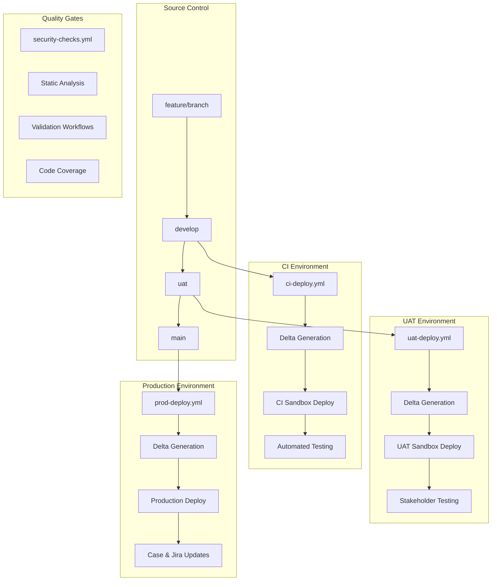

# CI/CD Pipeline Configuration

This document provides a comprehensive guide to the sophisticated CI/CD pipeline architecture implemented in this Salesforce project using GitHub Actions, featuring delta deployments, JWT authentication, and multi-environment promotion strategies.

## 🏗️ Pipeline Architecture Overview

The pipeline implements a **GitFlow-inspired, multi-environment deployment strategy** with automated quality gates and sophisticated integration capabilities:



## 🔄 Workflow Architecture & Triggers

### Reusable Workflow Strategy

The pipeline uses a **composite action pattern** with a central reusable workflow (`action-deploy.yml`) that is called by environment-specific workflows:

```yaml
# Environment-specific workflows call the reusable workflow
jobs:
  deploy-to-environment:
    uses: ./.github/workflows/action-deploy.yml
    with:
      environment: ci|uat|prod
      case-comment-creation: true
      user-map-for-deployments: true
    secrets: inherit
```

### Automated Trigger Configuration

| Workflow | Branch | Trigger | Path Filter | Description |
|----------|--------|---------|-------------|-------------|
| `ci-deploy.yml` | `develop` | Push | `force-app/**` | Automated CI deployment |
| `uat-deploy.yml` | `uat` | Push | `force-app/**` | UAT environment deployment |
| `prod-deploy.yml` | `main` | Push | `force-app/**` | Production deployment |
| `security-checks.yml` | Schedule | `0 6 * * 1-5` | All files | Daily security scans |
| `*-validate.yml` | Pull Request | Open/Update | `force-app/**` | Pre-merge validation |

### Manual Trigger Capabilities

All deployment workflows support manual execution via GitHub Actions UI with the following features:
- **Environment selection** override
- **Custom deployment parameters**
- **Emergency deployment** bypassing normal workflows
- **Rollback procedures** with previous commit reference

## 📋 Deployment Pipeline Stages

### Stage 1: Pre-Deployment Setup

```yaml
- name: Checkout code
  uses: actions/checkout@v4
  with:
    fetch-depth: 0  # Full history for delta generation

- name: Setup Salesforce Environment
  uses: ./.github/actions/setup-salesforce
  # Composite action that installs SF CLI and dependencies
```

### Stage 2: User Resolution & Authentication

The pipeline implements **dynamic user mapping** with fallback mechanisms:

```yaml
- name: Determine Deployment User
  id: resolve-user
  run: |
    if ${{ inputs.user-map-for-deployments }}; then
      username="${{ github.actor }}"
      email=$(echo "$DEPLOYMENT_USER_MAP" | jq -r --arg user "$username" '.[$user]')
      
      if [ "$email" != "null" ] && [ -n "$email" ]; then
        echo "Using mapped deployment user: $email"
        echo "DEPLOYMENT_USER_RESOLVED=$email" >> $GITHUB_ENV
      else
        echo "Mapped email not found. Falling back to secret."
        echo "DEPLOYMENT_USER_RESOLVED=${{ secrets.DEPLOYMENT_USER }}" >> $GITHUB_ENV
      fi
    else
      echo "DEPLOYMENT_USER_RESOLVED=${{ secrets.DEPLOYMENT_USER }}" >> $GITHUB_ENV
    fi
```

### Stage 3: Delta Package Generation

The pipeline uses **Source Git Delta (SGD)** for efficient deployments:

```yaml
- name: 'Create Delta Packages'
  run: |
    mkdir changed-sources
    sf sgd source delta \
      --to "HEAD" \
      --from "HEAD~1" \
      --output-dir changed-sources/ \
      --generate-delta \
      --source-dir force-app/
    
    echo "[INFO] Delta package generated with the following structure:"
    ls -la changed-sources/
```

**Generated Structure:**
```
changed-sources/
├── package/
│   └── package.xml          # Components to deploy
├── destructiveChanges/
│   └── destructiveChanges.xml  # Components to delete
└── [component directories]     # Actual component files
```

### Stage 4: JWT Authentication & Deployment

```yaml
- name: 'Deploy to ${{ inputs.environment }} (Delta with Destructive Changes)'
  run: |
    KEY_FILE="server.key"
    INSTANCE_URL="${{ vars.INSTANCE_URL }}"
    
    echo "${{ secrets.JWT_SERVER_KEY }}" > "$KEY_FILE"
    
    # JWT Authentication
    sf org login jwt \
      --username "${{ env.DEPLOYMENT_USER_RESOLVED }}" \
      --jwt-key-file "$KEY_FILE" \
      --client-id "${{ secrets.CONSUMER_KEY }}" \
      --instance-url "$INSTANCE_URL" \
      --set-default

    # Delta Deployment with Destructive Changes
    sf project deploy start \
      -x changed-sources/package/package.xml \
      --post-destructive-changes changed-sources/destructiveChanges/destructiveChanges.xml \
      --ignore-warnings --ignore-conflicts | tee sf_output.txt
    
    rm -f "$KEY_FILE"  # Security cleanup
```

### Stage 5: Integration & Case Management

**Ticket Extraction from Git Commits:**
```yaml
- name: Use ticket extractor action
  uses: ./.github/actions/extract-git-commits-tickets
  id: tickets
  # Extracts JIRA ticket references from commit messages
```

**Salesforce Case Updates:**
```yaml
- name: Update Salesforce Cases
  if: ${{ steps.tickets.outputs.has-tickets && inputs.case-comment-creation }}
  uses: ./.github/actions/update-sf-cases-by-ticket
  with:
    kerun-instance-url: ${{ vars.KERUN_INSTANCE_URL }}
    jwt-server-key: ${{ secrets.KERUN_ORG_JWT_SERVER_KEY }}
    deployment-user: ${{ secrets.KERUN_ORG_DEPLOYMENT_USER }}
    consumer-key: ${{ secrets.KERUN_ORG_CONSUMER_KEY }}
    case-comment-body: ${{ steps.read-package.outputs.package_content }}
    tickets: ${{steps.tickets.outputs.tickets}}
```

**Jira Integration:**
```yaml
- name: Update Jira status
  if: ${{ steps.tickets.outputs.has-tickets }}
  uses: ./.github/actions/jira-ticket-update
  with:
    jira_url: ${{ secrets.KERUN_JIRA_URL }}
    jira_username: ${{ secrets.KERUN_JIRA_USERNAME }}
    jira_api_token: ${{ secrets.KERUN_JIRA_ACCESS_API }}
    issue_keys: ${{steps.tickets.outputs.tickets}}
    status_name: ${{ vars.KERUN_ONE_CASE_STATUS }}
```

## 🔐 Security & Authentication

### JWT Authentication Strategy

The pipeline uses **JSON Web Token (JWT) Bearer Token Flow** for secure, certificate-based authentication:

#### Certificate Management
```bash
# Generate JWT certificates (automated)
./scripts/bash/generate-ssl-certificates-auto.sh

# Generated files:
server.key    # Private key (stored in GitHub secrets)
server.crt    # Public certificate (uploaded to Connected App)
```

#### Connected App Configuration
Each Salesforce environment requires a Connected App with:
- **OAuth Settings**: Enabled
- **JWT Bearer Token Flow**: Enabled
- **Certificate**: Upload the generated `server.crt`
- **API Scopes**: Full access (API), Perform requests on your behalf at any time (refresh_token, offline_access)

### Required Secrets Configuration

#### Per-Environment Secrets

| Secret | Environment | Description | Format |
|--------|-------------|-------------|---------|
| `JWT_SERVER_KEY` | ci, uat, prod | Private key for JWT authentication | PEM format with headers |
| `DEPLOYMENT_USER` | ci, uat, prod | Salesforce username for deployment | email@domain.com |
| `CONSUMER_KEY` | ci, uat, prod | Connected App Consumer Key | 3MVG9... |
| `KERUN_ORG_*` | All | Secondary org credentials for case management | Various formats |
| `KERUN_JIRA_*` | All | Jira integration credentials | API tokens |

#### Environment Variables

| Variable | Description | Example |
|----------|-------------|---------|
| `INSTANCE_URL` | Salesforce org URL | `https://company.my.salesforce.com` |
| `DEPLOYMENT_USER_MAP` | User mapping JSON | `{"githubuser": "sf-user@company.com"}` |
| `KERUN_INSTANCE_URL` | Secondary org URL | `https://kerun.my.salesforce.com` |
| `KERUN_ONE_CASE_STATUS` | Jira status for deployments | `"Deployed to Production"` |

### Security Best Practices

#### Secrets Management
- **Rotation Schedule**: JWT keys rotated quarterly
- **Least Privilege**: Deployment users have minimal required permissions
- **Environment Isolation**: Separate credentials for each environment
- **Audit Trail**: All deployments logged with user attribution

#### Access Control
```yaml
permissions:
  actions: read          # Read workflow status
  security-events: write # Write security scan results
  contents: read         # Read repository contents
  issues: write          # Create issues for failures
```

## 🛡️ Quality Gates & Validation

### Pre-Deployment Validation Workflows

#### Pull Request Validation (`pull-request-reject.yml`)
```yaml
# Validates all pull requests before merge
on:
  pull_request:
    paths: ['force-app/**']
    
quality_checks:
  - Static Code Analysis (PMD)
  - ESLint for Lightning Web Components
  - Apex Unit Tests (minimum 85% coverage)
  - Custom Metadata Validation
  - Security Vulnerability Scan
```

#### Validation Workflow (`action-validate.yml`)
```yaml
jobs:
  validate:
    steps:
      - name: 'Validate Deployment'
        run: |
          sf project deploy validate \
            -x changed-sources/package/package.xml \
            --post-destructive-changes changed-sources/destructiveChanges/destructiveChanges.xml \
            --test-level RunLocalTests \
            --target-org ${{ env.DEPLOYMENT_USER_RESOLVED }}
```

### Automated Security Scanning

#### Daily Security Checks (`security-checks.yml`)
```yaml
on:
  schedule:
    - cron: '0 6 * * 1-5'  # Weekdays at 6 AM UTC
    
jobs:
  dependencies-version-checks:
    # Scans for outdated dependencies and security vulnerabilities
    
  apex-security-scan:
    # Scans Apex code for security issues
    
  metadata-validation:
    # Validates metadata integrity and naming conventions
```

### Code Quality Enforcement

#### Quality Gate Criteria
```yaml
quality_gates:
  code_coverage:
    minimum: 85%
    blocker: true
    
  apex_tests:
    success_rate: 100%
    max_runtime: 300  # 5 minutes
    blocker: true
    
  static_analysis:
    max_critical_issues: 0
    max_major_issues: 5
    blocker: true
    
  security_scan:
    max_high_vulnerabilities: 0
    max_medium_vulnerabilities: 3
    blocker: true
```

#### ESLint Configuration
```javascript
// .eslintrc.json - Lightning Web Component linting
{
  "extends": ["@salesforce/eslint-config-lwc/recommended"],
  "rules": {
    "@lwc/lwc/no-async-operation": "error",
    "@lwc/lwc/no-leading-uppercase-api-name": "error"
  }
}
```

### Environment-Specific Approval Requirements

#### Production Deployment Approvals
- **Required Reviewers**: 2 senior developers or tech leads
- **Branch Protection**: Enforced on `main` branch
- **Status Checks**: All validation workflows must pass
- **Deployment Windows**: Business hours only (configurable)
- **Emergency Override**: Available for critical hotfixes

#### UAT Deployment Requirements
- **Required Reviewers**: 1 team member
- **Automated Testing**: All tests must pass
- **Business Validation**: Stakeholder notification required

## 📊 Monitoring, Metrics & Reporting

### Deployment Metrics Dashboard

#### Key Performance Indicators
```yaml
deployment_metrics:
  frequency:
    daily_average: 3.2
    weekly_total: 18
    monthly_total: 78
    
  lead_time:
    commit_to_ci: "< 5 minutes"
    ci_to_uat: "< 2 hours"  
    uat_to_production: "< 24 hours"
    
  success_rates:
    ci_deployment: 98.5%
    uat_deployment: 96.2%
    production_deployment: 99.1%
    
  rollback_metrics:
    mean_time_to_recovery: "< 15 minutes"
    rollback_frequency: 0.8%
```

#### Performance Benchmarks
- **Delta Generation**: < 30 seconds
- **JWT Authentication**: < 5 seconds  
- **Deployment Execution**: < 10 minutes
- **Test Execution**: < 5 minutes
- **Post-deployment Integration**: < 2 minutes

### Integration & Notification System

#### Case Management Integration
```yaml
salesforce_case_updates:
  trigger_conditions:
    - successful_deployment
    - deployment_failure
    - rollback_execution
    
  case_fields_updated:
    - Status: "Deployed"
    - Comments: "Deployment package details"
    - Priority: "Adjusted based on deployment type"
    - Owner: "Mapped to deployment user"
```

#### Jira Ticket Automation
```yaml
jira_integration:
  status_transitions:
    ci_deployment: "In Testing"
    uat_deployment: "Ready for UAT"
    production_deployment: "Deployed"
    rollback: "Reopened"
    
  automated_comments:
    - deployment_summary
    - component_list
    - test_results
    - rollback_procedures
```

### Alerting & Escalation

#### Real-time Notifications
- **Slack Channels**: `#deployments`, `#dev-alerts`, `#production-alerts`
- **Email Distribution**: Development team, stakeholders, management
- **PagerDuty Integration**: Critical production issues
- **Teams Integration**: Project management updates

#### Escalation Matrix
```yaml
escalation_levels:
  level_1: # Development Team
    - deployment_failures
    - test_failures
    - validation_errors
    
  level_2: # Technical Leads
    - repeated_failures
    - security_vulnerabilities
    - performance_degradation
    
  level_3: # Management
    - production_outages  
    - data_loss_incidents
    - compliance_violations
```

## 🚨 Rollback & Disaster Recovery

### Automated Rollback Triggers

```yaml
automatic_rollback_conditions:
  test_failure_rate: 
    threshold: "> 20%"
    action: "immediate_rollback"
    
  deployment_failure:
    critical_components: ["triggers", "flows", "permissionsets"]
    action: "immediate_rollback"
    
  performance_degradation:
    apex_cpu_time: "> 30 seconds"
    heap_size: "> 10MB"
    action: "alert_and_prepare_rollback"
    
  security_violations:
    unauthorized_access: true
    data_exposure: true
    action: "immediate_rollback_and_investigation"
```

### Manual Rollback Procedures

#### Emergency Rollback Process
```bash
# 1. Identify the problematic deployment
gh run list --workflow=prod-deploy.yml --limit=5

# 2. Trigger rollback workflow
gh workflow run rollback-production.yml \
  --field target_commit=<previous_good_commit> \
  --field reason="Performance degradation detected"

# 3. Validate rollback
sf project deploy validate --target-org prod-org

# 4. Execute rollback
sf project deploy start --target-org prod-org --test-level RunLocalTests
```

#### Rollback Validation Checklist
- [ ] **Database Integrity**: Verify no data loss occurred
- [ ] **User Access**: Confirm all users can access the system
- [ ] **Integration Points**: Test all external integrations
- [ ] **Performance Metrics**: Monitor system performance for 30 minutes
- [ ] **Stakeholder Communication**: Notify all affected parties

### Disaster Recovery Strategy

#### Recovery Time Objectives (RTO)
- **CI Environment**: 15 minutes
- **UAT Environment**: 30 minutes  
- **Production Environment**: 1 hour

#### Recovery Point Objectives (RPO)
- **Maximum Data Loss**: 5 minutes
- **Backup Frequency**: Every 15 minutes
- **Cross-Region Backup**: Daily

#### Recovery Procedures
```yaml
disaster_recovery_steps:
  immediate_response:
    - isolate_affected_systems
    - assess_impact_scope
    - notify_incident_response_team
    
  recovery_execution:
    - restore_from_backup
    - validate_system_integrity
    - perform_smoke_tests
    
  post_recovery:
    - conduct_root_cause_analysis
    - update_procedures
    - communicate_lessons_learned
```

## � Advanced Pipeline Customization

### Adding New Environments

#### Step-by-Step Environment Creation

1. **GitHub Environment Setup**
```bash
# Create the environment via GitHub CLI
gh api repos/:owner/:repo/environments \
  --method POST \
  --field name="staging" \
  --field wait_timer=0 \
  --field reviewers='[{"type":"User","id":12345}]'
```

2. **Environment-Specific Workflow**
```yaml
# .github/workflows/staging-deploy.yml
name: Deploy to Staging Environment

on:
  push:
    branches: [ staging ]
    paths: ['force-app/**']

jobs:
  deploy-to-staging:
    uses: ./.github/workflows/action-deploy.yml
    with:
      environment: staging
      case-comment-creation: true
      user-map-for-deployments: true
    secrets: inherit
```

3. **Configure Secrets and Variables**
```bash
# Add environment secrets
gh secret set JWT_SERVER_KEY --env staging --body "$(cat server.key)"
gh secret set CONSUMER_KEY --env staging --body "3MVG9..."
gh secret set DEPLOYMENT_USER --env staging --body "staging-user@company.com"

# Add environment variables  
gh variable set INSTANCE_URL --env staging --body "https://staging.my.salesforce.com"
```

### Custom Deployment Strategies

#### Blue-Green Deployment Script
```bash
#!/bin/bash
# scripts/deploy/blue-green-deploy.sh

ENVIRONMENT=$1
DEPLOYMENT_TYPE=$2

case $DEPLOYMENT_TYPE in
  "blue")
    TARGET_ORG="${ENVIRONMENT}-blue"
    INACTIVE_ORG="${ENVIRONMENT}-green"
    ;;
  "green")
    TARGET_ORG="${ENVIRONMENT}-green"
    INACTIVE_ORG="${ENVIRONMENT}-blue"
    ;;
esac

echo "Deploying to $TARGET_ORG environment..."

# Deploy to target environment
sf project deploy start \
  --target-org $TARGET_ORG \
  --test-level RunLocalTests \
  --wait 10

# Validate deployment
if [ $? -eq 0 ]; then
  echo "Deployment successful. Switching traffic to $TARGET_ORG"
  # Switch load balancer or DNS to point to new environment
  ./scripts/infrastructure/switch-traffic.sh $TARGET_ORG
else
  echo "Deployment failed. Traffic remains on $INACTIVE_ORG"
  exit 1
fi
```

#### Canary Deployment Configuration
```yaml
# Custom canary deployment workflow
canary_deployment:
  strategy:
    percentage_rollout: [10, 25, 50, 100]
    validation_period: "15m"
    success_criteria:
      error_rate: "< 1%"
      response_time: "< 2s"
      
  rollback_triggers:
    error_spike: "> 5%"
    performance_degradation: "> 50%"
    user_complaints: "> 3"
```

### Pipeline Extensions

#### Custom Composite Actions
```yaml
# .github/actions/advanced-validation/action.yml
name: 'Advanced Validation'
description: 'Performs comprehensive validation including custom rules'

inputs:
  environment:
    description: 'Target environment'
    required: true
  validation-level:
    description: 'Validation level (basic|full|compliance)'
    required: false
    default: 'full'

runs:
  using: 'composite'
  steps:
    - name: Run Custom Metadata Validation
      shell: bash
      run: |
        node scripts/validation/metadata-validator.js \
          --environment ${{ inputs.environment }} \
          --level ${{ inputs.validation-level }}
    
    - name: Compliance Check
      if: inputs.validation-level == 'compliance'
      shell: bash
      run: |
        # GDPR, SOX, HIPAA compliance checks
        ./scripts/compliance/run-compliance-checks.sh
```

## 🐛 Troubleshooting & Debug Guide

### Common Pipeline Issues & Solutions

#### Authentication & Connection Issues

| Issue | Symptoms | Root Cause | Solution |
|-------|----------|------------|----------|
| JWT Authentication Failure | `INVALID_LOGIN: Invalid username, password, security token` | Expired/incorrect JWT certificate | Regenerate certificates: `./scripts/bash/generate-ssl-certificates-auto.sh` |
| Org Connection Timeout | `Connection timeout after 30s` | Network/firewall issues | Check IP restrictions in Salesforce org settings |
| Consumer Key Invalid | `invalid_client_id` | Incorrect Connected App configuration | Verify Consumer Key in GitHub secrets matches Connected App |

#### Deployment Failures

| Issue | Symptoms | Root Cause | Solution |
|-------|----------|------------|----------|
| Test Failures | `System.AssertException: Assertion Failed` | Code changes broke existing tests | Run tests locally: `sf apex test run --test-level RunLocalTests` |
| Metadata API Error | `INVALID_CROSS_REFERENCE_KEY` | Dependency issues between components | Check component dependencies and deploy order |
| Insufficient Code Coverage | `Average test coverage across all Apex Classes is 75%` | New code without tests | Add test classes: minimum 85% coverage required |
| Destructive Changes Failed | `Cannot delete <component>: In use` | Component still referenced | Remove references before deletion |

#### Delta Generation Issues

| Issue | Symptoms | Root Cause | Solution |
|-------|----------|------------|----------|
| SGD Tool Error | `Error: no valid git repository` | Shallow clone or missing git history | Use `fetch-depth: 0` in checkout action |
| Empty Delta Package | No components in package.xml | No changes in force-app directory | Check file paths and commit history |
| Invalid Metadata Format | `XML parsing error` | Corrupted metadata files | Validate XML files locally |

### Debug Commands & Techniques

#### Local Debugging
```bash
# Validate deployment locally
sf project deploy start --dry-run --target-org your-org

# Check org limits and status
sf org display --target-org your-org --verbose

# Run specific test classes
sf apex test run --class-names "TestClass1,TestClass2" --result-format human

# Query deployment status
sf project deploy report --job-id <deployment-id> --target-org your-org

# Check code coverage
sf apex test report --test-run-id <test-run-id> --code-coverage
```

#### Log Analysis Tools
```bash
# Extract deployment logs
sf project deploy report --job-id $DEPLOYMENT_ID --coverage-formatters text-summary

# Parse test results
sf apex test report --test-run-id $TEST_RUN_ID --output-dir ./test-results

# Analyze performance metrics
grep "EXECUTION_FINISHED" logs/sf_output.txt | awk '{print $3,$4}'
```

### Performance Optimization

#### Deployment Speed Optimization
```yaml
optimization_strategies:
  delta_deployment:
    enabled: true
    description: "Only deploy changed components"
    time_savings: "60-80%"
    
  parallel_testing:
    enabled: true
    max_parallel_tests: 4
    description: "Run tests in parallel"
    
  smart_test_selection:
    enabled: true
    description: "Only run tests affected by changes"
    implementation: "Coming in future release"
```

#### Resource Usage Monitoring
```bash
# Monitor deployment resource usage
sf limits api display --target-org your-org

# Check heap size and CPU usage during tests
sf apex test run --synchronous --code-coverage --json | jq '.result.summary'
```

### Emergency Procedures

#### Critical Production Issues
```bash
#!/bin/bash
# Emergency rollback procedure

echo "🚨 EMERGENCY ROLLBACK INITIATED 🚨"

# 1. Get last successful deployment
LAST_GOOD_COMMIT=$(git log --oneline --grep="Production deployment successful" -1 --format="%H")

# 2. Create emergency rollback branch
git checkout -b emergency-rollback-$(date +%Y%m%d-%H%M%S)
git reset --hard $LAST_GOOD_COMMIT

# 3. Force deploy previous version
sf project deploy start \
  --target-org prod-org \
  --ignore-warnings \
  --ignore-conflicts \
  --test-level NoTestRun

# 4. Notify stakeholders
curl -X POST $SLACK_WEBHOOK_URL \
  -H 'Content-type: application/json' \
  --data '{"text":"🚨 Emergency rollback completed for production environment"}'
```

#### Incident Response Checklist
- [ ] **Assess Impact**: Determine scope and severity
- [ ] **Isolate Issue**: Prevent further damage
- [ ] **Communicate**: Notify stakeholders immediately
- [ ] **Execute Fix**: Deploy hotfix or rollback
- [ ] **Validate**: Confirm system stability
- [ ] **Document**: Record incident details and lessons learned

---

**Pipeline Documentation Version:** 2.1.0  
**Last Updated:** December 2024  
**Salesforce API Version:** 62.0  
**Framework Compatibility:** GitHub Actions v4+
