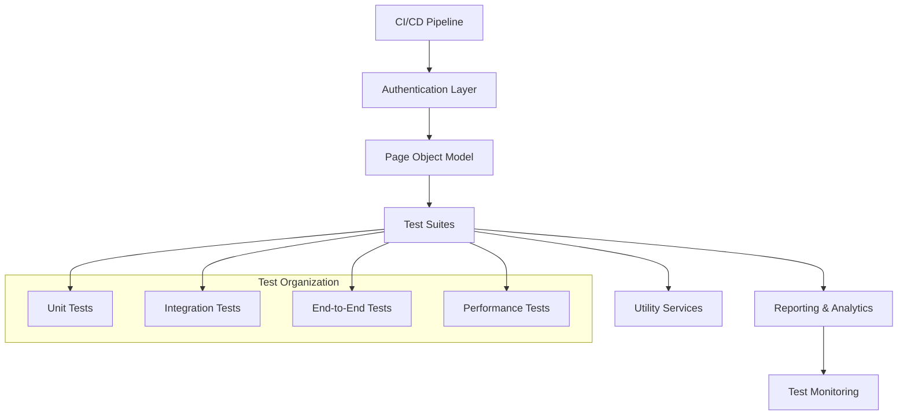

# Playwright E2E Testing Guide

> **Enterprise-Grade End-to-End Testing for Salesforce Applications**

This comprehensive guide covers advanced end-to-end testing strategies using Playwright for Salesforce Lightning applications. It includes enterprise authentication patterns, robust page object models, comprehensive test scenarios, and CI/CD integration for scalable test automation.

## 🎯 Overview

Playwright provides enterprise-grade end-to-end testing capabilities specifically optimized for Salesforce Lightning Experience, enabling comprehensive automated testing across:

- **Complex User Workflows** - Multi-step business processes across different Salesforce clouds
- **Lightning Web Components** - Advanced component interaction and state validation
- **Salesforce Setup & Configuration** - Automated configuration management and deployment validation
- **Data Operations** - Import/export processes, bulk data operations, and data integrity testing
- **Localization & Translation** - Multi-language support and translation workbench operations
- **Integration Testing** - External system integrations and API workflows
- **Performance Testing** - Load testing and performance validation at scale

### Enterprise Testing Architecture



## 📁 Project Structure & Organization

### Enterprise Test Architecture
```
e2e/
├── tests/
│   ├── core/
│   │   ├── account/
│   │   │   ├── account-creation.spec.ts
│   │   │   ├── account-territory.spec.ts
│   │   │   └── account-validation.spec.ts
│   │   ├── opportunity/
│   │   │   ├── opportunity-lifecycle.spec.ts
│   │   │   └── opportunity-forecasting.spec.ts
│   │   └── case/
│   │       ├── case-management.spec.ts
│   │       └── case-escalation.spec.ts
│   ├── integration/
│   │   ├── external-systems.spec.ts
│   │   ├── data-sync.spec.ts
│   │   └── api-workflows.spec.ts
│   ├── setup/
│   │   ├── user-management.spec.ts
│   │   ├── permission-sets.spec.ts
│   │   └── custom-metadata.spec.ts
│   └── performance/
│       ├── page-load.spec.ts
│       └── bulk-operations.spec.ts
├── pages/
│   ├── base/
│   │   ├── base-page.ts
│   │   ├── lightning-page.ts
│   │   └── setup-page.ts
│   ├── objects/
│   │   ├── account-page.ts
│   │   ├── opportunity-page.ts
│   │   └── case-page.ts
│   └── setup/
│       ├── user-management-page.ts
│       └── permission-sets-page.ts
├── utilities/
│   ├── auth/
│   │   ├── salesforce-auth.ts
│   │   ├── jwt-auth.ts
│   │   └── session-manager.ts
│   ├── data/
│   │   ├── test-data-factory.ts
│   │   ├── data-cleanup.ts
│   │   └── data-validators.ts
│   ├── helpers/
│   │   ├── wait-helpers.ts
│   │   ├── element-helpers.ts
│   │   └── screenshot-helpers.ts
│   └── fixtures/
│       ├── salesforce-fixtures.ts
│       └── performance-fixtures.ts
├── config/
│   ├── environments/
│   │   ├── development.json
│   │   ├── staging.json
│   │   └── production.json
│   └── test-data/
│       ├── accounts.json
│       ├── opportunities.json
│       └── users.json
└── reports/
    ├── html/
    ├── json/
    └── junit/
```

## 🚀 Setup & Installation

### Prerequisites & Environment Setup

```bash
# Install Node.js (LTS version recommended)
node --version  # Should be v18 or higher

# Install Playwright with Salesforce-optimized configuration
npm install --save-dev @playwright/test
npm install --save-dev dotenv
npm install --save-dev cross-env

# Install browsers with additional dependencies for Salesforce
npx playwright install --with-deps

# Verify installation
npx playwright --version
```

### Advanced Configuration

The `playwright.config.ts` provides enterprise-grade configuration for Salesforce testing:

```typescript
import { defineConfig, devices } from '@playwright/test';
import dotenv from 'dotenv';
import path from 'path';

// Load environment-specific configuration
const environment = process.env.TEST_ENV || 'development';
dotenv.config({ path: path.resolve(__dirname, `config/environments/${environment}.env`) });

export default defineConfig({
  testDir: './tests',
  outputDir: './test-results',
  
  // Test execution configuration
  fullyParallel: true,
  forbidOnly: !!process.env.CI,
  retries: process.env.CI ? 3 : 1,
  workers: process.env.CI ? 2 : 4,
  
  // Timeouts optimized for Salesforce
  timeout: 60000,
  expect: {
    timeout: 10000,
  },
  
  // Global test setup
  globalSetup: require.resolve('./utilities/global-setup.ts'),
  globalTeardown: require.resolve('./utilities/global-teardown.ts'),
  
  // Reporter configuration
  reporter: [
    ['html', { 
      outputFolder: 'reports/html',
      open: 'never' 
    }],
    ['json', { 
      outputFile: 'reports/json/test-results.json' 
    }],
    ['junit', { 
      outputFile: 'reports/junit/junit-results.xml' 
    }],
    ['github'],
    ['list'],
    ...(process.env.CI ? [['github']] : [])
  ],
  
  use: {
    // Base URL with environment-specific configuration
    baseURL: process.env.SALESFORCE_INSTANCE_URL,
    
    // Browser configuration optimized for Salesforce
    viewport: { width: 1920, height: 1080 },
    
    // Enhanced tracing and debugging
    trace: process.env.CI ? 'retain-on-failure' : 'on-first-retry',
    screenshot: 'only-on-failure',
    video: 'retain-on-failure',
    
    // Salesforce-specific settings
    extraHTTPHeaders: {
      'Accept-Language': 'en-US,en;q=0.9',
    },
    
    // Performance and reliability settings
    actionTimeout: 15000,
    navigationTimeout: 30000,
    
    // Storage state for session management
    storageState: process.env.STORAGE_STATE_PATH,
  },

  // Multi-environment and cross-browser testing
  projects: [
    {
      name: 'setup',
      testMatch: '**/global-setup.ts',
    },
    {
      name: 'chromium-desktop',
      use: { 
        ...devices['Desktop Chrome'],
        channel: 'chrome'
      },
      dependencies: ['setup'],
    },
    {
      name: 'firefox-desktop', 
      use: { 
        ...devices['Desktop Firefox'] 
      },
      dependencies: ['setup'],
    },
    {
      name: 'webkit-desktop',
      use: { 
        ...devices['Desktop Safari'] 
      },
      dependencies: ['setup'],
    },
    {
      name: 'mobile-chrome',
      use: { 
        ...devices['Pixel 5'] 
      },
      dependencies: ['setup'],
    },
    {
      name: 'mobile-safari',
      use: { 
        ...devices['iPhone 12'] 
      },
      dependencies: ['setup'],
    },
  ],

  // Test execution and sharding
  shard: process.env.CI ? { 
    current: parseInt(process.env.SHARD_INDEX || '1'), 
    total: parseInt(process.env.SHARD_TOTAL || '4') 
  } : undefined,
});
```

### Environment Configuration

Create environment-specific configuration files:

```bash
# config/environments/development.env
SALESFORCE_INSTANCE_URL=https://your-dev-org.my.salesforce.com
ORG_NAME=dev-org-alias
SF_USERNAME=test-user@your-dev-org.com
SF_PASSWORD=your-dev-password
JWT_KEY_FILE=./config/certificates/dev-server.key
JWT_CLIENT_ID=your-dev-connected-app-id
TEST_DATA_RESET=true
PERFORMANCE_MONITORING=false

# config/environments/staging.env  
SALESFORCE_INSTANCE_URL=https://your-staging-org.my.salesforce.com
ORG_NAME=staging-org-alias
SF_USERNAME=test-user@your-staging-org.com
SF_PASSWORD=your-staging-password
JWT_KEY_FILE=./config/certificates/staging-server.key
JWT_CLIENT_ID=your-staging-connected-app-id
TEST_DATA_RESET=false
PERFORMANCE_MONITORING=true

# config/environments/production.env
SALESFORCE_INSTANCE_URL=https://your-prod-org.my.salesforce.com
ORG_NAME=prod-org-alias
SF_USERNAME=test-user@your-prod-org.com
SF_PASSWORD=your-prod-password
JWT_KEY_FILE=./config/certificates/prod-server.key
JWT_CLIENT_ID=your-prod-connected-app-id
TEST_DATA_RESET=false
PERFORMANCE_MONITORING=true
SLACK_WEBHOOK_URL=your-slack-webhook-url
```

## 🔐 Enterprise Authentication Strategies

### JWT-Based Authentication (Recommended)

```typescript
// utilities/auth/jwt-auth.ts
import { exec } from 'child_process';
import { promisify } from 'util';
import fs from 'fs';
import jwt from 'jsonwebtoken';

const execAsync = promisify(exec);

export class JWTAuthenticationService {
  private keyFile: string;
  private clientId: string;
  private username: string;
  private instanceUrl: string;

  constructor(config: {
    keyFile: string;
    clientId: string;
    username: string;
    instanceUrl: string;
  }) {
    this.keyFile = config.keyFile;
    this.clientId = config.clientId;
    this.username = config.username;
    this.instanceUrl = config.instanceUrl;
  }

  /**
   * @description Authenticates using JWT flow and returns access token
   */
  async authenticate(): Promise<{
    accessToken: string;
    instanceUrl: string;
    loginUrl: string;
  }> {
    try {
      // Generate JWT token
      const jwtToken = this.generateJWTToken();
      
      // Exchange JWT for access token
      const response = await fetch(`${this.instanceUrl}/services/oauth2/token`, {
        method: 'POST',
        headers: {
          'Content-Type': 'application/x-www-form-urlencoded',
        },
        body: new URLSearchParams({
          grant_type: 'urn:ietf:params:oauth:grant-type:jwt-bearer',
          assertion: jwtToken,
        }),
      });

      if (!response.ok) {
        throw new Error(`JWT authentication failed: ${response.statusText}`);
      }

      const tokenData = await response.json();
      
      // Generate frontdoor URL
      const loginUrl = `${tokenData.instance_url}/secur/frontdoor.jsp?sid=${encodeURIComponent(tokenData.access_token)}&retURL=${encodeURIComponent('/lightning/page/home')}`;

      return {
        accessToken: tokenData.access_token,
        instanceUrl: tokenData.instance_url,
        loginUrl: loginUrl,
      };
    } catch (error) {
      console.error('❌ JWT Authentication failed:', error);
      throw error;
    }
  }

  /**
   * @description Generates JWT token for authentication
   */
  private generateJWTToken(): string {
    const privateKey = fs.readFileSync(this.keyFile, 'utf8');
    
    const payload = {
      iss: this.clientId,
      sub: this.username,
      aud: this.instanceUrl,
      exp: Math.floor(Date.now() / 1000) + (3 * 60), // 3 minutes
    };

    return jwt.sign(payload, privateKey, { algorithm: 'RS256' });
  }
}
```

### Session Management Service

```typescript
// utilities/auth/session-manager.ts
import { Page, Browser } from '@playwright/test';
import { JWTAuthenticationService } from './jwt-auth';

export class SessionManager {
  private static instance: SessionManager;
  private sessionCache = new Map<string, any>();
  private browser: Browser;

  private constructor(browser: Browser) {
    this.browser = browser;
  }

  static getInstance(browser: Browser): SessionManager {
    if (!SessionManager.instance) {
      SessionManager.instance = new SessionManager(browser);
    }
    return SessionManager.instance;
  }

  /**
   * @description Gets or creates authenticated session for environment
   */
  async getAuthenticatedSession(environment: string): Promise<{
    page: Page;
    context: any;
  }> {
    const cacheKey = `session_${environment}`;
    
    if (this.sessionCache.has(cacheKey)) {
      return this.sessionCache.get(cacheKey);
    }

    // Create new authenticated session
    const context = await this.browser.newContext({
      viewport: { width: 1920, height: 1080 },
      recordVideo: { dir: 'videos/' },
      recordHar: { path: `hars/session_${environment}.har` },
    });

    const page = await context.newPage();
    
    // Authenticate using JWT
    const authService = new JWTAuthenticationService({
      keyFile: process.env.JWT_KEY_FILE!,
      clientId: process.env.JWT_CLIENT_ID!,
      username: process.env.SF_USERNAME!,
      instanceUrl: process.env.SALESFORCE_INSTANCE_URL!,
    });

    const authResult = await authService.authenticate();
    
    // Navigate to Salesforce with authenticated session
    await page.goto(authResult.loginUrl, { 
      waitUntil: 'domcontentloaded',
      timeout: 30000 
    });

    // Wait for Lightning to fully load
    await page.waitForSelector('one-app-nav-bar', { timeout: 30000 });
    
    const session = { page, context };
    this.sessionCache.set(cacheKey, session);
    
    return session;
  }

  /**
   * @description Cleans up session resources
   */
  async cleanup(): Promise<void> {
    for (const [key, session] of this.sessionCache.entries()) {
      try {
        await session.context.close();
      } catch (error) {
        console.warn(`Failed to close session ${key}:`, error);
      }
    }
    this.sessionCache.clear();
  }
}
```

### Salesforce CLI Authentication Service

```typescript
// utilities/auth/salesforce-auth.ts
import { Page } from '@playwright/test';
import { exec } from 'child_process';
import { promisify } from 'util';

const execAsync = promisify(exec);

export class SalesforceAuthenticationService {
  constructor(private page: Page) {}

  /**
   * @description Authenticates using Salesforce CLI frontdoor method
   */
  async loginViaFrontdoor(orgAlias: string): Promise<boolean> {
    try {
      // Verify SF CLI is authenticated
      await this.verifySFCLIAuth(orgAlias);
      
      // Get access token and instance URL
      const orgInfo = await this.getOrgInfo(orgAlias);
      
      // Generate frontdoor URL
      const loginUrl = `${orgInfo.instanceUrl}/secur/frontdoor.jsp?sid=${encodeURIComponent(orgInfo.accessToken)}&retURL=${encodeURIComponent('/lightning/page/home')}`;

      // Navigate to Salesforce
      await this.page.goto(loginUrl, { 
        waitUntil: 'domcontentloaded',
        timeout: 30000 
      });

      // Wait for Lightning to load
      await this.page.waitForSelector('one-app-nav-bar', { timeout: 30000 });
      
      console.log('✅ Successfully authenticated via SF CLI frontdoor');
      return true;
      
    } catch (error) {
      console.error('❌ SF CLI frontdoor authentication failed:', error);
      return false;
    }
  }

  /**
   * @description Fallback UI-based authentication
   */
  async loginViaUI(username: string, password: string): Promise<boolean> {
    try {
      await this.page.goto('/');
      
      // Handle different login page layouts
      const usernameSelector = await this.getLoginSelector('username');
      const passwordSelector = await this.getLoginSelector('password');
      
      await this.page.fill(usernameSelector, username);
      await this.page.fill(passwordSelector, password);
      
      // Click login button
      const loginButton = await this.getLoginSelector('login');
      await this.page.click(loginButton);
      
      // Wait for successful navigation
      await this.page.waitForURL('**/lightning/**', { timeout: 30000 });
      
      console.log('✅ Successfully authenticated via UI');
      return true;
      
    } catch (error) {
      console.error('❌ UI authentication failed:', error);
      return false;
    }
  }

  /**
   * @description Verifies SF CLI authentication status
   */
  private async verifySFCLIAuth(orgAlias: string): Promise<void> {
    try {
      const { stdout } = await execAsync(`sf org display --target-org ${orgAlias} --json`);
      const result = JSON.parse(stdout);
      
      if (result.status !== 0) {
        throw new Error(`SF CLI authentication failed for org: ${orgAlias}`);
      }
    } catch (error) {
      throw new Error(`SF CLI not authenticated for org ${orgAlias}. Run: sf org login web --alias ${orgAlias}`);
    }
  }

  /**
   * @description Gets org information from SF CLI
   */
  private async getOrgInfo(orgAlias: string): Promise<{
    accessToken: string;
    instanceUrl: string;
    username: string;
  }> {
    const { stdout } = await execAsync(`sf org display --target-org ${orgAlias} --json`);
    const result = JSON.parse(stdout);
    
    return {
      accessToken: result.result.accessToken,
      instanceUrl: result.result.instanceUrl,
      username: result.result.username,
    };
  }

  /**
   * @description Gets appropriate login selector based on page layout
   */
  private async getLoginSelector(field: 'username' | 'password' | 'login'): Promise<string> {
    const selectors = {
      username: ['#username', 'input[name="username"]', 'lightning-input[data-id="username"] input'],
      password: ['#password', 'input[name="password"]', 'lightning-input[data-id="password"] input'],
      login: ['#Login', 'input[type="submit"]', 'button[type="submit"]', '.loginButton'],
    };

    for (const selector of selectors[field]) {
      if (await this.page.locator(selector).count() > 0) {
        return selector;
      }
    }

    throw new Error(`Could not find ${field} selector on login page`);
  }
}
```

## 🏗️ Enterprise Page Object Model

### Base Page Architecture

```typescript
// pages/base/lightning-page.ts
import { Page, Locator, expect } from '@playwright/test';

export class LightningBasePage {
  protected page: Page;
  protected url: string;

  // Common Lightning selectors
  protected readonly appLauncher = () => this.page.getByRole('button', { name: 'App Launcher' });
  protected readonly setupMenu = () => this.page.getByRole('button', { name: 'Setup' });
  protected readonly globalSearch = () => this.page.getByPlaceholder('Search Salesforce');
  protected readonly spinner = () => this.page.locator('.slds-spinner');
  protected readonly toast = () => this.page.locator('.forceToastMessage');
  protected readonly modal = () => this.page.locator('.slds-modal');

  constructor(page: Page, url: string = '') {
    this.page = page;
    this.url = url;
  }

  /**
   * @description Navigates to the page and waits for it to load
   */
  async goto(): Promise<void> {
    if (this.url) {
      await this.page.goto(this.url, { waitUntil: 'domcontentloaded' });
    }
    await this.waitForPageLoad();
  }

  /**
   * @description Waits for Lightning page to fully load
   */
  async waitForPageLoad(): Promise<void> {
    // Wait for Lightning framework to initialize
    await this.page.waitForSelector('one-app-nav-bar', { timeout: 30000 });
    
    // Wait for any spinners to disappear
    await this.waitForSpinnersToDisappear();
    
    // Wait for Lightning components to stabilize
    await this.page.waitForTimeout(1000);
  }

  /**
   * @description Waits for all loading spinners to disappear
   */
  async waitForSpinnersToDisappear(): Promise<void> {
    try {
      await this.page.waitForSelector('.slds-spinner', { state: 'hidden', timeout: 10000 });
    } catch (error) {
      // Spinners might not be present, which is fine
    }
  }

  /**
   * @description Handles Lightning modal dialogs
   */
  async handleModal(action: 'save' | 'cancel' | 'close' = 'save'): Promise<void> {
    const modal = this.modal();
    await modal.waitFor({ state: 'visible', timeout: 10000 });
    
    switch (action) {
      case 'save':
        await modal.getByRole('button', { name: /save/i }).click();
        break;
      case 'cancel':
        await modal.getByRole('button', { name: /cancel/i }).click();
        break;
      case 'close':
        await modal.getByRole('button', { name: /close/i }).click();
        break;
    }
    
    await modal.waitFor({ state: 'hidden', timeout: 10000 });
    await this.waitForSpinnersToDisappear();
  }

  /**
   * @description Navigates to a specific Salesforce app
   */
  async navigateToApp(appName: string): Promise<void> {
    await this.appLauncher().click();
    await this.page.getByPlaceholder('Search apps and items...').fill(appName);
    await this.page.getByText(appName, { exact: true }).click();
    await this.waitForPageLoad();
  }

  /**
   * @description Searches globally in Salesforce
   */
  async globalSearchFor(searchTerm: string): Promise<void> {
    await this.globalSearch().fill(searchTerm);
    await this.page.keyboard.press('Enter');
    await this.waitForPageLoad();
  }

  /**
   * @description Verifies toast message appears with expected text
   */
  async verifyToastMessage(expectedMessage: string, type: 'success' | 'error' | 'warning' = 'success'): Promise<void> {
    const toast = this.toast();
    await toast.waitFor({ state: 'visible', timeout: 10000 });
    
    const toastText = await toast.textContent();
    expect(toastText).toContain(expectedMessage);
    
    // Verify toast type if specified
    if (type) {
      const toastClass = await toast.getAttribute('class');
      expect(toastClass).toContain(`slds-theme_${type}`);
    }
  }

  /**
   * @description Switches to Setup context
   */
  async navigateToSetup(): Promise<void> {
    await this.setupMenu().click();
    const setupPagePromise = this.page.waitForEvent('popup');
    await this.page.getByRole('menuitem', { name: 'Setup Opens in a new tab' }).click();
    const setupPage = await setupPagePromise;
    return setupPage;
  }

  /**
   * @description Takes screenshot with timestamp
   */
  async takeScreenshot(name: string): Promise<void> {
    const timestamp = new Date().toISOString().replace(/[:.]/g, '-');
    await this.page.screenshot({ 
      path: `screenshots/${name}_${timestamp}.png`,
      fullPage: true 
    });
  }

  /**
   * @description Waits for Lightning component to be ready
   */
  async waitForLightningComponent(componentName: string): Promise<Locator> {
    const component = this.page.locator(`c-${componentName}, lightning-${componentName}`);
    await component.waitFor({ state: 'visible', timeout: 15000 });
    return component;
  }
}
```

### Object-Specific Page Objects

```typescript
// pages/objects/account-page.ts
import { LightningBasePage } from '../base/lightning-page';
import { Page, expect } from '@playwright/test';

export interface AccountData {
  name: string;
  type?: string;
  industry?: string;
  phone?: string;
  website?: string;
  billingStreet?: string;
  billingCity?: string;
  billingState?: string;
  billingPostalCode?: string;
  billingCountry?: string;
}

export class AccountPage extends LightningBasePage {
  
  // Page-specific selectors
  private readonly newButton = () => this.page.getByRole('button', { name: 'New' });
  private readonly listView = () => this.page.locator('lightning-datatable');
  private readonly searchBox = () => this.page.getByPlaceholder('Search this list...');
  
  // Form field selectors
  private readonly accountNameField = () => this.page.getByLabel('Account Name');
  private readonly typeField = () => this.page.getByLabel('Type');
  private readonly industryField = () => this.page.getByLabel('Industry');
  private readonly phoneField = () => this.page.getByLabel('Phone');
  private readonly websiteField = () => this.page.getByLabel('Website');
  private readonly billingStreetField = () => this.page.getByLabel('Billing Street');
  private readonly billingCityField = () => this.page.getByLabel('Billing City');
  private readonly billingStateField = () => this.page.getByLabel('Billing State/Province');
  private readonly billingPostalCodeField = () => this.page.getByLabel('Billing Zip/Postal Code');
  private readonly billingCountryField = () => this.page.getByLabel('Billing Country');
  
  constructor(page: Page) {
    super(page, '/lightning/o/Account/list');
  }

  /**
   * @description Creates a new account with comprehensive data validation
   */
  async createAccount(accountData: AccountData): Promise<void> {
    await this.newButton().click();
    await this.waitForPageLoad();
    
    // Fill required fields
    await this.accountNameField().fill(accountData.name);
    
    // Fill optional fields if provided
    if (accountData.type) {
      await this.typeField().click();
      await this.page.getByRole('option', { name: accountData.type }).click();
    }
    
    if (accountData.industry) {
      await this.industryField().click();
      await this.page.getByRole('option', { name: accountData.industry }).click();
    }
    
    if (accountData.phone) {
      await this.phoneField().fill(accountData.phone);
    }
    
    if (accountData.website) {
      await this.websiteField().fill(accountData.website);
    }
    
    // Fill billing address
    if (accountData.billingStreet) {
      await this.billingStreetField().fill(accountData.billingStreet);
    }
    
    if (accountData.billingCity) {
      await this.billingCityField().fill(accountData.billingCity);
    }
    
    if (accountData.billingState) {
      await this.billingStateField().fill(accountData.billingState);
    }
    
    if (accountData.billingPostalCode) {
      await this.billingPostalCodeField().fill(accountData.billingPostalCode);
    }
    
    if (accountData.billingCountry) {
      await this.billingCountryField().fill(accountData.billingCountry);
    }
    
    // Save the account
    await this.page.getByRole('button', { name: 'Save' }).click();
    await this.waitForSpinnersToDisappear();
  }

  /**
   * @description Verifies account was created successfully
   */
  async verifyAccountCreated(accountName: string): Promise<void> {
    // Wait for success toast
    await this.verifyToastMessage(`Account "${accountName}" was created`, 'success');
    
    // Verify we're on the account detail page
    await expect(this.page.getByText(accountName)).toBeVisible();
    
    // Verify URL contains account ID
    await expect(this.page.url()).toMatch(/\/lightning\/r\/Account\/[a-zA-Z0-9]{15,18}\/view/);
  }

  /**
   * @description Searches for accounts in list view
   */
  async searchAccounts(searchTerm: string): Promise<void> {
    await this.searchBox().fill(searchTerm);
    await this.page.keyboard.press('Enter');
    await this.waitForSpinnersToDisappear();
  }

  /**
   * @description Verifies account appears in search results
   */
  async verifyAccountInResults(accountName: string): Promise<void> {
    const accountLink = this.page.getByRole('link', { name: accountName });
    await expect(accountLink).toBeVisible({ timeout: 10000 });
  }

  /**
   * @description Opens specific account record
   */
  async openAccount(accountName: string): Promise<void> {
    await this.searchAccounts(accountName);
    await this.page.getByRole('link', { name: accountName }).click();
    await this.waitForPageLoad();
  }

  /**
   * @description Edits account information
   */
  async editAccount(updates: Partial<AccountData>): Promise<void> {
    // Click edit button
    await this.page.getByRole('button', { name: 'Edit' }).click();
    await this.waitForPageLoad();
    
    // Apply updates
    if (updates.name) {
      await this.accountNameField().clear();
      await this.accountNameField().fill(updates.name);
    }
    
    if (updates.phone) {
      await this.phoneField().clear();
      await this.phoneField().fill(updates.phone);
    }
    
    if (updates.billingPostalCode) {
      await this.billingPostalCodeField().clear();
      await this.billingPostalCodeField().fill(updates.billingPostalCode);
    }
    
    // Save changes
    await this.page.getByRole('button', { name: 'Save' }).click();
    await this.waitForSpinnersToDisappear();
  }

  /**
   * @description Verifies field values on account record
   */
  async verifyFieldValues(expectedValues: Partial<AccountData>): Promise<void> {
    if (expectedValues.name) {
      await expect(this.page.getByText(expectedValues.name)).toBeVisible();
    }
    
    if (expectedValues.phone) {
      await expect(this.page.getByText(expectedValues.phone)).toBeVisible();
    }
    
    if (expectedValues.type) {
      await expect(this.page.getByText(expectedValues.type)).toBeVisible();
    }
  }

  /**
   * @description Deletes account record
   */
  async deleteAccount(): Promise<void> {
    // Click delete button in actions menu
    await this.page.getByRole('button', { name: 'Show Actions' }).click();
    await this.page.getByRole('menuitem', { name: 'Delete' }).click();
    
    // Confirm deletion
    await this.handleModal('save');
    
    // Verify deletion success
    await this.verifyToastMessage('Account was deleted', 'success');
  }
}
```

### Lightning Web Component Page Objects

```typescript
// pages/components/territory-assignment-component.ts
import { LightningBasePage } from '../base/lightning-page';
import { Page, Locator, expect } from '@playwright/test';

export class TerritoryAssignmentComponent extends LightningBasePage {
  private component: Locator;

  constructor(page: Page, componentSelector: string = 'c-territory-assignment') {
    super(page);
    this.component = this.page.locator(componentSelector);
  }

  /**
   * @description Waits for component to load and become interactive
   */
  async waitForComponent(): Promise<void> {
    await this.component.waitFor({ state: 'visible', timeout: 15000 });
    
    // Wait for component to finish loading (look for loading spinner to disappear)
    const loadingSpinner = this.component.locator('.slds-spinner');
    try {
      await loadingSpinner.waitFor({ state: 'hidden', timeout: 10000 });
    } catch {
      // Spinner might not exist, which is fine
    }
  }

  /**
   * @description Interacts with territory selection dropdown
   */
  async selectTerritory(territoryName: string): Promise<void> {
    await this.waitForComponent();
    
    const territoryDropdown = this.component.getByRole('combobox', { name: /territory/i });
    await territoryDropdown.click();
    
    const option = this.page.getByRole('option', { name: territoryName });
    await option.click();
  }

  /**
   * @description Triggers territory assignment process
   */
  async assignTerritory(): Promise<void> {
    const assignButton = this.component.getByRole('button', { name: /assign territory/i });
    await assignButton.click();
    
    // Wait for assignment to complete
    await this.waitForSpinnersToDisappear();
  }

  /**
   * @description Verifies assignment result
   */
  async verifyAssignmentResult(expectedTerritory: string): Promise<void> {
    const resultMessage = this.component.locator('[data-id="assignment-result"]');
    await expect(resultMessage).toContainText(expectedTerritory);
  }

  /**
   * @description Gets current territory assignment
   */
  async getCurrentTerritory(): Promise<string> {
    const territoryDisplay = this.component.locator('[data-id="current-territory"]');
    return await territoryDisplay.textContent() || '';
  }

  /**
   * @description Verifies component error state
   */
  async verifyErrorState(expectedError: string): Promise<void> {
    const errorMessage = this.component.locator('.slds-has-error');
    await expect(errorMessage).toBeVisible();
    await expect(errorMessage).toContainText(expectedError);
  }
}
```

## 📝 Advanced Test Examples

### Comprehensive Account Management Tests

```typescript
// tests/core/account/account-lifecycle.spec.ts
import { test, expect } from '@playwright/test';
import { AccountPage } from '../../../pages/objects/account-page';
import { TestDataFactory } from '../../../utilities/data/test-data-factory';
import { DataCleanup } from '../../../utilities/data/data-cleanup';

test.describe('Account Lifecycle Management', () => {
  let accountPage: AccountPage;
  let testData: any;

  test.beforeEach(async ({ page }) => {
    accountPage = new AccountPage(page);
    await accountPage.goto();
    
    // Generate test data
    testData = TestDataFactory.generateAccountData();
  });

  test.afterEach(async () => {
    // Cleanup test data
    if (testData.accountId) {
      await DataCleanup.deleteAccount(testData.accountId);
    }
  });

  test('should create account with complete information', async () => {
    const accountData = {
      name: testData.accountName,
      type: 'Customer - Direct',
      industry: 'Technology',
      phone: '+1-555-123-4567',
      website: 'https://test-company.com',
      billingStreet: '123 Test Street',
      billingCity: 'San Francisco',
      billingState: 'CA',
      billingPostalCode: '94105',
      billingCountry: 'United States'
    };

    await test.step('Create account with all fields', async () => {
      await accountPage.createAccount(accountData);
    });

    await test.step('Verify account creation', async () => {
      await accountPage.verifyAccountCreated(accountData.name);
    });

    await test.step('Verify field values', async () => {
      await accountPage.verifyFieldValues(accountData);
    });
  });

  test('should handle territory assignment on account creation', async () => {
    const accountData = {
      name: testData.accountName,
      type: 'Customer - Direct',
      billingPostalCode: '90210' // Known territory mapping
    };

    await test.step('Create account with postal code', async () => {
      await accountPage.createAccount(accountData);
    });

    await test.step('Verify automatic territory assignment', async () => {
      // Wait for territory assignment automation to complete
      await accountPage.page.waitForTimeout(2000);
      
      // Refresh page to see updated territory
      await accountPage.page.reload();
      await accountPage.waitForPageLoad();
      
      // Verify territory was assigned
      await expect(accountPage.page.getByText('West Coast Premium')).toBeVisible();
    });
  });

  test('should update territory when postal code changes', async () => {
    // First create account
    const initialData = {
      name: testData.accountName,
      billingPostalCode: '90210'
    };

    await accountPage.createAccount(initialData);
    await accountPage.verifyAccountCreated(initialData.name);

    await test.step('Edit postal code', async () => {
      await accountPage.editAccount({
        billingPostalCode: '10001' // Different territory
      });
    });

    await test.step('Verify territory was updated', async () => {
      await accountPage.page.waitForTimeout(2000); // Wait for automation
      await accountPage.page.reload();
      await accountPage.waitForPageLoad();
      
      await expect(accountPage.page.getByText('East Coast Enterprise')).toBeVisible();
    });
  });

  test('should validate required fields', async () => {
    await test.step('Attempt to create account without name', async () => {
      await accountPage.newButton().click();
      await accountPage.page.getByRole('button', { name: 'Save' }).click();
    });

    await test.step('Verify validation error', async () => {
      const errorMessage = accountPage.page.locator('.slds-has-error');
      await expect(errorMessage).toBeVisible();
      await expect(errorMessage).toContainText('Complete this field');
    });
  });
});
```

### Integration Testing Example

```typescript
// tests/integration/territory-management-integration.spec.ts
import { test, expect } from '@playwright/test';
import { AccountPage } from '../../pages/objects/account-page';
import { TerritoryAssignmentComponent } from '../../pages/components/territory-assignment-component';
import { TestDataFactory } from '../../utilities/data/test-data-factory';
import { APIHelper } from '../../utilities/helpers/api-helper';

test.describe('Territory Management Integration', () => {
  test('should handle end-to-end territory assignment workflow', async ({ page }) => {
    const accountPage = new AccountPage(page);
    const territoryComponent = new TerritoryAssignmentComponent(page);
    const testData = TestDataFactory.generateAccountData();

    await test.step('Setup test data via API', async () => {
      // Create territory mappings via API for consistent test data
      await APIHelper.createTerritoryMapping('12345', 'North Territory');
      await APIHelper.createTerritoryMapping('67890', 'South Territory');
    });

    await test.step('Create account via UI', async () => {
      await accountPage.goto();
      await accountPage.createAccount({
        name: testData.accountName,
        billingPostalCode: '12345'
      });
    });

    await test.step('Verify automatic territory assignment', async () => {
      await page.waitForTimeout(3000); // Wait for trigger
      await page.reload();
      await accountPage.waitForPageLoad();
      
      const currentTerritory = await territoryComponent.getCurrentTerritory();
      expect(currentTerritory).toBe('North Territory');
    });

    await test.step('Test manual territory reassignment', async () => {
      await territoryComponent.selectTerritory('South Territory');
      await territoryComponent.assignTerritory();
      
      await territoryComponent.verifyAssignmentResult('South Territory');
    });

    await test.step('Verify audit trail', async () => {
      // Check that territory assignment was logged
      const auditLog = await APIHelper.getTerritortyAuditLog(testData.accountId);
      expect(auditLog.length).toBeGreaterThan(0);
      expect(auditLog[0].newTerritory).toBe('South Territory');
    });

    await test.step('Cleanup test data', async () => {
      await APIHelper.deleteAccount(testData.accountId);
      await APIHelper.deleteTerritoryMappings(['12345', '67890']);
    });
  });
});
```

### Performance Testing Example

```typescript
// tests/performance/account-bulk-operations.spec.ts
import { test, expect } from '@playwright/test';
import { AccountPage } from '../../pages/objects/account-page';
import { TestDataFactory } from '../../utilities/data/test-data-factory';

test.describe('Account Performance Tests', () => {
  test('should handle bulk account creation within performance thresholds', async ({ page }) => {
    const accountPage = new AccountPage(page);
    const testAccounts = TestDataFactory.generateBulkAccountData(50);

    await test.step('Navigate to accounts', async () => {
      await accountPage.goto();
    });

    await test.step('Create multiple accounts', async () => {
      const startTime = Date.now();
      
      for (const accountData of testAccounts) {
        await accountPage.createAccount({
          name: accountData.name,
          type: accountData.type,
          billingPostalCode: accountData.postalCode
        });
        
        // Navigate back to list for next account
        await accountPage.goto();
      }
      
      const endTime = Date.now();
      const totalTime = endTime - startTime;
      const averageTimePerAccount = totalTime / testAccounts.length;
      
      // Performance assertions
      expect(averageTimePerAccount).toBeLessThan(10000); // Less than 10 seconds per account
      expect(totalTime).toBeLessThan(300000); // Total less than 5 minutes
      
      console.log(`Created ${testAccounts.length} accounts in ${totalTime}ms (avg: ${averageTimePerAccount}ms per account)`);
    });

    await test.step('Verify all accounts were created', async () => {
      for (const account of testAccounts) {
        await accountPage.searchAccounts(account.name);
        await accountPage.verifyAccountInResults(account.name);
      }
    });
  });

  test('should load account list view within performance threshold', async ({ page }) => {
    const accountPage = new AccountPage(page);

    await test.step('Measure list view load time', async () => {
      const startTime = Date.now();
      
      await accountPage.goto();
      await accountPage.waitForPageLoad();
      
      const endTime = Date.now();
      const loadTime = endTime - startTime;
      
      // Performance assertion
      expect(loadTime).toBeLessThan(5000); // Less than 5 seconds
      
      console.log(`Account list view loaded in ${loadTime}ms`);
    });
  });
});
```

## 🔧 Test Utilities

### Data Factory

```typescript
// utils/data-factory.ts
export class DataFactory {
  static generateAccountData() {
    const timestamp = Date.now();
    return {
      name: `Test Account ${timestamp}`,
      phone: '555-0123',
      type: 'Customer - Direct',
      website: `https://test-${timestamp}.com`
    };
  }

  static generateContactData() {
    const timestamp = Date.now();
    return {
      firstName: `John${timestamp}`,
      lastName: `Doe${timestamp}`,
      email: `john.doe${timestamp}@test.com`,
      phone: '555-0124'
    };
  }
}
```

### Test Fixtures

```typescript
// fixtures/salesforce-fixtures.ts
import { test as base } from '@playwright/test';
import { SalesforceAuth } from '../utils/salesforce-auth';
import { AccountPage } from '../pages/account-page';

type SalesforceFixtures = {
  auth: SalesforceAuth;
  accountPage: AccountPage;
};

export const test = base.extend<SalesforceFixtures>({
  auth: async ({ page }, use) => {
    const auth = new SalesforceAuth(page);
    await auth.loginViaFrontdoor(process.env.ORG_NAME);
    await use(auth);
  },

  accountPage: async ({ page }, use) => {
    const accountPage = new AccountPage(page);
    await accountPage.navigateToApp('Sales');
    await use(accountPage);
  },
});
```

## 📊 Reporting & CI Integration

### HTML Reporter Configuration

```typescript
// playwright.config.ts
export default defineConfig({
  reporter: [
    ['html', { 
      outputFolder: 'playwright-report',
      open: 'never' 
    }],
    ['json', { 
      outputFile: 'test-results.json' 
    }],
    ['junit', { 
      outputFile: 'junit-results.xml' 
    }]
  ],
});
```

### GitHub Actions Integration

```yaml
# .github/workflows/e2e-tests.yml
name: E2E Tests
on: [push, pull_request]

jobs:
  test:
    runs-on: ubuntu-latest
    steps:
      - uses: actions/checkout@v4
      
      - name: Setup Node.js
        uses: actions/setup-node@v4
        with:
          node-version: '18'
          
      - name: Install dependencies
        run: npm ci
        
      - name: Install Playwright
        run: npx playwright install --with-deps
        
      - name: Run Playwright tests
        run: npx playwright test
        env:
          SALESFORCE_INSTANCE_URL: ${{ secrets.SALESFORCE_INSTANCE_URL }}
          ORG_NAME: ${{ secrets.ORG_NAME }}
          
      - name: Upload test results
        uses: actions/upload-artifact@v4
        if: always()
        with:
          name: playwright-report
          path: playwright-report/
```

## 🎯 Best Practices

### Test Organization

```typescript
// Group related tests
test.describe('Account Management', () => {
  test.beforeEach(async ({ page }) => {
    // Setup code
  });

  test('should create account', async ({ page }) => {
    // Test code
  });

  test('should edit account', async ({ page }) => {
    // Test code
  });
});
```

### Error Handling

```typescript
test('should handle errors gracefully', async ({ page }) => {
  try {
    await page.getByRole('button', { name: 'Save' }).click();
  } catch (error) {
    // Take screenshot on error
    await page.screenshot({ path: 'error-screenshot.png' });
    throw error;
  }
});
```

### Performance Testing

```typescript
test('should load page within acceptable time', async ({ page }) => {
  const start = Date.now();
  await page.goto('/lightning/o/Account/list');
  await page.waitForSelector('lightning-datatable');
  const loadTime = Date.now() - start;
  
  expect(loadTime).toBeLessThan(5000); // 5 second max load time
});
```

## 🐛 Troubleshooting

### Common Issues

#### Authentication Failures
```bash
# Check SF CLI authentication
sf org list

# Re-authenticate if needed
sf org login web -a your-org-alias
```

#### Element Not Found
```typescript
// Use proper waits
await page.waitForSelector('selector', { state: 'visible' });

// Use retry logic
await expect(page.locator('selector')).toBeVisible({ timeout: 10000 });
```

#### Iframe Issues
```typescript
// Handle iframes properly
const frame = page.frameLocator('iframe[title="Accessibility title"]');
await frame.locator('input').fill('value');
```

### Debug Mode

```bash
# Run tests in debug mode
npx playwright test --debug

# Run specific test
npx playwright test tests/account-creation.spec.ts --debug

# Generate test code
npx playwright codegen https://your-org.my.salesforce.com
```

## 📋 Test Checklist

- [ ] Authentication method implemented
- [ ] Page objects created for reusability
- [ ] Test data factories implemented
- [ ] Error handling and screenshots on failure
- [ ] CI/CD integration configured
- [ ] Test reports generated
- [ ] Cross-browser testing enabled
- [ ] Performance thresholds defined

## 📚 Additional Resources

- [Playwright Documentation](https://playwright.dev/docs/intro)
- [Salesforce Testing Best Practices](https://developer.salesforce.com/docs/atlas.en-us.lightning.meta/lightning/testing_intro.htm)
- [Lightning Testing Service](https://developer.salesforce.com/docs/component-library/tools/lightning-testing-service)

---

**Last Updated:** June 2025
