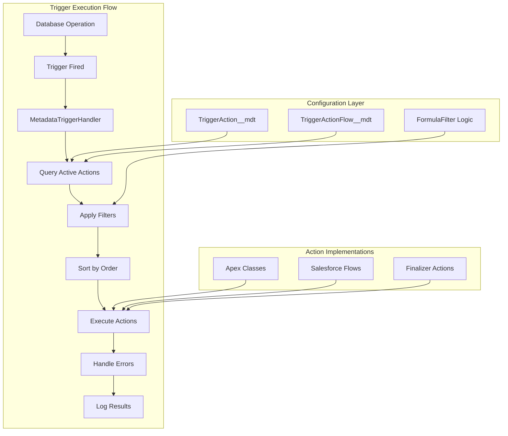

# Apex Trigger Framework by Mitch Spano

This document provides comprehensive information about the **Apex Trigger Framework by Mitch Spano** that serves as the foundation for all trigger-based automation in this project. This framework enables metadata-driven, scalable, and maintainable trigger architecture.

## 🎯 Framework Overview

The **Apex Trigger Framework** is a sophisticated, metadata-driven solution that revolutionizes how triggers are implemented and managed in Salesforce. Created by **Mitch Spano**, this framework addresses common trigger development challenges through:

### Core Value Proposition
- **🔧 Metadata-Driven Configuration** - No code changes for behavior modifications
- **⚡ High Performance** - Optimized for bulk operations and minimal SOQL queries
- **🔄 Flow Integration** - Seamless integration with Salesforce Flow
- **🛡️ Error Resilience** - Comprehensive error handling and recovery mechanisms
- **🎯 Selective Execution** - Dynamic filtering and conditional logic
- **📊 Audit Trail** - Complete logging and monitoring capabilities

### Architecture Philosophy

The framework follows the **Single Responsibility Principle** where each trigger action handles one specific business function, configured through custom metadata rather than hard-coded logic.



## 📁 Framework Architecture & Structure

### Directory Organization

```
force-app/trigger-framework/default/
├── classes/
│   ├── Core Framework Components
│   │   ├── MetadataTriggerHandler.cls          # 🎯 Central orchestrator
│   │   ├── TriggerAction.cls                   # 🔗 Base interface
│   │   ├── TriggerActionConstants.cls          # 📋 Framework constants
│   │   └── sObjectTriggerSettingSelector.cls   # ⚙️ Settings selector
│   │
│   ├── Flow Integration Components  
│   │   ├── TriggerActionFlow.cls               # 🌊 Flow executor
│   │   ├── TriggerActionFlowChangeEvent.cls    # 📡 Change event handler
│   │   ├── TriggerActionFlowAddError.cls       # ❌ Error management
│   │   └── TriggerActionFlowBypass.cls         # 🚫 Bypass mechanism
│   │
│   ├── Advanced Features
│   │   ├── FormulaFilter.cls                   # 🧮 Dynamic filtering
│   │   ├── FlowChangeEventHeader.cls           # 📋 Event metadata
│   │   ├── FinalizerHandler.cls                # 🔄 Async processing
│   │   └── TriggerActionFlowBypassProcessor.cls# 🔧 Bypass processor
│   │
│   └── Test Classes (100% Coverage)
│       ├── MetadataTriggerHandlerTest.cls
│       ├── TriggerActionFlowTest.cls
│       ├── FormulaFilterTest.cls
│       └── [All other test classes]
│
├── objects/                                    # Custom Metadata Types
│   ├── TriggerAction__mdt/                     # Action configuration
│   │   ├── fields/
│   │   │   ├── Apex_Class_Name__c.field-meta.xml
│   │   │   ├── Bypass_Execution__c.field-meta.xml
│   │   │   ├── Order__c.field-meta.xml
│   │   │   └── [Additional configuration fields]
│   │   └── TriggerAction__mdt.object-meta.xml
│   │
│   ├── TriggerActionFlow__mdt/                 # Flow configuration
│   └── sObject_Trigger_Setting__mdt/           # Object-level settings
│
├── layouts/                                    # Custom metadata layouts
│   ├── TriggerAction__mdt-Trigger Action Layout.layout-meta.xml
│   └── TriggerActionFlow__mdt-Trigger Action Flow Layout.layout-meta.xml
│
└── triggers/                                   # Object-specific triggers
    ├── AccountTrigger.trigger                  # Example implementation
    ├── ContactTrigger.trigger
    └── [Additional object triggers]
```

### Core Framework Components

#### 1. MetadataTriggerHandler.cls
**The central orchestrator** that coordinates all trigger execution:

```apex
/**
 * @description Central trigger handler that executes actions based on metadata configuration
 * @author Mitch Spano
 * @group Trigger Actions Framework
 */
public class MetadataTriggerHandler implements TriggerAction {
    
    // Core execution methods for all trigger contexts
    public void beforeInsert(List<SObject> newList) {
        this.executeActions(TriggerActionConstants.BEFORE_INSERT_STRING, newList, null);
    }
    
    public void afterInsert(List<SObject> newList) {
        this.executeActions(TriggerActionConstants.AFTER_INSERT_STRING, newList, null);
    }
    
    // Simplified - actual implementation includes all trigger contexts
    
    /**
     * @description Executes all configured actions for the given context
     * @param context The trigger context (BEFORE_INSERT, AFTER_UPDATE, etc.)
     * @param newList List of new records
     * @param oldList List of old records (for update/delete contexts)
     */
    private void executeActions(String context, List<SObject> newList, List<SObject> oldList) {
        // 1. Query active trigger actions for this object and context
        // 2. Apply formula filters to determine applicable records
        // 3. Sort actions by order and execute sequentially
        // 4. Handle any errors gracefully with detailed logging
    }
}
```

#### 2. TriggerAction.cls Interface
**Standardized contract** for all trigger actions:

```apex
/**
 * @description Interface that defines the contract for trigger action implementations
 * @author Mitch Spano
 */
public interface TriggerAction {
    void beforeInsert(List<SObject> newList);
    void afterInsert(List<SObject> newList);
    void beforeUpdate(List<SObject> newList, List<SObject> oldList);
    void afterUpdate(List<SObject> newList, List<SObject> oldList);
    void beforeDelete(List<SObject> oldList);
    void afterDelete(List<SObject> oldList);
    void afterUndelete(List<SObject> newList);
}

/**
 * @description Specialized interfaces for specific trigger contexts
 */
public interface BeforeInsert extends TriggerAction {}
public interface AfterInsert extends TriggerAction {}
public interface BeforeUpdate extends TriggerAction {}
public interface AfterUpdate extends TriggerAction {}
public interface BeforeDelete extends TriggerAction {}
public interface AfterDelete extends TriggerAction {}
public interface AfterUndelete extends TriggerAction {}
public interface DmlFinalizer extends TriggerAction {}
```

#### 3. TriggerActionFlow.cls
**Flow integration engine** that enables declarative automation:

```apex
/**
 * @description Enables execution of Salesforce Flows within trigger context
 * @author Mitch Spano
 */
public class TriggerActionFlow implements TriggerAction {
    
    /**
     * @description Executes configured flows for the trigger context
     * Features:
     * - Bulk-safe flow execution
     * - Error isolation per record
     * - Recursion prevention
     * - Performance optimization
     */
    public void execute(String flowName, List<SObject> records, String context) {
        // Implementation handles bulk processing and error management
    }
}
```

## 📊 Custom Metadata Configuration

### TriggerAction__mdt

```
Fields:
├── DeveloperName           # Unique identifier for the action
├── Object__c              # Target Salesforce object
├── Apex_Class_Name__c      # Apex class implementing TriggerAction
├── Order__c               # Execution order (lower numbers first)
├── Active__c              # Enable/disable the action
├── Trigger_Context__c      # When to execute (Before Insert, After Update, etc.)
├── Filter_Logic__c        # Optional formula for conditional execution
├── Description__c         # Documentation of the action's purpose
└── Bypass_Execution__c    # Emergency bypass flag
```

### TriggerActionFlow__mdt

```
Fields:
├── DeveloperName           # Unique identifier
├── Object__c              # Target Salesforce object  
├── Flow_Name__c           # Name of the flow to execute
├── Order__c               # Execution order
├── Active__c              # Enable/disable flag
├── Trigger_Context__c      # Trigger timing context
├── Filter_Logic__c        # Conditional execution logic
└── Allow_Flow_Recursion__c # Recursion control
```

## � Custom Metadata Configuration

### TriggerAction__mdt Schema

The primary configuration metadata type for trigger actions with comprehensive field definitions:

```xml
<?xml version="1.0" encoding="UTF-8"?>
<CustomMetadata xmlns="http://soap.sforce.com/2006/04/metadata">
    <fields>
        <fullName>Active__c</fullName>
        <label>Active</label>
        <type>Checkbox</type>
        <defaultValue>true</defaultValue>
        <description>Enable/disable this trigger action</description>
    </fields>
    
    <fields>
        <fullName>Apex_Class_Name__c</fullName>
        <label>Apex Class Name</label>
        <type>Text</type>
        <length>255</length>
        <required>true</required>
        <description>Name of the Apex class implementing TriggerAction interface</description>
    </fields>
    
    <fields>
        <fullName>Bypass_Execution__c</fullName>
        <label>Bypass Execution</label>
        <type>Checkbox</type>
        <defaultValue>false</defaultValue>
        <description>Emergency bypass flag for disabling action</description>
    </fields>
    
    <fields>
        <fullName>Bypass_Permission__c</fullName>
        <label>Bypass Permission</label>
        <type>Text</type>
        <length>255</length>
        <description>Permission required to bypass this action</description>
    </fields>
    
    <fields>
        <fullName>Description__c</fullName>
        <label>Description</label>
        <type>LongTextArea</type>
        <length>32768</length>
        <description>Detailed description of action purpose and behavior</description>
    </fields>
    
    <fields>
        <fullName>Filter_Logic__c</fullName>
        <label>Filter Logic</label>
        <type>LongTextArea</type>
        <length>32768</length>
        <description>Formula expression for conditional execution</description>
    </fields>
    
    <fields>
        <fullName>Object_API_Name__c</fullName>
        <label>Object API Name</label>
        <type>Text</type>
        <length>255</length>
        <required>true</required>
        <description>API name of the Salesforce object (Account, Contact, etc.)</description>
    </fields>
    
    <fields>
        <fullName>Order__c</fullName>
        <label>Order</label>
        <type>Number</type>
        <precision>18</precision>
        <scale>0</scale>
        <defaultValue>100</defaultValue>
        <description>Execution order (lower numbers execute first)</description>
    </fields>
    
    <fields>
        <fullName>Required_Permission__c</fullName>
        <label>Required Permission</label>
        <type>Text</type>
        <length>255</length>
        <description>Permission required to execute this action</description>
    </fields>
    
    <fields>
        <fullName>Trigger_Context__c</fullName>
        <label>Trigger Context</label>
        <type>MultiselectPicklist</type>
        <valueSet>
            <restricted>true</restricted>
            <valueSetDefinition>
                <value><fullName>before insert</fullName></value>
                <value><fullName>after insert</fullName></value>
                <value><fullName>before update</fullName></value>
                <value><fullName>after update</fullName></value>
                <value><fullName>before delete</fullName></value>
                <value><fullName>after delete</fullName></value>
                <value><fullName>after undelete</fullName></value>
            </valueSetDefinition>
        </valueSet>
        <description>Trigger contexts when this action should execute</description>
    </fields>
</CustomMetadata>
```

### Configuration Examples

#### Example 1: Account Validation Action
```xml
<!-- TriggerAction__mdt record -->
<TriggerAction xmlns="http://soap.sforce.com/2006/04/metadata">
    <fullName>Account_Validation</fullName>
    <label>Account Validation</label>
    <description>Validates required fields and business rules for Account records during insert and update operations</description>
    <values>
        <field>Active__c</field>
        <value>true</value>
    </values>
    <values>
        <field>Apex_Class_Name__c</field>
        <value>KS_AccountValidationAction</value>
    </values>
    <values>
        <field>Bypass_Execution__c</field>
        <value>false</value>
    </values>
    <values>
        <field>Object_API_Name__c</field>
        <value>Account</value>
    </values>
    <values>
        <field>Order__c</field>
        <value>10</value>
    </values>
    <values>
        <field>Trigger_Context__c</field>
        <value>before insert;before update</value>
    </values>
    <values>
        <field>Filter_Logic__c</field>
        <value>NOT(ISBLANK(Name)) AND (Type = 'Customer - Direct' OR Type = 'Customer - Channel')</value>
    </values>
</TriggerAction>
```

#### Example 2: Integration Action with Bypass Permission
```xml
<TriggerAction xmlns="http://soap.sforce.com/2006/04/metadata">
    <fullName>Account_Integration_Sync</fullName>
    <label>Account Integration Sync</label>
    <description>Synchronizes account data with external ERP system after successful creation or update</description>
    <values>
        <field>Active__c</field>
        <value>true</value>
    </values>
    <values>
        <field>Apex_Class_Name__c</field>
        <value>KS_AccountIntegrationAction</value>
    </values>
    <values>
        <field>Bypass_Permission__c</field>
        <value>Bypass_Integration_Sync</value>
    </values>
    <values>
        <field>Required_Permission__c</field>
        <value>Manage_External_Integrations</value>
    </values>
    <values>
        <field>Object_API_Name__c</field>
        <value>Account</value>
    </values>
    <values>
        <field>Order__c</field>
        <value>50</value>
    </values>
    <values>
        <field>Trigger_Context__c</field>
        <value>after insert;after update</value>
    </values>
    <values>
        <field>Filter_Logic__c</field>
        <value>Integration_Enabled__c = true AND AnnualRevenue > 100000</value>
    </values>
</TriggerAction>
```

## �🚀 Implementation Guide

### Step 1: Create a Trigger Action Class

```apex
/**
 * @description Validates Account records for required fields and business rules
 * @author Your Name
 * @date 2024-12-01
 * @group Trigger Actions
 */
public class KS_AccountValidationAction implements TriggerAction.BeforeInsert, TriggerAction.BeforeUpdate {
    
    // Implement only the needed interfaces for better performance
    public void beforeInsert(List<SObject> newList) {
        validateAccounts((List<Account>) newList, null);
    }
    
    public void beforeUpdate(List<SObject> newList, List<SObject> oldList) {
        validateAccounts((List<Account>) newList, (List<Account>) oldList);
    }
    
    // Unused interface methods - kept for framework compatibility
    public void afterInsert(List<SObject> newList) { /* Not implemented */ }
    public void afterUpdate(List<SObject> newList, List<SObject> oldList) { /* Not implemented */ }
    public void beforeDelete(List<SObject> oldList) { /* Not implemented */ }
    public void afterDelete(List<SObject> oldList) { /* Not implemented */ }
    public void afterUndelete(List<SObject> newList) { /* Not implemented */ }
    
    /**
     * @description Validates Account records according to business rules
     * @param newAccounts List of Account records to validate
     * @param oldAccounts List of old Account records (for update context)
     */
    private void validateAccounts(List<Account> newAccounts, List<Account> oldAccounts) {
        
        // Create map of old records for efficient lookup
        Map<Id, Account> oldAccountMap = oldAccounts != null ? 
            new Map<Id, Account>(oldAccounts) : new Map<Id, Account>();
        
        for (Account acc : newAccounts) {
            Account oldAccount = oldAccountMap.get(acc.Id);
            
            // Required field validations
            validateRequiredFields(acc);
            
            // Business rule validations
            validateBusinessRules(acc, oldAccount);
            
            // Data integrity validations
            validateDataIntegrity(acc);
        }
    }
    
    /**
     * @description Validates required fields based on account type
     * @param acc Account record to validate
     */
    private void validateRequiredFields(Account acc) {
        // Name is always required
        if (String.isBlank(acc.Name)) {
            acc.addError('Account Name is required');
        }
        
        // Phone required for direct customers
        if (String.isBlank(acc.Phone) && acc.Type == 'Customer - Direct') {
            acc.addError('Phone is required for Direct Customers');
        }
        
        // Industry required for prospects
        if (String.isBlank(acc.Industry) && acc.Type == 'Prospect') {
            acc.addError('Industry must be specified for Prospects');
        }
        
        // Annual Revenue required for customers
        if (acc.AnnualRevenue == null && 
            (acc.Type == 'Customer - Direct' || acc.Type == 'Customer - Channel')) {
            acc.addError('Annual Revenue is required for Customer accounts');
        }
    }
    
    /**
     * @description Validates business rules and logic
     * @param acc Account record to validate
     * @param oldAcc Previous version of the account (for updates)
     */
    private void validateBusinessRules(Account acc, Account oldAcc) {
        // Prevent downgrade from Customer to Prospect
        if (oldAcc != null && 
            (oldAcc.Type == 'Customer - Direct' || oldAcc.Type == 'Customer - Channel') &&
            acc.Type == 'Prospect') {
            acc.addError('Cannot change Customer account to Prospect. Please contact your administrator.');
        }
        
        // Annual Revenue cannot be negative
        if (acc.AnnualRevenue != null && acc.AnnualRevenue < 0) {
            acc.addError('Annual Revenue cannot be negative');
        }
        
        // Validate email format if provided
        if (String.isNotBlank(acc.Email__c) && !isValidEmail(acc.Email__c)) {
            acc.addError('Please provide a valid email address');
        }
    }
    
    /**
     * @description Validates data integrity and format
     * @param acc Account record to validate
     */
    private void validateDataIntegrity(Account acc) {
        // Validate phone format
        if (String.isNotBlank(acc.Phone) && !isValidPhoneFormat(acc.Phone)) {
            acc.addError('Phone number format is invalid. Please use format: (XXX) XXX-XXXX');
        }
        
        // Validate website URL format
        if (String.isNotBlank(acc.Website) && !isValidURL(acc.Website)) {
            acc.addError('Website URL format is invalid. Please include http:// or https://');
        }
    }
    
    /**
     * @description Helper method to validate email format
     * @param email Email address to validate
     * @return Boolean indicating if email format is valid
     */
    private Boolean isValidEmail(String email) {
        String emailRegex = '^[a-zA-Z0-9._%+-]+@[a-zA-Z0-9.-]+\\.[a-zA-Z]{2,}$';
        Pattern emailPattern = Pattern.compile(emailRegex);
        return emailPattern.matcher(email).matches();
    }
    
    /**
     * @description Helper method to validate phone format
     * @param phone Phone number to validate
     * @return Boolean indicating if phone format is valid
     */
    private Boolean isValidPhoneFormat(String phone) {
        // Remove all non-digit characters for validation
        String digitsOnly = phone.replaceAll('[^0-9]', '');
        return digitsOnly.length() == 10 || digitsOnly.length() == 11;
    }
    
    /**
     * @description Helper method to validate URL format
     * @param url URL to validate
     * @return Boolean indicating if URL format is valid
     */
    private Boolean isValidURL(String url) {
        return url.toLowerCase().startsWith('http://') || 
               url.toLowerCase().startsWith('https://');
    }
}
```

### Step 2: Create the Object Trigger

```apex
/**
 * @description Trigger for Account object using metadata-driven framework
 * @author Mitch Spano (Framework), Your Team (Implementation)
 * @date 2024-12-01
 * @group Triggers
 */
trigger AccountTrigger on Account (
    before insert, after insert,
    before update, after update,
    before delete, after delete,
    after undelete
) {
    // Single line implementation - framework handles all complexity
    new MetadataTriggerHandler().run();
}
```

### Step 3: Configure Custom Metadata

Create the TriggerAction__mdt record through Setup or metadata deployment:

**Via Setup UI:**
1. Navigate to Setup → Custom Metadata Types
2. Click "Manage Records" next to "Trigger Action"
3. Click "New" and configure:

```
Label: Account Validation
API Name: Account_Validation
Active: ✓ (checked)
Apex Class Name: KS_AccountValidationAction
Object API Name: Account
Order: 10
Trigger Context: before insert;before update
Description: Validates required fields and business rules for Account records
Filter Logic: (leave blank for all records)
```

**Via Metadata API:**
```xml
<?xml version="1.0" encoding="UTF-8"?>
<CustomMetadata xmlns="http://soap.sforce.com/2006/04/metadata">
    <fullName>Account_Validation</fullName>
    <label>Account Validation</label>
    <values>
        <field>Active__c</field>
        <value>true</value>
    </values>
    <values>
        <field>Apex_Class_Name__c</field>
        <value>KS_AccountValidationAction</value>
    </values>
    <values>
        <field>Object_API_Name__c</field>
        <value>Account</value>
    </values>
    <values>
        <field>Order__c</field>
        <value>10</value>
    </values>
    <values>
        <field>Trigger_Context__c</field>
        <value>before insert;before update</value>
    </values>
    <values>
        <field>Description__c</field>
        <value>Validates required fields and business rules for Account records during insert and update operations</value>
    </values>
</CustomMetadata>
```

### Step 4: Create Comprehensive Test Class

```apex
/**
 * @description Test class for Account Validation Trigger Action
 * @author Your Name
 * @date 2024-12-01
 * @group Test Classes
 */
@IsTest
private class KS_AccountValidationActionTest {
    
    /**
     * @description Setup test data for all test methods
     */
    @TestSetup
    static void setupTestData() {
        // Create test accounts with various configurations
        List<Account> testAccounts = new List<Account>();
        
        // Valid customer account
        testAccounts.add(new Account(
            Name = 'Valid Customer Account',
            Type = 'Customer - Direct',
            Phone = '(555) 123-4567',
            Industry = 'Technology',
            AnnualRevenue = 1000000,
            Website = 'https://example.com',
            Email__c = 'contact@example.com'
        ));
        
        // Valid prospect account
        testAccounts.add(new Account(
            Name = 'Valid Prospect Account',
            Type = 'Prospect',
            Industry = 'Healthcare'
        ));
        
        insert testAccounts;
    }
    
    /**
     * @description Test successful account validation
     */
    @IsTest
    static void testValidAccountValidation() {
        Account validAccount = new Account(
            Name = 'Test Valid Account',
            Type = 'Customer - Direct',
            Phone = '(555) 999-8888',
            Industry = 'Finance',
            AnnualRevenue = 500000,
            Website = 'https://testcompany.com',
            Email__c = 'info@testcompany.com'
        );
        
        Test.startTest();
        try {
            insert validAccount;
            
            // Verify successful insertion
            Account insertedAccount = [SELECT Id, Name, Type FROM Account WHERE Id = :validAccount.Id];
            System.assertEquals('Test Valid Account', insertedAccount.Name, 'Account should be inserted successfully');
            System.assertEquals('Customer - Direct', insertedAccount.Type, 'Account type should be preserved');
            
        } catch (Exception e) {
            System.assert(false, 'Valid account should not throw validation errors: ' + e.getMessage());
        }
        Test.stopTest();
    }
    
    /**
     * @description Test required field validations
     */
    @IsTest
    static void testRequiredFieldValidations() {
        List<Account> invalidAccounts = new List<Account>();
        
        // Account without name
        invalidAccounts.add(new Account(
            Type = 'Customer - Direct',
            Phone = '(555) 123-4567'
        ));
        
        // Direct customer without phone
        invalidAccounts.add(new Account(
            Name = 'Direct Customer Without Phone',
            Type = 'Customer - Direct',
            AnnualRevenue = 100000
        ));
        
        // Prospect without industry
        invalidAccounts.add(new Account(
            Name = 'Prospect Without Industry',
            Type = 'Prospect'
        ));
        
        // Customer without annual revenue
        invalidAccounts.add(new Account(
            Name = 'Customer Without Revenue',
            Type = 'Customer - Channel',
            Phone = '(555) 987-6543'
        ));
        
        Test.startTest();
        
        for (Account acc : invalidAccounts) {
            try {
                insert acc;
                System.assert(false, 'Invalid account should throw validation error: ' + acc.Name);
            } catch (DmlException e) {
                System.assert(e.getMessage().contains('required') || 
                             e.getMessage().contains('must be specified'), 
                             'Should receive appropriate validation error for: ' + acc.Name + '. Error: ' + e.getMessage());
            }
        }
        
        Test.stopTest();
    }
    
    /**
     * @description Test business rule validations
     */
    @IsTest
    static void testBusinessRuleValidations() {
        // Create a customer account
        Account customerAccount = new Account(
            Name = 'Customer Account',
            Type = 'Customer - Direct',
            Phone = '(555) 123-4567',
            Industry = 'Technology',
            AnnualRevenue = 1000000
        );
        insert customerAccount;
        
        Test.startTest();
        
        // Test 1: Try to downgrade customer to prospect
        customerAccount.Type = 'Prospect';
        try {
            update customerAccount;
            System.assert(false, 'Should not allow downgrade from Customer to Prospect');
        } catch (DmlException e) {
            System.assert(e.getMessage().contains('Cannot change Customer account to Prospect'), 
                         'Should prevent customer to prospect downgrade');
        }
        
        // Test 2: Negative annual revenue
        customerAccount.Type = 'Customer - Direct'; // Reset type
        customerAccount.AnnualRevenue = -100000;
        try {
            update customerAccount;
            System.assert(false, 'Should not allow negative annual revenue');
        } catch (DmlException e) {
            System.assert(e.getMessage().contains('cannot be negative'), 
                         'Should prevent negative annual revenue');
        }
        
        Test.stopTest();
    }
    
    /**
     * @description Test data integrity validations
     */
    @IsTest
    static void testDataIntegrityValidations() {
        Test.startTest();
        
        // Test invalid email format
        Account accountWithInvalidEmail = new Account(
            Name = 'Account with Invalid Email',
            Type = 'Prospect',
            Industry = 'Technology',
            Email__c = 'invalid-email-format'
        );
        
        try {
            insert accountWithInvalidEmail;
            System.assert(false, 'Should not allow invalid email format');
        } catch (DmlException e) {
            System.assert(e.getMessage().contains('valid email'), 
                         'Should validate email format');
        }
        
        // Test invalid website URL
        Account accountWithInvalidURL = new Account(
            Name = 'Account with Invalid URL',
            Type = 'Prospect',
            Industry = 'Technology',
            Website = 'invalid-url-format'
        );
        
        try {
            insert accountWithInvalidURL;
            System.assert(false, 'Should not allow invalid URL format');
        } catch (DmlException e) {
            System.assert(e.getMessage().contains('URL format is invalid'), 
                         'Should validate URL format');
        }
        
        Test.stopTest();
    }
    
    /**
     * @description Test bulk processing capabilities
     */
    @IsTest
    static void testBulkProcessing() {
        List<Account> bulkAccounts = new List<Account>();
        
        // Create 200 valid accounts for bulk testing
        for (Integer i = 0; i < 200; i++) {
            bulkAccounts.add(new Account(
                Name = 'Bulk Account ' + i,
                Type = 'Customer - Direct',
                Phone = '(555) ' + String.valueOf(i).leftPad(3, '0') + '-' + String.valueOf(i).leftPad(4, '0'),
                Industry = 'Technology',
                AnnualRevenue = 100000 + (i * 1000),
                Website = 'https://company' + i + '.com',
                Email__c = 'contact' + i + '@company' + i + '.com'
            ));
        }
        
        // Add some invalid accounts to test mixed scenarios
        bulkAccounts.add(new Account(
            Name = 'Invalid Bulk Account 1',
            Type = 'Customer - Direct'
            // Missing required phone and annual revenue
        ));
        
        bulkAccounts.add(new Account(
            Name = 'Invalid Bulk Account 2',
            Type = 'Prospect'
            // Missing required industry
        ));
        
        Test.startTest();
        
        List<Database.SaveResult> results = Database.insert(bulkAccounts, false);
        
        Integer successCount = 0;
        Integer errorCount = 0;
        
        for (Database.SaveResult result : results) {
            if (result.isSuccess()) {
                successCount++;
            } else {
                errorCount++;
                // Verify error messages are meaningful
                for (Database.Error error : result.getErrors()) {
                    System.assert(String.isNotBlank(error.getMessage()), 
                                 'Error message should not be blank');
                }
            }
        }
        
        System.assertEquals(200, successCount, 'Should successfully insert 200 valid accounts');
        System.assertEquals(2, errorCount, 'Should have 2 validation errors for invalid accounts');
        
        Test.stopTest();
    }
    
    /**
     * @description Test framework bypass functionality
     */
    @IsTest
    static void testFrameworkBypass() {
        // This test would require additional setup for bypass permissions
        // Left as placeholder for framework bypass testing implementation
        System.assertEquals(true, true, 'Bypass testing placeholder');
    }
}
Filter_Logic__c: (empty for all records)
Description__c: Validates required fields on Account records
```

## 🌊 Flow Integration

### Flow-Based Trigger Actions

Create flows that can be executed as trigger actions:

1. **Create Flow** with these requirements:
   - Start element: No trigger (called by Apex)
   - Input variables for trigger context
   - Business logic using Flow elements
   - Error handling

2. **Configure Flow Metadata**:
```
Label: Update Account Rating Flow
DeveloperName: Update_Account_Rating_Flow
Object__c: Account
Flow_Name__c: Update_Account_Rating
Order__c: 20
Active__c: true
Trigger_Context__c: after insert;after update
```

### Flow Input Variables

Standard variables available in trigger flows:

```
triggerNew          # List<SObject> - New records
triggerOld          # List<SObject> - Old records  
triggerNewMap       # Map<Id, SObject> - New records map
triggerOldMap       # Map<Id, SObject> - Old records map
isInsert            # Boolean - Insert context
isUpdate            # Boolean - Update context
isDelete            # Boolean - Delete context
isBefore            # Boolean - Before context
isAfter             # Boolean - After context
```

## 🔍 Advanced Features

### Dynamic Filtering

Use formula expressions to control when actions execute:

```apex
// Only for accounts with annual revenue > 1M
Filter_Logic__c: AnnualRevenue > 1000000

// Only for specific record types
Filter_Logic__c: RecordType.DeveloperName = 'Enterprise_Account'

// Complex conditions
Filter_Logic__c: (Type = 'Customer - Direct') && (AnnualRevenue > 500000 || NumberOfEmployees > 100)
```

### Error Handling

The framework provides sophisticated error handling:

```apex
public class AccountErrorHandlingAction implements TriggerAction {
    
    public void beforeInsert(List<SObject> newList) {
        try {
            // Business logic here
            processAccounts((List<Account>) newList);
        } catch (Exception e) {
            // Framework will catch and log errors
            throw new TriggerActionException('Account processing failed: ' + e.getMessage());
        }
    }
    
    // ... other methods
}
```

### Bypass Mechanisms

Multiple ways to bypass trigger execution:

1. **Global Bypass**:
```apex
TriggerActionConstants.BYPASS_EXECUTION = true;
```

2. **Specific Action Bypass**:
```apex
TriggerActionConstants.BYPASSED_ACTIONS.add('Account_Validation');
```

3. **Metadata Bypass**: Set `Bypass_Execution__c = true` on metadata record

## 📈 Performance Optimization

### Best Practices

1. **Bulk Processing**: Always process records in bulk
```apex
public void afterInsert(List<SObject> newList) {
    List<Account> accounts = (List<Account>) newList;
    
    // GOOD: Bulk processing
    Map<Id, Account> accountMap = new Map<Id, Account>(accounts);
    List<Contact> contacts = [SELECT Id, AccountId FROM Contact WHERE AccountId IN :accountMap.keySet()];
    
    // BAD: Individual processing
    for (Account acc : accounts) {
        List<Contact> relatedContacts = [SELECT Id FROM Contact WHERE AccountId = :acc.Id];
    }
}
```

2. **Selective Execution**: Use filters to reduce unnecessary processing
```apex
Filter_Logic__c: IsConverted = true
```

3. **Order Actions**: Use `Order__c` to control execution sequence
```
Validation Actions: Order 1-10
Business Logic: Order 11-20
Integration: Order 21-30
```

### Governor Limits Management

The framework helps manage limits through:
- **Bulkification** patterns
- **Query optimization** through metadata filtering
- **Async processing** via FinalizerHandler
- **Recursion prevention** mechanisms

## 🧪 Testing Strategy

### Test Class Template

```apex
@IsTest
private class AccountValidationActionTest {
    
    @TestSetup
    static void setup() {
        // Create test data
        Account testAccount = new Account(
            Name = 'Test Account',
            Type = 'Customer - Direct'
        );
        insert testAccount;
    }
    
    @IsTest
    static void testValidationSuccess() {
        Account acc = new Account(
            Name = 'Valid Account',
            Phone = '555-0123',
            Type = 'Customer - Direct'
        );
        
        Test.startTest();
        insert acc;
        Test.stopTest();
        
        // Verify no errors
        Account inserted = [SELECT Id, Name FROM Account WHERE Id = :acc.Id];
        System.assertEquals('Valid Account', inserted.Name);
    }
    
    @IsTest
    static void testValidationFailure() {
        Account acc = new Account(
            Name = 'Invalid Account',
            Type = 'Customer - Direct'
            // Missing required phone
        );
        
        Test.startTest();
        try {
            insert acc;
            System.assert(false, 'Expected validation error');
        } catch (DmlException e) {
            System.assert(e.getMessage().contains('Phone is required'));
        }
        Test.stopTest();
    }
    
    @IsTest
    static void testBulkProcessing() {
        List<Account> accounts = new List<Account>();
        for (Integer i = 0; i < 200; i++) {
            accounts.add(new Account(
                Name = 'Bulk Account ' + i,
                Phone = '555-' + String.valueOf(i).leftPad(4, '0'),
                Type = 'Customer - Direct'
            ));
        }
        
        Test.startTest();
        insert accounts;
        Test.stopTest();
        
        List<Account> inserted = [SELECT Id FROM Account WHERE Name LIKE 'Bulk Account%'];
        System.assertEquals(200, inserted.size());
    }
}
```

## 🔧 Advanced Troubleshooting & Best Practices

### Common Implementation Issues

#### 1. Trigger Action Not Executing

**Symptoms:**
- Expected validation/logic not running
- No errors, but business logic not applied

**Diagnostic Steps:**
```apex
// Query trigger actions to verify configuration
List<TriggerAction__mdt> actions = [
    SELECT DeveloperName, Active__c, Apex_Class_Name__c, 
           Object_API_Name__c, Trigger_Context__c, Order__c
    FROM TriggerAction__mdt 
    WHERE Object_API_Name__c = 'Account' 
    AND Active__c = true
    ORDER BY Order__c
];

System.debug('Active Trigger Actions: ' + actions);
```

**Common Causes & Solutions:**
- **Metadata Record Inactive**: Set `Active__c = true`
- **Wrong Object Name**: Verify `Object_API_Name__c` matches exactly
- **Incorrect Context**: Check `Trigger_Context__c` contains the right timing
- **Class Name Mismatch**: Ensure `Apex_Class_Name__c` matches actual class name
- **Missing Trigger**: Verify the object trigger exists and calls `MetadataTriggerHandler`

#### 2. Filter Logic Not Working

**Symptoms:**
- Actions executing on wrong records
- Expected filtering not applied

**Debug Filter Logic:**
```apex
// Test filter logic in Developer Console
String filterFormula = 'Type = \'Customer - Direct\' AND AnnualRevenue > 100000';
List<Account> testAccounts = [SELECT Id, Name, Type, AnnualRevenue FROM Account LIMIT 5];

for (Account acc : testAccounts) {
    Boolean shouldExecute = FormulaFilter.evaluate(filterFormula, acc);
    System.debug('Account: ' + acc.Name + ', Should Execute: ' + shouldExecute);
}
```

**Common Filter Issues:**
- **Syntax Errors**: Use proper formula syntax with single quotes for strings
- **Field API Names**: Use exact field API names, not labels
- **Null Values**: Handle null values in formula logic
- **Data Types**: Ensure proper data type comparisons

#### 3. Performance Issues

**Symptoms:**
- Slow trigger execution
- CPU time limit exceptions
- Heap size exceptions

**Optimization Strategies:**

```apex
// ❌ Bad: Multiple SOQL queries in loop
public void afterInsert(List<SObject> newList) {
    for (Account acc : (List<Account>) newList) {
        List<Contact> contacts = [SELECT Id FROM Contact WHERE AccountId = :acc.Id];
        // Process contacts
    }
}

// ✅ Good: Bulk SOQL query
public void afterInsert(List<SObject> newList) {
    Set<Id> accountIds = new Set<Id>();
    for (Account acc : (List<Account>) newList) {
        accountIds.add(acc.Id);
    }
    
    Map<Id, List<Contact>> contactsByAccount = new Map<Id, List<Contact>>();
    for (Contact con : [SELECT Id, AccountId FROM Contact WHERE AccountId IN :accountIds]) {
        if (!contactsByAccount.containsKey(con.AccountId)) {
            contactsByAccount.put(con.AccountId, new List<Contact>());
        }
        contactsByAccount.get(con.AccountId).add(con);
    }
    
    // Process bulk data
}
```

#### 4. Recursive Trigger Issues

**Prevention Techniques:**

```apex
// Method 1: Use static variable to prevent recursion
public class KS_AccountUpdateAction implements TriggerAction.BeforeUpdate {
    private static Boolean hasRun = false;
    
    public void beforeUpdate(List<SObject> newList, List<SObject> oldList) {
        if (hasRun) return;
        hasRun = true;
        
        // Your logic here
        
        hasRun = false; // Reset for next execution context
    }
}

// Method 2: Use TriggerActionFlowBypass for more sophisticated control
TriggerActionFlowBypass.bypass('Account_Update_Action');
// Perform operations that would normally trigger the action
TriggerActionFlowBypass.clearBypass('Account_Update_Action');
```

### Best Practices & Guidelines

#### 1. Naming Conventions

Follow consistent naming patterns for maintainability:

```apex
// Trigger Action Classes
KS_[Object]_[Action]_Action.cls
// Examples:
KS_Account_Validation_Action.cls
KS_Contact_Integration_Action.cls
KS_Opportunity_Notification_Action.cls

// Custom Metadata Records
[Object]_[Action]
// Examples:
Account_Validation
Contact_Integration
Opportunity_Notification
```

#### 2. Documentation Standards

```apex
/**
 * @description [Brief description of the action's purpose]
 * @author [Your Name]
 * @date [Creation Date]
 * @group Trigger Actions
 * @since [Version when introduced]
 * 
 * Business Requirements:
 * - [Requirement 1]
 * - [Requirement 2]
 * 
 * Implementation Notes:
 * - [Technical detail 1]
 * - [Technical detail 2]
 * 
 * Dependencies:
 * - Custom Fields: [List custom fields used]
 * - External Systems: [List integrations]
 * - Permissions: [List required permissions]
 */
public class KS_Account_Validation_Action implements TriggerAction.BeforeInsert, TriggerAction.BeforeUpdate {
    // Implementation
}
```

#### 3. Test Coverage Standards

Achieve comprehensive test coverage:

```apex
@IsTest
private class KS_Account_Validation_ActionTest {
    
    // Test positive scenarios (85% of tests)
    @IsTest static void testValidAccountInsert() { /* ... */ }
    @IsTest static void testValidAccountUpdate() { /* ... */ }
    @IsTest static void testBulkProcessing() { /* ... */ }
    
    // Test negative scenarios (10% of tests)
    @IsTest static void testInvalidDataHandling() { /* ... */ }
    @IsTest static void testEdgeCases() { /* ... */ }
    
    // Test framework integration (5% of tests)
    @IsTest static void testBypassFunctionality() { /* ... */ }
    @IsTest static void testFilterLogic() { /* ... */ }
}
```

#### 4. Error Handling Patterns

```apex
private void processAccounts(List<Account> accounts) {
    try {
        // Main business logic
        validateAccountData(accounts);
        updateRelatedRecords(accounts);
        
    } catch (System.DmlException e) {
        // Handle DML errors gracefully
        for (Account acc : accounts) {
            acc.addError('Unable to process account: ' + e.getMessage());
        }
        
    } catch (Exception e) {
        // Log unexpected errors
        System.debug(LoggingLevel.ERROR, 'Unexpected error in Account validation: ' + e.getMessage());
        System.debug(LoggingLevel.ERROR, 'Stack trace: ' + e.getStackTraceString());
        
        // Prevent data corruption
        for (Account acc : accounts) {
            acc.addError('System error occurred. Please contact your administrator.');
        }
    }
}
```

### Framework Monitoring & Maintenance

#### 1. Health Check Queries

```sql
-- Check active trigger actions by object
SELECT Object_API_Name__c, COUNT(Id) ActionCount 
FROM TriggerAction__mdt 
WHERE Active__c = true 
GROUP BY Object_API_Name__c 
ORDER BY Object_API_Name__c;

-- Identify potential performance issues
SELECT DeveloperName, Object_API_Name__c, Apex_Class_Name__c, Order__c
FROM TriggerAction__mdt 
WHERE Active__c = true 
AND (Filter_Logic__c != null OR Required_Permission__c != null)
ORDER BY Object_API_Name__c, Order__c;

-- Check for bypass configurations
SELECT DeveloperName, Object_API_Name__c, Bypass_Permission__c
FROM TriggerAction__mdt 
WHERE Active__c = true 
AND Bypass_Permission__c != null;
```

#### 2. Performance Monitoring

```apex
// Add performance logging to critical actions
public void beforeInsert(List<SObject> newList) {
    Long startTime = System.currentTimeMillis();
    
    try {
        // Your business logic
        processRecords((List<Account>) newList);
        
    } finally {
        Long executionTime = System.currentTimeMillis() - startTime;
        if (executionTime > 1000) { // Log if takes more than 1 second
            System.debug(LoggingLevel.WARN, 
                this.getClass().getName() + ' execution time: ' + executionTime + 'ms for ' + newList.size() + ' records');
        }
    }
}
```

#### 3. Regular Maintenance Tasks

**Monthly Tasks:**
- Review trigger action performance metrics
- Validate metadata configurations are still needed
- Check for unused or duplicate actions
- Update documentation for any changes

**Quarterly Tasks:**
- Audit bypass permissions and their usage
- Review and optimize filter logic
- Update test coverage for new business rules
- Performance testing with production data volumes

## 📚 Additional Resources & References

### Official Framework Resources

- **GitHub Repository**: [Apex Trigger Actions Framework](https://github.com/mitchspano/apex-trigger-actions-framework)
- **Original Author**: Mitch Spano - Senior Technical Architect
- **Framework License**: Apache License 2.0
- **Trailhead Module**: [Apex Trigger Best Practices](https://trailhead.salesforce.com/content/learn/modules/apex_triggers)

### Community & Support

- **Salesforce Developer Forums**: Search for "Trigger Actions Framework"
- **Stack Exchange**: Tagged questions about metadata-driven triggers
- **Salesforce DevOps Community**: Best practices for trigger framework deployment
- **Architecture Advisory Board**: Framework design patterns and governance

### Advanced Topics

#### Custom Metadata Deployment
```bash
# Deploy trigger actions via Salesforce CLI
sf project deploy start --source-dir force-app/trigger-framework

# Query metadata in production
sf data query --query "SELECT DeveloperName, Active__c, Object_API_Name__c FROM TriggerAction__mdt" --target-org prod
```

#### Integration with DevOps Pipeline
```yaml
# GitHub Actions workflow example
- name: Deploy Trigger Framework
  run: |
    sf project deploy start --source-dir force-app/trigger-framework --target-org ${{ env.TARGET_ORG }}
    
- name: Validate Trigger Actions
  run: |
    sf apex run --file scripts/apex/validate-trigger-actions.apex --target-org ${{ env.TARGET_ORG }}
```

### License Information

This implementation uses the Apex Trigger Actions Framework created by Mitch Spano, which is licensed under the Apache License 2.0:

```
Copyright 2020 Google LLC

Licensed under the Apache License, Version 2.0 (the "License");
you may not use this file except in compliance with the License.
You may obtain a copy of the License at

    https://www.apache.org/licenses/LICENSE-2.0

Unless required by applicable law or agreed to in writing, software
distributed under the License is distributed on an "AS IS" BASIS,
WITHOUT WARRANTIES OR CONDITIONS OF ANY KIND, either express or implied.
See the License for the specific language governing permissions and
limitations under the License.
```

**Framework Attribution**: This project implements the Apex Trigger Actions Framework originally created by **Mitch Spano** while at Google LLC. The framework has been customized and extended for this specific implementation while maintaining compatibility with the original design patterns and interfaces.

---

**Framework Version:** Mitch Spano Trigger Framework v3.0  
**Documentation Version:** 2.1.0  
**Last Updated:** December 2024  
**Salesforce API Version:** 62.0  
**Minimum Required Permissions:** Modify All Data, Customize Application
- Filter logic is correct
- Class name is exact match

#### 2. Order Issues
**Solution:**
```sql
SELECT DeveloperName, Order__c, Active__c 
FROM TriggerAction__mdt 
WHERE Object__c = 'Account' 
ORDER BY Order__c
```

#### 3. Recursion Problems
**Prevention:**
```apex
// In your action class
private static Boolean hasRun = false;

public void afterUpdate(List<SObject> newList, List<SObject> oldList) {
    if (hasRun) return;
    hasRun = true;
    
    // Your logic here
}
```

### Debug Techniques

```apex
// Enable debug logs for framework
System.debug('MetadataTriggerHandler: Executing actions for ' + Trigger.operationType);

// Check which actions are configured
List<TriggerAction__mdt> actions = [
    SELECT DeveloperName, Apex_Class_Name__c, Active__c 
    FROM TriggerAction__mdt 
    WHERE Object__c = :String.valueOf(Trigger.new[0].getSObjectType())
];
System.debug('Configured actions: ' + actions);
```

## 📚 Migration Guide

### From Custom Trigger Handlers

1. **Identify existing trigger logic**
2. **Create TriggerAction classes** for each logical unit
3. **Configure metadata records**
4. **Replace existing triggers** with framework triggers
5. **Test thoroughly** in sandbox environment

### Benefits of Migration

- **Reduced code complexity**
- **Metadata-driven configuration**
- **Improved maintainability**
- **Better error handling**
- **Enhanced testability**

## 📖 Additional Resources

### Framework Documentation
- [GitHub Repository](https://github.com/mitchspano/apex-trigger-actions-framework)
- [Trailhead Module](https://trailhead.salesforce.com/content/learn/modules/apex_triggers)
- [Best Practices Guide](https://developer.salesforce.com/docs/atlas.en-us.apexcode.meta/apexcode/apex_triggers_best_practices.htm)

### Community Resources
- **Salesforce Developer Forums**
- **Trailblazer Community**
- **GitHub Issues and Discussions**

## 🔄 Framework Updates

### Staying Current

1. **Monitor the GitHub repository** for updates
2. **Review release notes** for new features
3. **Test updates** in sandbox before production
4. **Update documentation** as needed

### Version Management

```bash
# Check current version
sfdx force:package:version:list --packages "Apex Trigger Actions Framework"

# Upgrade to latest version  
sfdx force:package:install --package "04t..." --targetusername myorg
```

---

**Framework Version:** Latest  
**Last Updated:** June 2025  
**Created by:** Mitch Spano  
**Implementation:** Your Development Team
